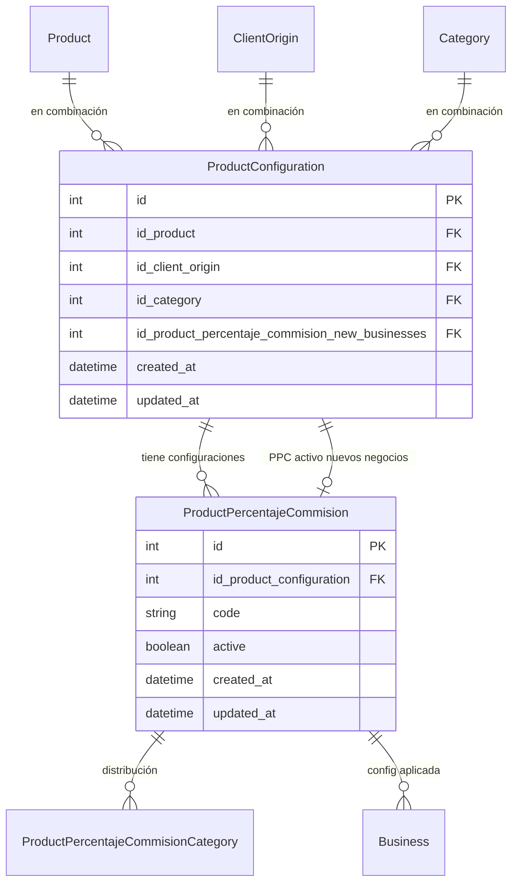

# ProductPercentajeCommision: nuevos vs existentes (actualizado)

## Resumen

- El modelo actual ya permite que negocios existentes sigan liquidando con su PPC asignado.
- La brecha es elegir qué configuración usar para **nuevos** negocios cuando hay varias para la misma (producto, origen, categoría).
- Se evaluaron: campo de vigencia (`effectiveFrom`), flag `isDefaultForNewBusinesses`, convención por fecha y **tabla adicional de combinación** para facilitar la administración desde la UI.

---

## Opción: ProductConfiguration + PPC activo para nuevos negocios

### Idea

- **ProductConfiguration** facilita la administración: representa la combinación (producto, origen, categoría) en una sola tabla. Cada configuración tiene varias **ProductPercentajeCommision** (históricas o vigentes).
- Hay que **identificar de forma explícita qué ProductPercentajeCommision se aplica a los nuevos negocios** para esa configuración, y **dar la opción de cambiarlo** por otro PPC existente de la misma configuración.

Así:

- **ProductConfiguration** → muchos **ProductPercentajeCommision** (varias “versiones” de porcentajes).
- En **ProductConfiguration** se guarda **cuál** de esos PPC está activo para nuevos negocios (FK opcional). La UI permite **cambiar** esa elección entre los PPC existentes de esa configuración.
- Los negocios ya creados siguen liquidando con el PPC que tienen asignado al crearse; solo la creación de **nuevos** negocios usa el PPC activo para nuevos negocios de la ProductConfiguration.

### Modelo propuesto (esquemático)

- **ProductConfiguration**: `id`, `idProduct`, `idClientOrigin`, `idCategory`, `**idProductPercentajeCommisionNewBusinesses**` (FK nullable a `ProductPercentajeCommision`), `createdAt`, `updatedAt`. `@@unique([idProduct, idClientOrigin, idCategory])`. La FK debe apuntar a un PPC cuya `idProductConfiguration` sea esta configuración (validar en app o con CHECK).
- **ProductPercentajeCommision**: quitar `idProduct`, `idClientOrigin`, `idCategory`; añadir `idProductConfiguration` (FK a ProductConfiguration). No hace falta `effectiveFrom` si la vigencia para nuevos negocios se decide por la FK en ProductConfiguration.
- **Business**: sigue con `idProductPercentajeCommision`. Sin cambio en liquidación.

**Creación de negocio**: por (producto, origen, categoría) se obtiene la ProductConfiguration; se usa `productConfiguration.idProductPercentajeCommisionNewBusinesses` como PPC a asignar al negocio. Si es null, no hay PPC definido para nuevos negocios (error o regla de negocio a definir).

**Cambio de PPC para nuevos negocios**: en la UI de una ProductConfiguration, se listan los PPC de esa configuración; se muestra cuál está seleccionado como "activo para nuevos negocios" y se ofrece cambiar a otro PPC existente (actualizar `idProductPercentajeCommisionNewBusinesses`).

### Actualización del flujo de creación de negocios

Con el nuevo modelo, la **creación de negocios** debe usar ProductConfiguration e `idProductPercentajeCommisionNewBusinesses` en lugar de buscar PPC por (producto, origen, categoría). Cambios a contemplar:

1. **Obtener ProductConfiguration** por (idProduct, idClientOrigin, idCategory). La categoría sigue saliendo del agente seleccionado (`user.idCategoria`), como hoy.
2. **Leer** `productConfiguration.idProductPercentajeCommisionNewBusinesses`. Si es `null`, devolver error claro (ej.: "No hay configuración de comisión para nuevos negocios en esta combinación producto/origen/categoría").
3. **Asignar al negocio** ese `idProductPercentajeCommision` al crear el Business (igual que hoy, pero el id viene de ProductConfiguration, no de `findProductPercentajeCommision`).
4. **Código afectado**:
  - [create-business.ts](src/features/negocios/actions/create-business.ts): dejar de llamar a `findProductPercentajeCommision`; en su lugar, buscar ProductConfiguration por (idProduct, idClientOrigin, idCategory) y usar `productConfiguration.idProductPercentajeCommisionNewBusinesses`.
  - [find-product-percentaje-commision.ts](src/features/negocios/actions/find-product-percentaje-commision.ts): reemplazar o adaptar para que busque ProductConfiguration, incluya la relación `productPercentajeCommisionNewBusinesses`, y devuelva ese PPC (o error si es null). Si se mantiene el nombre del action, su contrato puede seguir siendo (idProduct, idClientOrigin, idCategory) → PPC, pero la implementación interna usa ProductConfiguration.

Tests de creación de negocio y de `findProductPercentajeCommision` (o del nuevo action) deben actualizarse para el nuevo modelo y para el caso en que `idProductPercentajeCommisionNewBusinesses` sea null.

### Buenas prácticas en la implementación

Al implementar los cambios, respetar principios de **software-architecture** y calidad de código (el proyecto es Next.js + Prisma, no Nest.js; los principios son aplicables igual):

- **Separación de responsabilidades**: la lógica de “obtener PPC para nuevos negocios” vive en actions/lib (p. ej. `findProductPercentajeCommision` o un servicio de dominio), no en componentes UI. Las Server Actions orquestan y llaman a esa lógica; los componentes solo envían datos y muestran resultado/error.
- **Nombres de dominio**: evitar genéricos (`utils`, `helpers`). Usar nombres que reflejen el dominio: p. ej. `getProductConfigurationForNewBusinesses`, `resolvePpcForNewBusiness`, o mantener `findProductPercentajeCommision` con contrato claro (idProduct, idClientOrigin, idCategory) → PPC.
- **Early return**: en create-business y en la función que resuelve el PPC, validar y devolver error pronto (ProductConfiguration no encontrada, `idProductPercentajeCommisionNewBusinesses` null) en lugar de anidar condicionales.
- **Una responsabilidad por función**: la acción que obtiene el PPC para nuevos negocios solo resuelve eso; create-business orquesta validación de negocio, resolución de PPC y creación en BD. Si la resolución de PPC crece, extraer a un módulo/lib del feature negocios o de configuración de producto.
- **Validación en orden**: después de cada cambio, ejecutar en este orden: `npm run type-check` → tests unitarios del feature → tests de integración si aplican → tests e2e si tocan flujo de creación de negocio.
- **Tests**: cubrir el caso “ProductConfiguration sin idProductPercentajeCommisionNewBusinesses” (error esperado), el caso “ProductConfiguration con PPC asignado” (éxito) y que los negocios existentes no cambian de PPC.
- **Sin lógica de negocio en UI**: la decisión “qué PPC usar” no debe depender de estado del cliente ni de cálculos en el componente; debe vivir en el servidor (action o servicio llamado por la action).

### Ventajas para la interfaz

- **Administración clara**: pantalla “Configuraciones” (producto, origen, categoría). Al abrir una, se listan todos los PPC de esa configuración y cuál está activo para nuevos negocios, con opción de cambiar a otro PPC existente.
- **Identificación explícita**: un solo campo en ProductConfiguration (idProductPercentajeCommisionNewBusinesses) indica qué PPC aplica a los nuevos negocios; no depende de fechas ni flags. 
- **Cambio sencillo**: cambiar = actualizar una FK (elegir otro PPC de la lista); los negocios ya creados no se tocan.
- **Escalable**: si más adelante la combinación tiene más atributos (nombre amigable, estado, etc.), se mantienen en una sola tabla.

### Desventajas / coste

- **Migración**: crear tabla de combinaciones, rellenarla a partir de las combinaciones únicas actuales de `ProductPercentajeCommision`, añadir FK en PPC, migrar datos, eliminar las tres columnas viejas en PPC. Más pasos que solo añadir un campo.
- **Una capa más**: un join extra en consultas que hoy filtran por producto/origen/categoría (p. ej. al buscar PPC para crear negocio: ProductConfiguration por (producto, origen, categoría) → PPC de esa configuración con vigencia correcta).
- **Impacto en código**: todos los sitios que hoy usan `idProduct`, `idClientOrigin`, `idCategory` de PPC deben pasar a usar la configuración (o seguir exponiendo producto/origen/categoría vía relación `productConfiguration.product`, etc.).

### Cuándo compensa

- Compensa si la prioridad es **administrar desde la UI** de forma clara: “combinaciones” como pantalla principal y, dentro de cada una, varias configuraciones de porcentaje (incluida la de “nuevos negocios”).
- Compensa menos si solo se quiere **resolver el criterio para nuevos negocios** con el mínimo cambio (ahí basta con `effectiveFrom` o `isDefaultForNewBusinesses` en la tabla actual).

---

## Comparación rápida

| Criterio                                                    | Solo campo vigencia (effectiveFrom)                                                         | Tabla ProductConfiguration + PPC por configuración                              |
| ----------------------------------------------------------- | ------------------------------------------------------------------------------------------- | ------------------------------------------------------------------------------- |
| Facilidad de administración en UI                           | Listar “todas las configuraciones” y filtrar por producto/origen/categoría; elegir vigente. | Listar “combinaciones”; dentro de cada una, listar configuraciones. Más guiado. |
| Cambio en modelo                                            | Un campo nuevo en PPC.                                                                      | Nueva tabla + refactor de PPC.                                                  |
| Migración                                                   | Simple.                                                                                     | Más trabajo (combinaciones únicas, FKs, datos).                                 |
| Consultas                                                   | Siguen por producto/origen/categoría en PPC.                                                | Una join a la tabla de combinación.                                             |
| Un solo objetivo: “nuevos negocios usen la config correcta” | Resuelve bien.                                                                              | También resuelve, con mejor estructura para UI.                                 |

---

## Recomendación

- **Si el foco es “que sea más fácil administrar desde la interfaz”** y está previsto que las combinaciones (producto, origen, categoría) y sus múltiples configuraciones se gestionen mucho desde la UI, **la tabla adicional de combinación es la mejor opción**: modelo más claro, pantallas más naturales (combinaciones → configuraciones) y un solo lugar donde vive la tripleta.
- **Si el foco es solo fijar el criterio para nuevos negocios con el mínimo cambio**, es suficiente añadir `effectiveFrom` (o un flag) en la tabla actual y ordenar/filtrar en `findProductPercentajeCommision`; se puede introducir la tabla de combinación más adelante si la administración por UI gana peso.

Si eliges la tabla de combinación, los pasos serían: (1) diseñar y crear la tabla `ProductConfiguration` con unique (producto, origen, categoría) y `idProductPercentajeCommisionNewBusinesses`; (2) migración de datos desde PPC actual; (3) refactor de PPC a FK a ProductConfiguration; (4) **actualizar el flujo de creación de negocios** (create-business + findProductPercentajeCommision o equivalente) para usar ProductConfiguration e `idProductPercentajeCommisionNewBusinesses`; (5) actualizar toda la UI que liste/filtre por producto/origen/categoría para usar la nueva entidad; (6) actualizar ERD y documentación.