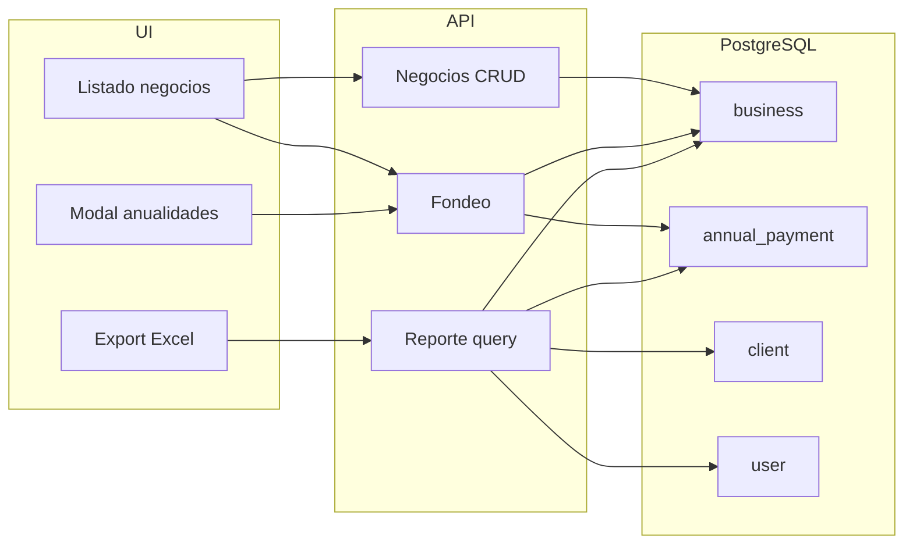
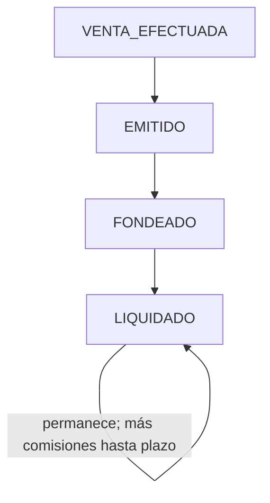

# PRD — Gestión de negocios (estados, anualidades) y reporte Excel

**Ámbito:** ciclo de vida del negocio (`VENTA_EFECTUADA` → `EMITIDO` → `FONDEADO` → `LIQUIDADO` tras la primera liquidación), modelo de **anualidades** (`Annual_payment`), **reglas de origen** frente a liquidación, permisos por rol, exportación a Excel para comisiones, y mejoras de listado.

**Engram:** `topic_key: business-report-prd` · `project: financieramente-app`

**Estado del producto vs código (abril 2026):** Hoy `Business` en Prisma no incluye `date_issued` ni `date_anchored`; el código histórico usa `COMISIONANDO` tras liquidación. Este PRD define que **`COMISIONANDO` ya no aplica** y lo sustituye **`LIQUIDADO`** al registrar la primera liquidación; migración de datos y OpenSpec en §5.

---

## 1. Resumen ejecutivo

### 1.1 Problemática

Los coaches necesitan **trazar el negocio** desde la venta hasta el fondeo (incluyendo **varias anualidades** cuando la periodicidad es anual), y operación/administración necesitan un **extracto confiable en Excel** para el cálculo de comisiones con filtros por **fecha de fondeo** (rango inicio/fin) y estado, sin perder jerarquía de liderazgo ni datos de cliente/producto.

### 1.2 Solución propuesta

1. **Persistencia de anualidades** en tabla `Annual_payment` solo cuando la periodicidad de compra es **Anual**, generando **n** filas según el **plazo** (`term`).  
2. **Ciclo comercial secuencial** (no paralelo): **`VENTA_EFECTUADA`** (creación) → **`EMITIDO`** (registro de contrato) → **`FONDEADO`** (confirmación de pago / fondeo). El fondeo asegura que el negocio **ya fue pagado** por el cliente y está **listo para comisionar**, previo al archivo y la liquidación.  
3. **Transiciones:** `LIQUIDADO` cuando la **primera** comisión del negocio pasa a **`SETTLED`**; el estado **permanece** `LIQUIDADO` y acumula comisiones hasta completar el plazo del producto.  
4. **Origen (`id_client_origin`):** editable solo en **`FONDEADO`** si el negocio **no tiene comisiones** asociadas (`SettlementCommission`) y según sincronización en archivo (§4.2); **prohibido** modificar origen si el negocio está **`LIQUIDADO`**.  
5. **Carga de archivo:** mantiene las **mismas reglas de sincronización** y flujo **rezagado** actuales.  
6. **Exportación Excel** y listados con filtros por rango sobre **`date_anchored`** (**fecha de fondeo** del negocio, ver H5), en **hora local Colombia**; columnas dinámicas de fondeo por anualidad; mejoras visuales de listado.  
7. **Migración:** todo registro **`COMISIONANDO`** → **`LIQUIDADO`**.

### 1.3 Criterios de éxito (medibles)

| ID | KPI | Meta |
|----|-----|------|
| K1 | Creación anual | Al crear negocio con periodicidad Anual y plazo `n`, existen **exactamente `n`** registros en `Annual_payment` con índices **1…n** y estado inicial coherente. |
| K2 | No regresión no-anual | Negocios con periodicidad distinta de Anual **no** crean filas en `Annual_payment`. |
| K3 | Trazabilidad de fechas | Listado principal muestra **fecha creación**, **fecha emisión** (`date_issued` cuando aplica), **fecha(s) fondeo** (negocio o por anualidad según reglas). |
| K4 | Export | Usuario autorizado descarga Excel en **< 30 s** para hasta **5 000** filas en entorno de referencia (TBD ajuste por infra). |
| K5 | Autorización | Coach solo sus negocios; **líder** ve **toda la cadena descendente** — **solo edita los propios**; negocios de otros coaches **solo lectura** (incl. anualidades y resumen); admin, asistente operativo y analista soporte según §4.3. |
| K6 | Estados y liquidación | UI, APIs y archivo respetan §4.6 / H7: origen solo `FONDEADO` sin `SettlementCommission`; primera **`SETTLED`** → `LIQUIDADO`; sin `COMISIONANDO` nuevo; líder solo edita propios. |

---

## 2. Experiencia de usuario y funcionalidad

### 2.1 Personas

| Persona | Rol técnico (referencia código) | Necesidad principal |
|---------|----------------------------------|---------------------|
| Coach | `AGENTE` | CRUD y fondeo de **sus** negocios. |
| Líder | Usuario con subordinados (`id_user_leader` / árbol) | **Visibilidad** de **toda la cadena descendente**; **edición** solo de **sus propios** negocios; negocios de coaches a cargo: **solo lectura** (incl. anualidades y resumen). |
| Asistente operativo | `ASISTENTE_GERENCIA_OPERATIVA` | Ver todos los negocios; **exportar Excel**. |
| Administrador | `ADMIN` | Igual que asistente operativo; auditoría y soporte. |
| Analista de soporte | `ANALISTA_SOPORTE` | Mismos permisos de **export / visión** que asistente operativo y admin en exporte (ver H5). |

### 2.2 Historias de usuario y criterios de aceptación

#### H1 — Creación con periodicidad Anual y plazo n

- **Historia:** Como **coach** (y roles con permiso de creación), quiero que al crear un negocio con **periodicidad Anual** y **plazo** `n`, el sistema registre **n anualidades** para controlar el fondeo por año.
- **Criterios de aceptación:**
  - Se crean `n` filas en `Annual_payment` asociadas al `id_business`.
  - Cada fila tiene: **`installment_index`** (1…n; ver §4.1), **estado** `SIN_FONDEAR` | `FONDEADO`, **fecha de fondeo** (`date_anchored`, nullable hasta marcar el pago), **fecha de creación** / actualización. **No** se registra fecha de vencimiento ni calendario de anualidad (`due_date` **no aplica** en este alcance).
  - El negocio queda en estado **`VENTA_EFECTUADA`** en la primera creación (sin contrato).
  - Periodicidad **≠ Anual**: flujo actual sin filas en `Annual_payment`.

#### H2 — Registro de contrato (EMITIDO)

- **Historia:** Como usuario con permiso, quiero registrar el **contrato** para reflejar que el negocio fue emitido.
- **Criterios de aceptación:**
  - Al persistir el contrato, `status` = **`EMITIDO`**.
  - Se actualiza **`date_issued`** en el negocio (nuevo campo en modelo `business`).

#### H3 — Fondeo sin anualidades

- **Historia:** Como **coach** (u otro rol autorizado), quiero marcar el negocio como **fondeado** cuando el cliente me confirma el pago.
- **Criterios de aceptación:**
  - En la lista de negocios hay acción **“Fondeado”** (o equivalente acorde al DS).
  - Al confirmar, se actualiza **`date_anchored`** a nivel negocio y el estado pasa a **`FONDEADO`**.
  - No aplica modal de selección si no hay anualidades.

#### H4 — Fondeo con anualidades

- **Historia:** Como **coach** (u otro rol autorizado), quiero indicar **qué anualidades** fueron pagadas.
- **Criterios de aceptación:**
  - La acción abre **modal** listando todas las `Annual_payment` del negocio con **checkbox** por fila; **en el modal se muestra la fecha de fondeo** por anualidad (`date_anchored`) cuando exista.
  - Al guardar la **primera** anualidad marcada como pagada, el **`Business.status`** del padre pasa a **`FONDEADO`** (confirmado por producto).
  - El negocio puede seguir liquidándose **sin** bloqueo por anualidades pendientes: **no** se exige tener todas las anualidades en `FONDEADO` para procesar liquidación/archivo (§4.2).

#### H5 — Reporte Excel (operación / admin / analista)

- **Historia:** Como **asistente operativo**, **administrador** o **analista de soporte**, quiero **descargar Excel** con los negocios para cálculo de comisiones.
- **Criterios de aceptación:**
  - Filtros **fecha inicio / fecha fin:** aplican al campo **`date_anchored`** del **`business`** (**fecha de fondeo** ya registrada en sistema), **no** a `created_at`. Intervalo **[inicio, fin]** inclusivo en **hora local Colombia** (`America/Bogotá` o equivalente).
  - Un negocio entra en el resultado si **`business.date_anchored`** cae dentro del rango (fin de día / inicio de día según implementación única documentada).
  - Negocios **sin** fondeo registrado (`date_anchored` **null**) **no** aparecen al filtrar solo por este rango (salvo modo explícito “incluir sin fecha de fondeo” si producto lo pide después).
  - Para periodicidad **Anual**, la fecha que gobierna el filtro sigue siendo **`business.date_anchored`** (alineada con el primer fondeo de anualidad que lleva el padre a `FONDEADO`, H4); las columnas por anualidad en el Excel siguen siendo detalle complementario.
  - El mismo criterio de rango sobre **`date_anchored`** debe usarse en el **listado filtrado** cuando exista par fecha inicio/fin, para coherencia con la exportación (§4.4).
  - Filtro por **estado**: `VENTA_EFECTUADA`, `EMITIDO`, `FONDEADO`, `LIQUIDADO` (y exclusión / migración de `COMISIONANDO` en datos históricos según §5).
  - Columnas incluyen: datos completos del negocio, **cliente**, **producto**, **compañía**, **precio/valor**, **plazo**, **anualidad** (indicador o texto según periodicidad), **nombre del coach**, **categoría del coach**, cadena de **líderes** (nombre + categoría por cada nivel), **origen del negocio**.
  - Si el negocio es por anualidades: columnas dinámicas **`Fecha fondeo anualidad 1` … `Fecha fondeo anualidad n`** (vacías si no aplica).
  - Reutilizar patrones de UI existentes (filtros, botones de exportación similares a otros módulos).

#### H6 — Listado principal mejorado

- **Historia:** Como usuario del módulo negocios, quiero ver fechas y estados con **mejor legibilidad** (tags, precios, tipografía).
- **Criterios de aceptación:**
  - Columnas visibles: al menos **fecha creación**, **fecha emisión**, y resumen coherente de fondeo; el **detalle por anualidad** (fechas `date_anchored`) se muestra en el **modal de anualidades** (H4), no obligatorio expandir todas en la tabla del listado.
  - Estilo alineado al design system del proyecto (tokens, `BusinessStatusBadge` o sucesor, formato monetario localizado).
  - El estado **`LIQUIDADO`** debe mostrarse en badge/indicador cuando aplique; **`COMISIONANDO`** no se usa en UI para flujos nuevos.

#### H7 — Origen del negocio y liquidación

- **Historia:** Como usuario con permiso de edición, quiero que las reglas de **cambio de origen** (`id_client_origin`) estén alineadas con **fondeo**, **archivo** y **liquidación** para evitar inconsistencias en comisiones.
- **Criterios de aceptación:**
  - **Antes (legado):** el origen podía modificarse con negocio en **`EMITIDO`** (con advertencia de recálculo).
  - **Ahora — condiciones simultáneas:** `status === FONDEADO`, el negocio **no tiene comisiones** asociadas en `SettlementCommission` (ninguna fila ligada a `id_business`), y se respetan las **mismas reglas de sincronización** del proceso de carga de archivo / comisiones **sincronizadas** (para no contradicir rezagado y estados del flujo de importación). Con eso el usuario puede cambiar origen para **ajustar la distribución** de comisiones.
  - **`LIQUIDADO`:** **no** se permite modificar el origen (negocio ya liquidado).
  - En **`EMITIDO`**, **`VENTA_EFECTUADA`** u otros distintos de **`FONDEADO`**: sin edición de origen en flujos nuevos.
  - **`LIQUIDADO` por primera comisión `SETTLED`:** cuando la **primera** fila `settlement_commission` del negocio alcanza **`SETTLED`** (acción Liquidar del proceso vigente), `business.status` → **`LIQUIDADO`**.
  - **Posterior:** el negocio **permanece** `LIQUIDADO`; siguen acumulándose liquidaciones/comisiones hasta completar el **plazo** del negocio.
  - **`COMISIONANDO` deprecado:** migración masiva **`COMISIONANDO` → `LIQUIDADO`**; ninguna lógica nueva escribe `COMISIONANDO`.

#### H8 — Claridad estado ↔ liquidación (documentación)

- **Historia:** Como **PM / ingeniería**, quiero que quede documentado **cómo participa cada estado** del negocio en el proceso de liquidación para implementar filtros y transiciones sin ambigüedad.
- **Criterios de aceptación:**
  - La documentación canónica es **§4.6** (tabla y texto); cualquier pantalla de archivo importado / liquidación debe poder justificar reglas contra esa sección.
  - **Archivo / liquidación:** el camino esperado es negocio **`FONDEADO`** antes de comisionar vía archivo (ciclo secuencial §4.6); la liquidación **no** bloquea por anualidades incompletas (§4.2).

### 2.3 No objetivos (v1)

- Repensar el **motor contable completo** de liquidación más allá de estados y reglas de origen aquí descritas (detalle en módulo pre-liquidación / archivo).
- Importación masiva de fondeos vía Excel en esta versión.
- Notificaciones push/email al cliente final por fondeo (opcional fases futuras).

---

## 3. Requisitos de sistema con IA

**No aplica.** La funcionalidad es CRUD, reportes y exportación tabular sin modelos generativos en alcance.

---

## 4. Especificaciones técnicas

### 4.1 Arquitectura y datos

**Nueva tabla `Annual_payment` (nombre lógico; mapeo físico `annual_payment` recomendado en snake_case):**

**`installment_index`:** número ordinal de la cuota anual **dentro del plazo del negocio** cuando la periodicidad es Anual: `1` = primera anualidad, `2` = segunda, … `n` = última (`n` = valor del **plazo** `term`). Sirve para etiquetar filas en UI (“Anualidad 1”), modal de fondeo y columnas del Excel (**Fecha fondeo anualidad 1…n**). No es una fecha; no implica calendario de cobro hasta que exista definición de negocio para ello.

| Campo propuesto | Tipo | Notas |
|-----------------|------|--------|
| `id` | PK | autoincrement |
| `id_business` | FK → `business` | on delete cascade (TBD) |
| `installment_index` | int | único por negocio; rango 1…n; índice de la anualidad (ver arriba) |
| `status` | enum/string | `SIN_FONDEAR`, `FONDEADO` |
| `date_anchored` | timestamp nullable | fecha en que el coach marcó el fondeo de **esa** anualidad |
| `created_at` | timestamp | |
| `updated_at` | timestamp | |

**Fuera de alcance:** campo tipo `due_date` (fecha prevista / vencimiento de anualidad). **No aplica** en v1; el producto solo controla **qué** anualidades se fondearon y **cuándo** se registró el fondeo (`date_anchored`).

**Cambios en `business`:**

| Campo | Notas |
|-------|--------|
| `status` | Estados activos: `VENTA_EFECTUADA`, `EMITIDO`, `FONDEADO`, `LIQUIDADO`. **`COMISIONANDO` deprecado** (migración desde datos y código — ver §4.2 y §5). |
| `date_issued` | set al pasar a `EMITIDO` |
| `date_anchored` | fondeo global para negocios **sin** tabla de anualidades (o política unificada — ver §4.2) |

**Identificación “periodicidad Anual” (cerrado):** en seed el nombre del catálogo es **`'Anual'`** (`prisma/seeds/buy-periodicity.ts`); criterio de implementación: `buyPeriodicity.name === 'Anual'` (o el `id` fijado en despliegue).

### 4.2 Reglas de negocio transversales

1. **Ciclo secuencial:** **`VENTA_EFECTUADA` → `EMITIDO` → `FONDEADO`** antes de considerar el negocio **listo para comisionar** por archivo; el fondeo **no** es paralelo al resto — confirma pago del cliente.
2. **Negocio anual — `Business.status`:** al marcar la **primera** anualidad como pagada (`Annual_payment`), el padre pasa a **`FONDEADO`** (no esperar todas las anualidades).
3. **Liquidación sin bloqueo por anualidades:** puede ejecutarse liquidación/archivo **sin** exigir que todas las filas `Annual_payment` estén en `FONDEADO`.
4. **Origen (`id_client_origin`):**
   - Edición permitida solo si **`FONDEADO`**, **sin** filas `SettlementCommission` con `id_business` del negocio, y alineado a las **reglas de sincronización** de la carga de archivo (coherente con comisiones sincronizadas / rezagado).
   - **No** editar si `status === LIQUIDADO`.
   - **No** editar en `EMITIDO` ni estados previos a `FONDEADO` en UI/API nuevas.
5. **`LIQUIDADO`:** se asigna cuando la **primera** `settlement_commission` del negocio llega a **`SETTLED`**. Estado estable: permanece `LIQUIDADO` con **comisiones acumuladas** hasta cumplir el **plazo** del negocio.
6. **Migración:** todas las filas `business.status = COMISIONANDO` pasan a **`LIQUIDADO`**; código deja de escribir `COMISIONANDO` (reemplazo de `updateBusinessStatusOnSettle` y afines — ver §5).
7. Referencia cruzada del rol de cada estado en archivo: **§4.6**.

### 4.3 Integración y permisos

| Acción | Coach (`AGENTE`) | Líder | Asistente operativo | Admin | Analista soporte |
|--------|------------------|-------|---------------------|-------|------------------|
| Crear / editar negocio | Sí (**propios**) | Sí (**solo propios**) | Sí (todos) | Sí (todos) | Según política roles existente |
| Ver negocios descendencia | No aplica | Sí (**toda la cadena**); negocios ajenos **solo lectura** (resumen + anualidades) | Sí (todos) | Sí (todos) | Según alcance rol |
| Fondeo | Sí (propios / reglas rol) | Sí (**solo propios**) | Sí (todos) | Sí (todos) | No |
| Export Excel | No | No | Sí | Sí | **Sí** (igual que operativo/admin — H5) |

**Líder:** no edita ni fondea negocios cuyo `id_user` coach sea otro usuario; solo visualiza datos y desglose de anualidades para gestión del equipo.

### 4.4 Consulta reporte / jerarquía

- Resolución de **cadena de líderes:** recorrer `user.id_user_leader` hasta raíz sobre **toda la descendencia** en export y vistas donde aplique; exportar **nombre** y **categoría** (`Category` asociada al usuario) por nivel.
- **Filtro por rango de fechas:** criterio único **`business.date_anchored`** (H5), no fecha de creación.
- Filtros aplicados en servidor; export debe usar la **misma** consulta filtrada que la vista previa/listado (opcional: paginación en UI + export full).

### 4.5 Seguridad y privacidad

- Autorización en **cada** endpoint (listado, update status, export).
- Excel: no incluir datos no necesarios para comisiones; evitar exponer PII redundante (TBD lista mínima legal).
- Auditoría recomendada: log de cambios de estado y fondeos (fase 1.1).

### 4.6 Estados del negocio y proceso de liquidación

**Secuencia de negocio:** **`VENTA_EFECTUADA` → `EMITIDO` → `FONDEADO`** (listo para comisionar) → primera comisión **`SETTLED`** → **`LIQUIDADO`** (permanece y acumula hasta plazo). La **carga de archivo** conserva las **reglas de sincronización** y tratamiento **rezagado** actuales.

| Estado | Rol frente al proceso de liquidación |
|--------|--------------------------------------|
| `VENTA_EFECTUADA` | Creación; aún sin contrato ni fondeo; no es estado objetivo del archivo. |
| `EMITIDO` | Contrato registrado; **sin** edición de origen en flujo nuevo; pendiente de fondeo para el ciclo deseado. |
| `FONDEADO` | Pagado por el cliente / listo para comisionar; **único** estado donde puede editarse **origen** si **no** hay `SettlementCommission` del negocio y aplican reglas de sync de archivo (H7). Esperado como condición previa del flujo de archivo para nuevos desarrollos. |
| `LIQUIDADO` | Primera **`SETTLED`** en `settlement_commission`; **no** edición de origen; siguientes liquidaciones **mantienen** `LIQUIDADO` acumulando hasta fin de **plazo**. |

**Liquidación y anualidades:** no se bloquea liquidación por anualidades pendientes en `Annual_payment`.

---

## 5. Riesgos y roadmap

### 5.1 Riesgos técnicos

| Riesgo | Mitigación |
|--------|------------|
| Datos y código aún en `COMISIONANDO` | Migración: actualizar `business.status` (o lectura), pruebas de liquidación, OpenSpec `negocios` y pre-liquidación; transición `COMISIONANDO` → `LIQUIDADO` con verificación en históricos. |
| Listas y permisos asumían edición de origen en `EMITIDO` | Revisar API, modal “Ver negocio”, `ROLES_CAN_EDIT_*` y copy de alerta; alinear con H7 (solo `FONDEADO` + sin liquidaciones). |
| Columnas dinámicas en Excel (`n` anualidades) | Librería de export con columnas generadas por `max(n)` del dataset o fila con columnas hasta N máximo del filtro. |
| Expectativas futuras de “fecha de vencimiento” por anualidad | Hoy **no** hay `due_date`; si en el futuro se exige calendario, será un cambio acotado encima del mismo modelo. |

### 5.2 Fases sugeridas

| Fase | Contenido |
|------|-----------|
| **MVP** | `Annual_payment` + creación; `date_issued`; fondeo simple y modal anual; estados `VENTA_EFECTUADA` / `EMITIDO` / `FONDEADO` / `LIQUIDADO`; reglas H7 (origen + primera liquidación); deprecación `COMISIONANDO`; permisos base. |
| **v1.1** | Export Excel con columnas jerarquía + anualidades; mejoras visuales listado; auditoría. |
| **v2.0** | Opcional: fechas previstas por anualidad si negocio las define; reprogramación; notificaciones. |

---

## 6. Decisiones cerradas (refinamiento producto)

| Tema | Decisión |
|------|-----------|
| Ciclo comercial | Secuencial: `VENTA_EFECTUADA` → `EMITIDO` → `FONDEADO`; fondeo confirma pago y prepara comisiones — **no** paralelo a esos pasos. |
| Archivo | Misma lógica de **sincronización** y **rezagado** actual. |
| Origen | Solo `FONDEADO` + **sin** `SettlementCommission` del negocio + sync; **no** si `LIQUIDADO`. |
| Primera liquidación | Primera fila `settlement_commission` del negocio en **`SETTLED`**. |
| Post-`LIQUIDADO` | Estado estable; acumula comisiones hasta **plazo**. |
| `COMISIONANDO` | Migración total → `LIQUIDADO`. |
| Anual — padre `FONDEADO` | Al **primer** anualidad marcada pagada. |
| Liquidación vs anualidades | **Sin** bloqueo por anualidades incompletas. |
| Líder | Ve **toda la descendencia**; **solo edita propios**; resto **solo lectura** (anualidades + resumen). |
| Filtros fecha (Excel y listado) | Rango **[inicio, fin]** sobre **`business.date_anchored`** (fondeo); **hora local Colombia**. Sin `date_anchored`, excluidos del filtro por rango salvo modo explícito futuro. |
| UI fechas anualidades | Detalle en **modal** (H4). |
| `ANALISTA_SOPORTE` | Mismo export que operativo/admin. |
| Periodicidad Anual | Nombre catálogo **`Anual`** (seed). |

**Pendientes menores de implementación:** lista PII mínima legal en Excel (§4.5); SLA exacto export K4 por infra.

---

*Documento generado para implementación alineada al repositorio **financieramente-app** (Prisma, feature `negocios`, roles en `src/features/auth/lib/roles.ts`).*
