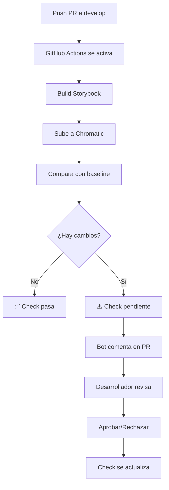

# Flujo de Desarrollo con Visual Testing

Esta guía documenta el flujo completo de desarrollo desde creación de PR hasta merge, incluyendo la integración de Chromatic para visual testing.

## 📋 Índice

- [Flujo Visual Completo](#flujo-visual-completo)
- [Proceso de Visual Testing](#proceso-de-visual-testing)
- [Estados de GitHub Checks](#estados-de-github-checks)
- [Flujo de Trabajo Diario](#flujo-de-trabajo-diario)
- [Ventajas del Sistema](#ventajas-del-sistema)
- [Troubleshooting](#troubleshooting)

## Flujo Visual Completo

```
┌─────────────────────────────────────────────────────────────────────┐
│                    DESARROLLADOR CREA PR A QA                        │
└─────────────────────────────────────────────────────────────────────┘
                                    │
                                    ▼
┌─────────────────────────────────────────────────────────────────────┐
│                    GITHUB ACTIONS SE ACTIVA                          │
│  (test-pr-qa.yml + chromatic.yml ejecutan en paralelo)              │
└─────────────────────────────────────────────────────────────────────┘
                                    │
                    ┌───────────────┴───────────────┐
                    ▼                               ▼
        ┌───────────────────────┐       ┌───────────────────────┐
        │   🔍 LINT             │       │   🎨 CHROMATIC        │
        │   🧪 UNIT TESTS       │       │   (Visual Testing)    │
        │   🔗 INTEGRATION      │       │                       │
        └───────────────────────┘       └───────────────────────┘
                    │                               │
                    │                               ▼
                    │               ┌───────────────────────────────┐
                    │               │  1. Build Storybook           │
                    │               │  2. Captura screenshots       │
                    │               │  3. Compara con baseline      │
                    │               └───────────────────────────────┘
                    │                               │
                    │               ┌───────────────┴────────────────┐
                    │               │                                │
                    │               ▼                                ▼
                    │    ┌──────────────────┐           ┌──────────────────┐
                    │    │ ✅ SIN CAMBIOS   │           │ ⚠️  HAY CAMBIOS  │
                    │    │ VISUALES         │           │ VISUALES         │
                    │    └──────────────────┘           └──────────────────┘
                    │               │                                │
                    │               │                                ▼
                    │               │               ┌─────────────────────────────┐
                    │               │               │ GitHub Check = ❌ PENDING   │
                    │               │               │ (Bloquea merge)             │
                    │               │               └─────────────────────────────┘
                    │               │                                │
                    │               │                                ▼
                    │               │               ┌─────────────────────────────┐
                    │               │               │ 🤖 Bot comenta en PR:       │
                    │               │               │                             │
                    │               │               │ "⚠️ Visual changes detected"│
                    │               │               │ - Link a Chromatic          │
                    │               │               │ - # de cambios              │
                    │               │               │ - Screenshots               │
                    │               │               └─────────────────────────────┘
                    │               │                                │
                    └───────────────┤                                │
                                    │                                ▼
                                    │               ┌─────────────────────────────┐
                                    │               │ REVISOR VA A CHROMATIC      │
                                    │               │ https://chromatic.com       │
                                    │               └─────────────────────────────┘
                                    │                                │
                                    │                ┌───────────────┴──────────────┐
                                    │                ▼                              ▼
                                    │    ┌────────────────────┐        ┌────────────────────┐
                                    │    │ 👍 ACEPTA CAMBIOS  │        │ 👎 RECHAZA CAMBIOS │
                                    │    │ (Approve)          │        │ (Deny)             │
                                    │    └────────────────────┘        └────────────────────┘
                                    │                │                              │
                                    │                ▼                              ▼
                                    │    ┌────────────────────┐        ┌────────────────────┐
                                    │    │ GitHub Check = ✅  │        │ Desarrollador debe │
                                    │    │ (Permite merge)    │        │ hacer cambios      │
                                    │    └────────────────────┘        └────────────────────┘
                                    │                │                              │
                                    ▼                ▼                              │
                        ┌───────────────────────────────┐                          │
                        │  🌐 E2E TESTS                 │                          │
                        │  (Solo si todos pasan)        │                          │
                        └───────────────────────────────┘                          │
                                    │                                              │
                                    ▼                                              │
                        ┌───────────────────────────┐                              │
                        │ 📝 RESUMEN EN PR          │                              │
                        │                           │                              │
                        │ ✅ Lint: passed           │                              │
                        │ ✅ Unit: 85% coverage     │                              │
                        │ ✅ Integration: passed    │                              │
                        │ ✅ Visual: approved       │◄─────────────────────────────┘
                        │ ✅ E2E: passed            │
                        └───────────────────────────┘
                                    │
                                    ▼
                        ┌───────────────────────────┐
                        │ 🎉 PR LISTO PARA MERGE    │
                        └───────────────────────────┘
```

## Proceso de Visual Testing

### Dashboard de Chromatic

```
┌──────────────────────────────────────────────────────────────────────┐
│                    CHROMATIC DASHBOARD                                │
├──────────────────────────────────────────────────────────────────────┤
│                                                                       │
│  Build #123 - PR #45: "Add new button variant"                       │
│  ⚠️  3 changes detected                                               │
│                                                                       │
│  ┌────────────────────────────────────────────────────────────┐     │
│  │  Component: Button                                          │     │
│  │  Story: Primary Button                                      │     │
│  │                                                              │     │
│  │  ┌──────────────┐         ┌──────────────┐                 │     │
│  │  │   BASELINE   │   VS    │   CAMBIO     │                 │     │
│  │  │              │         │              │                 │     │
│  │  │  [Botón]     │   ≠     │  [Botón]     │                 │     │
│  │  │   Azul       │         │   Verde      │                 │     │
│  │  │              │         │              │                 │     │
│  │  └──────────────┘         └──────────────┘                 │     │
│  │                                                              │     │
│  │  Diferencias detectadas:                                    │     │
│  │  • Color de fondo cambió                                    │     │
│  │  • Padding aumentó 2px                                      │     │
│  │                                                              │     │
│  │  [👍 Accept]  [👎 Deny]  [🔍 Ver Diff]                     │     │
│  └────────────────────────────────────────────────────────────┘     │
│                                                                       │
│  ┌────────────────────────────────────────────────────────────┐     │
│  │  Component: Input                                           │     │
│  │  Story: With Error                                          │     │
│  │  [Similar layout...]                                        │     │
│  └────────────────────────────────────────────────────────────┘     │
│                                                                       │
│  ┌────────────────────────────────────────────────────────────┐     │
│  │  Component: Card                                            │     │
│  │  Story: Dark Mode                                           │     │
│  │  [Similar layout...]                                        │     │
│  └────────────────────────────────────────────────────────────┘     │
│                                                                       │
│  [✅ Approve All Changes]  [❌ Deny All]                             │
│                                                                       │
└──────────────────────────────────────────────────────────────────────┘
```

### ¿Qué hacer cuando hay cambios visuales?

1. **Recibir notificación**: Bot de GitHub comenta en tu PR
2. **Revisar cambios**: Click en el link de Chromatic
3. **Evaluar**: ¿Son cambios intencionales o un bug?
4. **Decidir**:
   - ✅ **Approve**: Si son cambios esperados
   - ❌ **Deny**: Si son cambios no deseados
5. **Acción**: GitHub Check se actualiza automáticamente

## Estados de GitHub Checks

### Antes de Aprobar en Chromatic

```
┌─────────────────────────────────────────────────────────────┐
│  Pull Request #45                                            │
├─────────────────────────────────────────────────────────────┤
│                                                              │
│  Checks:                                                     │
│  ✅ Lint                                    passed           │
│  ✅ Unit Tests                              passed           │
│  ✅ Integration Tests                       passed           │
│  ⏳ Visual Tests (Chromatic)                pending          │
│     └─ Waiting for approval in Chromatic                    │
│  ⏸️  E2E Tests                              waiting          │
│     └─ Blocked by Visual Tests                              │
│                                                              │
│  ⚠️  Merge blocked: 1 check pending                          │
│                                                              │
│  ┌──────────────────────────────────────────────────────┐   │
│  │  🤖 chromatic-bot commented 2 minutes ago            │   │
│  │                                                       │   │
│  │  ## 🎨 Visual Testing Results                        │   │
│  │                                                       │   │
│  │  ⚠️ **Visual changes detected!**                     │   │
│  │                                                       │   │
│  │  - 📚 [View Storybook](https://...)                  │   │
│  │  - 🔍 [Review Changes](https://chromatic.com/...)    │   │
│  │  - 📊 Changes: 3                                     │   │
│  │                                                       │   │
│  │  **Action required**: Please review and approve     │   │
│  │  changes in Chromatic before merging.                 │   │
│  └──────────────────────────────────────────────────────┘   │
│                                                              │
└─────────────────────────────────────────────────────────────┘
```

### Después de Aprobar en Chromatic

```
┌─────────────────────────────────────────────────────────────┐
│  Pull Request #45                                            │
├─────────────────────────────────────────────────────────────┤
│                                                              │
│  Checks:                                                     │
│  ✅ Lint                                    passed           │
│  ✅ Unit Tests                              passed           │
│  ✅ Integration Tests                       passed           │
│  ✅ Visual Tests (Chromatic)                approved         │
│  ✅ E2E Tests                               passed           │
│                                                              │
│  ✅ All checks passed                                        │
│                                                              │
│  [Merge pull request]  ▼                                     │
│                                                              │
└─────────────────────────────────────────────────────────────┘
```

## Cuándo Subir Cambios a Chromatic

### 🚀 Automático (Recomendado)
**Chromatic se ejecuta automáticamente** cuando creas un PR a `develop`. No necesitas hacer nada manual.

```bash
# 1. Crear PR a develop
git push origin feature/new-button-variant
# Crear PR en GitHub

# 2. GitHub Actions ejecuta automáticamente:
#    - Build Storybook
#    - Sube a Chromatic
#    - Compara con baseline
#    - Comenta en el PR con resultados
```

### 🔧 Manual (Opcional)
Solo necesitas subir manualmente en estos casos:

#### **Antes del PR** (Validación Temprana)
```bash
# Cuando quieres validar cambios visuales ANTES de crear el PR
npm run chromatic
# Útil para:
# - Cambios visuales complejos
# - Feedback temprano del equipo
# - Debugging de problemas visuales
```

#### **Después del PR** (Si falla el automático)
```bash
# Si el CI falla por problemas de Chromatic
npm run chromatic:ci
# Regenera el build y sube nuevamente
```

### 📋 Cuándo Usar Cada Opción

| Escenario | Método | Cuándo Usar |
|-----------|--------|-------------|
| **Desarrollo Normal** | Automático | ✅ Siempre (recomendado) |
| **Cambios Visuales Complejos** | Manual antes del PR | Cuando necesitas validación temprana |
| **Debugging Visual** | Manual | Para investigar problemas |
| **CI Falló** | Manual después del PR | Solo si el automático falla |

### ⚡ Proceso Automático Detallado

Cuando creas un PR a `develop`, esto sucede automáticamente:



### 🎯 Momentos Clave para Intervención Manual

#### **1. Antes del PR** - Validación Temprana
```bash
# Cuando desarrollas cambios visuales complejos
npm run storybook          # Ver localmente
npm run chromatic          # Validar en Chromatic
# Útil para:
# - Nuevos componentes
# - Cambios de tema
# - Responsive design
# - Animaciones complejas
```

#### **2. Durante el PR** - Si el automático falla
```bash
# Si GitHub Actions falla por problemas técnicos
npm run chromatic:ci        # Reintentar subida
# Causas comunes:
# - Token expirado
# - Problemas de red
# - Build de Storybook falló
```

#### **3. Después del PR** - Debugging
```bash
# Si hay cambios visuales inesperados
npm run storybook          # Debug local
npm run chromatic          # Comparar con baseline
# Para investigar:
# - Regresiones visuales
# - Diferencias entre navegadores
# - Problemas de CSS
```

### 🔍 Cómo Saber Cuándo Intervenir

#### **Señales de que necesitas intervención manual:**

1. **GitHub Actions falla** con error de Chromatic
2. **Cambios visuales inesperados** en el PR
3. **Baseline desactualizado** (muchos cambios falsos positivos)
4. **Desarrollo de componentes complejos** que necesitan validación temprana

#### **Señales de que NO necesitas intervención:**

1. ✅ **PR creado normalmente** - El automático funciona
2. ✅ **Bot comenta con cambios esperados** - Solo necesitas aprobar
3. ✅ **Todos los checks pasan** - Todo está bien
4. ✅ **Cambios visuales menores** - El automático los maneja

### 🎨 Acceso al Dashboard de Chromatic

#### **URL del Proyecto**
- **Dashboard Principal**: [https://www.chromatic.com/builds?appId=68f1c0249289c9e94cd95256](https://www.chromatic.com/builds?appId=68f1c0249289c9e94cd95256)
- **App ID**: `68f1c0249289c9e94cd95256`

#### **Cómo Acceder**
1. **Desde el PR**: Click en el link que proporciona el bot de GitHub
2. **Directamente**: Usar la URL del dashboard
3. **Desde GitHub Actions**: Click en el step "Publish to Chromatic"

#### **Qué Encontrarás en el Dashboard**
- 📊 **Historial de builds** por PR
- 🔍 **Comparaciones visuales** antes/después
- ✅ **Estado de aprobaciones** pendientes
- 📈 **Métricas de cambios** por componente
- 🎯 **Baseline actual** del proyecto

## Flujo de Trabajo Diario

### Paso a Paso

```bash
# 1. Crear rama desde develop
git checkout develop
git pull origin develop
git checkout -b feature/new-button-variant

# 2. Desarrollar feature/fix
# ... hacer cambios en código ...

# 3. Ejecutar tests localmente
npm run test:unit          # Tests unitarios
npm run test:integration   # Tests de integración
npm run test:e2e           # Tests E2E (opcional)

# 4. Verificar visualmente con Storybook
npm run storybook
# Revisar componentes en localhost:6006

# 4.1. OPCIONAL: Subir cambios a Chromatic ANTES del PR
# (Solo si quieres validar cambios visuales temprano)
npm run chromatic
# Esto sube a Chromatic y puedes revisar cambios localmente
# Útil para cambios visuales complejos o cuando quieres feedback temprano

# 5. Commit cambios
git add .
git commit -m "feat: add new button variant"

# 6. Push y crear PR
git push origin feature/new-button-variant
# Crear PR a rama 'develop' en GitHub

# 7. CI ejecuta automáticamente:
#    - Lint
#    - Unit tests con cobertura
#    - Integration tests
#    - Visual tests (Chromatic) ← SE EJECUTA AUTOMÁTICAMENTE
#    - E2E tests

# 8. Revisar y aprobar cambios visuales en Chromatic
#    - Click en link del bot en el PR
#    - Revisar cada cambio
#    - Approve si son correctos

# 9. Esperar aprobación de código del equipo

# 10. Merge a qa
#     - El PR se puede mergear automáticamente
#     - Se despliega a QA

# 11. Después de validación en QA, crear PR de qa a main
#     - Mismo proceso se repite
#     - Auto-approve en main (configurado)
```

## Ventajas del Sistema

### ✅ Prevención de Regresiones Visuales
Cualquier cambio no intencional en la UI es detectado automáticamente antes de llegar a producción.

### ✅ Revisión Obligatoria
No se puede hacer merge sin aprobar los cambios visuales, garantizando calidad consistente.

### ✅ Documentación Visual
Cada cambio queda documentado con screenshots antes/después en Chromatic.

### ✅ Baseline Automático
Una vez aprobado, el nuevo estado se convierte en el baseline para futuros PRs.

### ✅ Integración con GitHub
El estado se muestra directamente en el PR como un check más, integrado con el flujo normal.

### ✅ Comentarios Automáticos
El bot informa al equipo sobre cambios visuales sin necesidad de revisar logs manualmente.

### ✅ Optimización de Builds
Solo analiza componentes modificados gracias a `onlyChanged: true`.

## Configuración Clave

### Chromatic Settings

```yaml
# Bloquea merge si hay cambios
exitZeroOnChanges: false  # ❌ Falla si hay cambios
exitOnceUploaded: false     # ⏳ Espera aprobación

# Optimiza el proceso
onlyChanged: true          # 🚀 Solo analiza componentes modificados

# Auto-aprueba en main (producción)
autoAcceptChanges: ${{ github.ref == 'refs/heads/main' }}
```

### ¿Por qué bloquea el merge?

- `exitZeroOnChanges: false` hace que Chromatic falle si detecta cambios visuales
- `exitOnceUploaded: false` espera a que alguien apruebe los cambios
- GitHub Check queda en estado "pending" hasta aprobación

## Troubleshooting

### Chromatic falla sin razón aparente

```bash
# 1. Verificar configuración
cat .github/workflows/chromatic.yml

# 2. Revisar logs en GitHub Actions
# Ir a Actions > Workflow run > Visual Tests

# 3. Regenerar baseline si es necesario
# En Chromatic: Settings > Build > Regenerate baseline
```

### Cambios visuales inesperados

1. Verificar si los cambios son intencionales
2. Si NO son intencionales:
   - Revisar código reciente
   - Verificar dependencias actualizadas
   - Revertir cambios
3. Si SÍ son intencionales:
   - Aprobar en Chromatic
   - Documentar el cambio en el PR

### GitHub Check queda en "pending"

1. Verificar que se recibió notificación del bot
2. Revisar que Chromatic build completó
3. Si completó pero check sigue pending:
   - Ir manualmente a Chromatic
   - Aprobar/rechazar cambios
   - Check se actualizará automáticamente

### Baseline desactualizado

```bash
# Opción 1: Regenerar desde Chromatic UI
# Settings > Build > Regenerate baseline

# Opción 2: Forzar nuevo baseline
# En Chromatic, marcar build actual como nuevo baseline
```

## Comandos Útiles

### Testing Local

```bash
# Todos los tests
npm run test:all

# Solo visuales (Chromatic local)
npm run storybook          # Ver componentes localmente
npm run chromatic          # Subir a Chromatic manualmente
npm run chromatic:ci       # Para CI/CD (auto-accept)

# Debugging
npm run test:e2e:debug
npm run test:ui
```

### Comandos Chromatic Específicos

```bash
# Subir cambios a Chromatic
npm run chromatic          # Subida manual (requiere aprobación)
npm run chromatic:ci       # Subida para CI (auto-accept en main)

# Build Storybook para Chromatic
npm run build-storybook    # Build estático para producción

# Verificar configuración
cat .github/workflows/chromatic.yml  # Ver configuración de CI
```

### Verificar Estado de CI

```bash
# Ver estado de PR
gh pr view <number>

# Ver logs de workflow
gh run view <run-id> --log
```

## Mejores Prácticas

### Para Desarrolladores

1. ✅ Revisar Storybook localmente antes de PR
2. ✅ Ejecutar tests antes de push
3. ✅ Aprobar cambios visuales rápidamente
4. ✅ Documentar cambios visuales intencionales en el PR

### Para Revisores

1. ✅ Revisar código primero
2. ✅ Aprobar cambios visuales si son correctos
3. ✅ Comentar específicamente qué cambiar si hay problemas
4. ✅ No bloquear el PR por cambios menores

### Para Visual Testing

1. ✅ Aprobar cambios intencionales de diseño
2. ✅ Denegar cambios no documentados
3. ✅ Usar comentarios para comunicar razón
4. ✅ Mantener baseline actualizado

## Recursos

- [Chromatic Docs](https://www.chromatic.com/docs/)
- [Chromatic Project Dashboard](https://www.chromatic.com/builds?appId=68f1c0249289c9e94cd95256)
- [Storybook Docs](https://storybook.js.org/docs/)
- [GitHub Actions](https://docs.github.com/en/actions)
- [Testing Guide](./TESTING.md)

