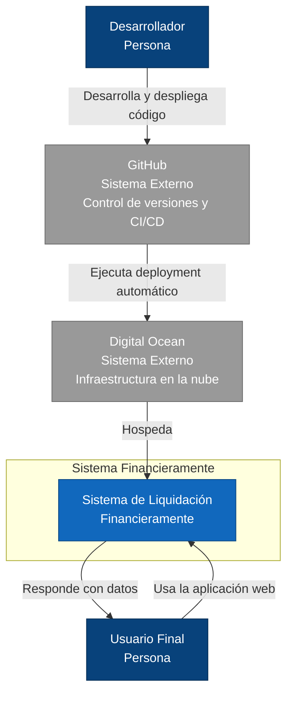
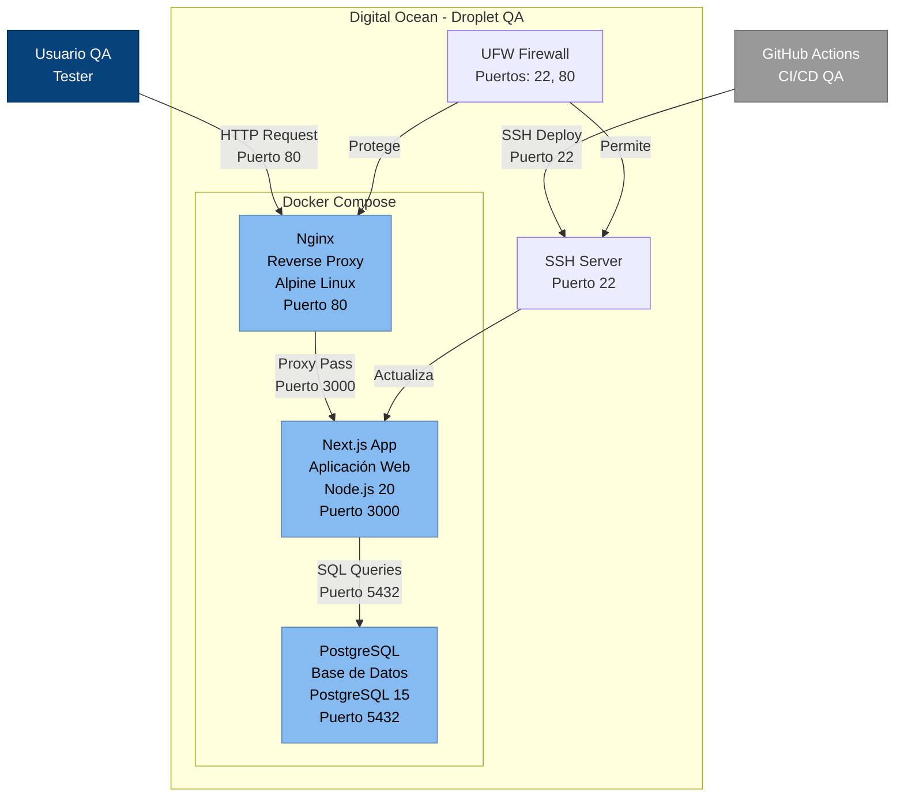
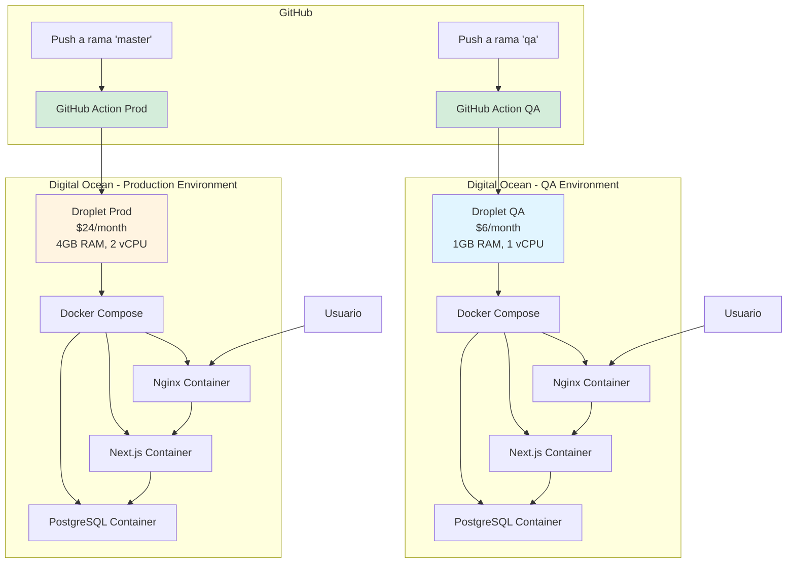

# Infraestructura Financieramente

Esta documentación describe la arquitectura completa del sistema de liquidación Financieramente desplegado en Digital Ocean.

## Arquitectura General

El sistema utiliza una arquitectura de microservicios containerizados con Docker, desplegados en Droplets de Digital Ocean usando Terraform como Infraestructura como Código (IaC).

### Componentes Principales

- **Frontend**: Next.js 15 con React 19 y Tailwind CSS
- **Backend**: API Routes de Next.js con Prisma ORM
- **Base de Datos**: PostgreSQL 15
- **Proxy**: Nginx con configuración de seguridad
- **Contenedores**: Docker con Docker Compose
- **CI/CD**: GitHub Actions
- **Infraestructura**: Terraform + Digital Ocean

## Diagramas de Arquitectura

### Diagrama C4 - Nivel 1: Contexto del Sistema



### Diagrama C4 - Nivel 2: Contenedores (Ambiente QA)



## Ambientes

### QA (Quality Assurance)
- **Droplet**: `s-1vcpu-1gb` ($6/month)
- **Recursos**: 1GB RAM, 1 vCPU, 25GB SSD
- **Propósito**: Testing y desarrollo
- **URL**: `http://[QA_DROPLET_IP]`

### Producción
- **Droplet**: `s-2vcpu-4gb` ($24/month)
- **Recursos**: 4GB RAM, 2 vCPU, 80GB SSD
- **Propósito**: Ambiente de producción
- **URL**: `http://[PROD_DROPLET_IP]`

## Flujo de CI/CD



## Estructura de Archivos

```
financieramente-app/
├── terraform/                 # Infraestructura como código
│   ├── provider.tf           # Configuración del provider
│   ├── variables.tf          # Variables de configuración
│   ├── main.tf               # Recursos principales
│   ├── droplet-qa.tf         # Droplet de QA
│   ├── droplet-prod.tf       # Droplet de Producción
│   ├── outputs.tf            # Outputs de Terraform
│   ├── terraform.tfvars.example # Ejemplo de variables
│   └── scripts/
│       ├── setup-droplet.sh  # Script de inicialización
│       └── deploy-app.sh     # Script de deployment
├── docker/                   # Configuración de Docker
│   ├── Dockerfile            # Imagen de Next.js
│   ├── docker-compose.qa.yml # Compose para QA
│   ├── docker-compose.prod.yml # Compose para Producción
│   ├── env.example           # Variables de entorno
│   └── nginx/
│       └── nginx.conf        # Configuración de Nginx
├── .github/
│   └── workflows/
│       ├── deploy-qa.yml     # GitHub Action para QA
│       └── deploy-prod.yml   # GitHub Action para Producción
├── scripts/                  # Scripts de utilidad
│   ├── db-tunnel-qa.sh       # SSH tunnel para QA
│   └── infrastructure.sh     # Gestión de infraestructura
└── docs/                     # Documentación
    ├── INFRASTRUCTURE.md      # Esta documentación
    ├── ENVIRONMENT_VARIABLES.md # Variables de entorno
    ├── DATABASE_CONNECTION.md # Conexión a base de datos
    └── PRISMA_MIGRATIONS.md   # Migraciones de Prisma
```

## Costos Estimados

| Ambiente | Droplet | Costo Mensual | Recursos |
|----------|---------|---------------|----------|
| QA | s-1vcpu-1gb | $6 | 1GB RAM, 1 vCPU, 25GB SSD |
| Producción | s-2vcpu-4gb | $24 | 4GB RAM, 2 vCPU, 80GB SSD |
| **Total** | | **$30** | |

## Seguridad

### Medidas Implementadas

1. **Firewall UFW**: Solo puertos necesarios abiertos
2. **SSH Key Authentication**: Sin contraseñas
3. **Nginx Security Headers**: Headers de seguridad configurados
4. **Rate Limiting**: Protección contra ataques DDoS
5. **PostgreSQL No Expuesto**: Solo accesible internamente
6. **Variables Sensibles**: En GitHub Secrets
7. **Fail2ban**: Protección contra ataques de fuerza bruta

### Puertos Abiertos

| Puerto | Servicio | Acceso | Propósito |
|--------|----------|--------|-----------|
| 22 | SSH | Público | Administración |
| 80 | HTTP | Público | Aplicación web |
| 443 | HTTPS | Público | Aplicación web (cuando se configure SSL) |
| 5432 | PostgreSQL | Interno | Base de datos |

## Monitoreo y Logs

### Logs Disponibles

- **Nginx Access Logs**: `/var/log/nginx/access.log`
- **Nginx Error Logs**: `/var/log/nginx/error.log`
- **Application Logs**: `docker-compose logs`
- **System Logs**: `/var/log/syslog`
- **Deployment Logs**: `/var/log/financieramente/deploy.log`

### Comandos de Monitoreo

```bash
# Ver logs de la aplicación
./scripts/infrastructure.sh logs-qa
./scripts/infrastructure.sh logs-prod

# Ver estado de contenedores
ssh root@[IP] "cd /opt/financieramente && docker-compose ps"

# Ver uso de recursos
ssh root@[IP] "htop"
```

## Procedimientos de Mantenimiento

### Actualización de la Aplicación

1. **Desarrollo**: Hacer cambios en código
2. **Commit**: `git commit -m "feat: nueva funcionalidad"`
3. **Push QA**: `git push origin qa`
4. **Testing**: Verificar en ambiente QA
5. **Push Producción**: `git push origin master`

### Backup de Base de Datos

```bash
# Backup manual
ssh root@[IP] "cd /opt/financieramente && docker-compose exec postgres pg_dump -U financieramente_user financieramente_qa > backup.sql"

# Restaurar backup
ssh root@[IP] "cd /opt/financieramente && docker-compose exec -T postgres psql -U financieramente_user financieramente_qa < backup.sql"
```

### Escalado Horizontal

Para escalar horizontalmente:

1. Crear nuevos Droplets con Terraform
2. Configurar Load Balancer
3. Actualizar DNS
4. Migrar base de datos a servicio managed

## Troubleshooting

### Problemas Comunes

#### 1. Aplicación no responde

```bash
# Verificar contenedores
ssh root@[IP] "cd /opt/financieramente && docker-compose ps"

# Ver logs
ssh root@[IP] "cd /opt/financieramente && docker-compose logs"

# Reiniciar servicios
./scripts/infrastructure.sh restart-qa
```

#### 2. Base de datos no conecta

```bash
# Verificar PostgreSQL
ssh root@[IP] "cd /opt/financieramente && docker-compose exec postgres pg_isready"

# Verificar variables de entorno
ssh root@[IP] "cd /opt/financieramente && cat .env"
```

#### 3. GitHub Actions falla

1. Verificar GitHub Secrets
2. Verificar SSH key
3. Verificar IPs de Droplets
4. Revisar logs del workflow

### Comandos Útiles

```bash
# Gestión de infraestructura
./scripts/infrastructure.sh status
./scripts/infrastructure.sh outputs
./scripts/infrastructure.sh connect-qa

# SSH Tunnel para base de datos
./scripts/db-tunnel-qa.sh start
./scripts/db-tunnel-qa.sh test

# Terraform
cd terraform
terraform plan
terraform apply
terraform output
```

## Próximos Pasos

### Mejoras Futuras

1. **SSL/HTTPS**: Configurar Let's Encrypt
2. **Monitoring**: Implementar Prometheus + Grafana
3. **Backup Automático**: Backup diario de base de datos
4. **Load Balancer**: Para alta disponibilidad
5. **CDN**: Para assets estáticos
6. **Managed Database**: PostgreSQL managed de Digital Ocean

### Escalabilidad

- **Vertical**: Aumentar tamaño de Droplets
- **Horizontal**: Múltiples instancias con Load Balancer
- **Database**: Migrar a PostgreSQL managed
- **Caching**: Implementar Redis
- **CDN**: Para assets estáticos

## Contacto y Soporte

Para soporte técnico o preguntas sobre la infraestructura:

1. Revisar esta documentación
2. Verificar logs del sistema
3. Consultar GitHub Issues
4. Contactar al equipo de desarrollo
