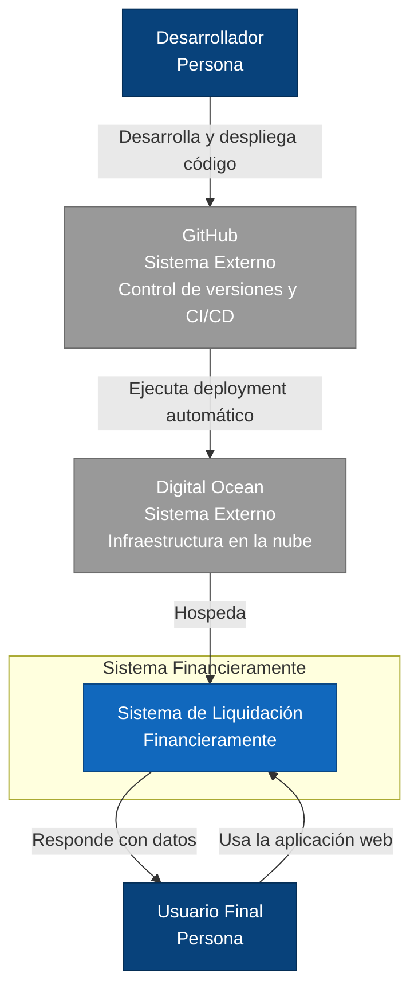
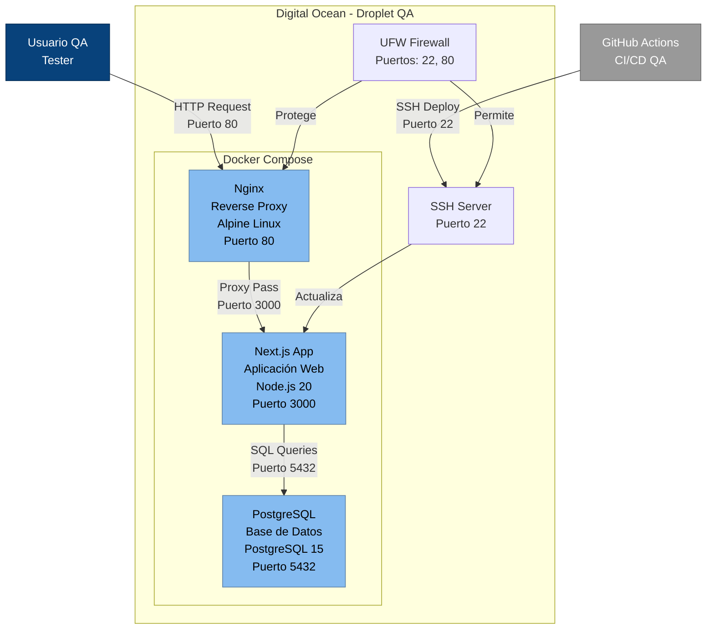
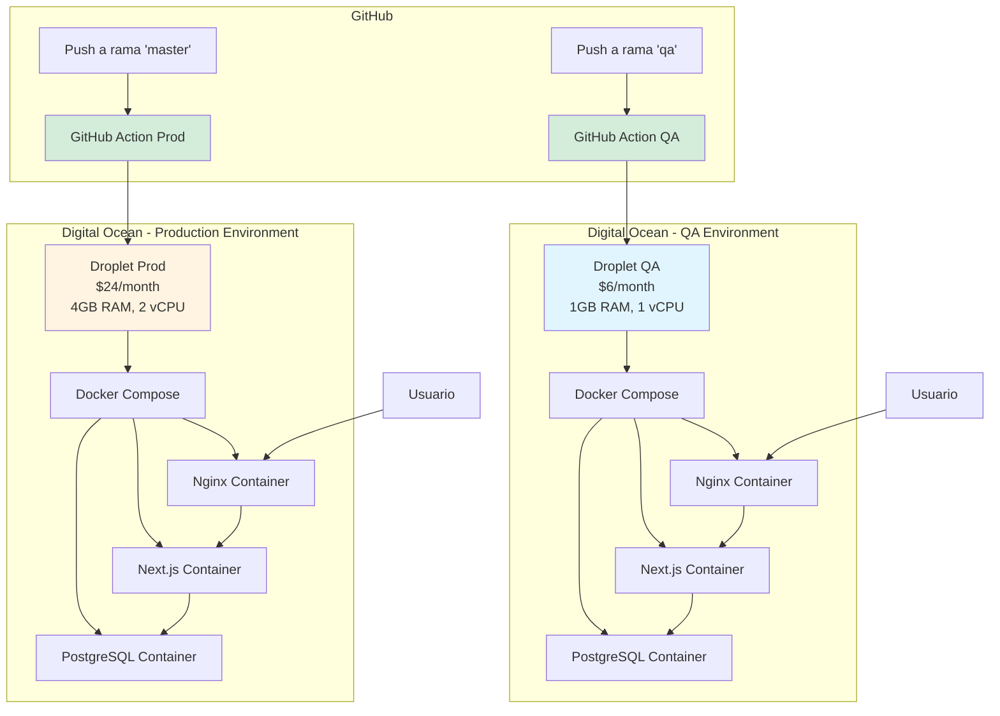

# Infraestructura Financieramente

Esta documentación describe la arquitectura completa del sistema de liquidación Financieramente desplegado en Digital Ocean.

## Arquitectura General

El sistema utiliza una arquitectura de microservicios containerizados con Docker, desplegados en Droplets de Digital Ocean usando Terraform como Infraestructura como Código (IaC).

### Componentes Principales

- **Frontend**: Next.js 15 con React 19 y Tailwind CSS
- **Backend**: API Routes de Next.js con Prisma ORM
- **Base de Datos**: PostgreSQL 15
- **Proxy**: Nginx con configuración de seguridad
- **Contenedores**: Docker con Docker Compose
- **CI/CD**: GitHub Actions
- **Infraestructura**: Terraform + Digital Ocean

## Diagramas de Arquitectura

### Diagrama C4 - Nivel 1: Contexto del Sistema


```mermaid
graph TB
    subgraph "Sistema Financieramente"
        SYS[Sistema de Liquidación<br/>Financieramente]
    end
    
    USER[Usuario Final<br/>Persona]
    DEV[Desarrollador<br/>Persona]
    GITHUB[GitHub<br/>Sistema Externo<br/>Control de versiones y CI/CD]
    DO[Digital Ocean<br/>Sistema Externo<br/>Infraestructura en la nube]
    
    USER -->|Usa la aplicación web| SYS
    DEV -->|Desarrolla y despliega código| GITHUB
    GITHUB -->|Ejecuta deployment automático| DO
    DO -->|Hospeda| SYS
    SYS -->|Responde con datos| USER
    
    style SYS fill:#1168bd,stroke:#0b4884,color:#ffffff
    style USER fill:#08427b,stroke:#052e56,color:#ffffff
    style DEV fill:#08427b,stroke:#052e56,color:#ffffff
    style GITHUB fill:#999999,stroke:#6b6b6b,color:#ffffff
    style DO fill:#999999,stroke:#6b6b6b,color:#ffffff
```

### Diagrama C4 - Nivel 2: Contenedores (Ambiente QA)


```mermaid
graph TB
    subgraph "Digital Ocean - Droplet QA"
        subgraph "Docker Compose"
            NGINX[Nginx<br/>Reverse Proxy<br/>Alpine Linux<br/>Puerto 80]
            NEXT[Next.js App<br/>Aplicación Web<br/>Node.js 20<br/>Puerto 3000]
            PG[PostgreSQL<br/>Base de Datos<br/>PostgreSQL 15<br/>Puerto 5432]
        end
        
        UFW[UFW Firewall<br/>Puertos: 22, 80]
        SSH[SSH Server<br/>Puerto 22]
    end
    
    USER[Usuario QA<br/>Tester]
    GHACTION[GitHub Actions<br/>CI/CD QA]
    
    USER -->|HTTP Request<br/>Puerto 80| NGINX
    NGINX -->|Proxy Pass<br/>Puerto 3000| NEXT
    NEXT -->|SQL Queries<br/>Puerto 5432| PG
    GHACTION -->|SSH Deploy<br/>Puerto 22| SSH
    SSH -->|Actualiza| NEXT
    UFW -->|Protege| NGINX
    UFW -->|Permite| SSH
    
    style NGINX fill:#85bbf0,stroke:#5d82a8,color:#000000
    style NEXT fill:#85bbf0,stroke:#5d82a8,color:#000000
    style PG fill:#85bbf0,stroke:#5d82a8,color:#000000
    style USER fill:#08427b,stroke:#052e56,color:#ffffff
    style GHACTION fill:#999999,stroke:#6b6b6b,color:#ffffff
```

## Ambientes

### QA (Quality Assurance)
- **Droplet**: `s-1vcpu-1gb` ($6/month)
- **Recursos**: 1GB RAM, 1 vCPU, 25GB SSD
- **Propósito**: Testing y desarrollo
- **URL**: `http://[QA_DROPLET_IP]`

### Producción
- **Droplet**: `s-2vcpu-4gb` ($24/month)
- **Recursos**: 4GB RAM, 2 vCPU, 80GB SSD
- **Propósito**: Ambiente de producción
- **URL**: `http://[PROD_DROPLET_IP]`

## Flujo de CI/CD


```mermaid
graph TB
    subgraph GitHub
        A[Push a rama 'qa'] --> B[GitHub Action QA]
        C[Push a rama 'master'] --> D[GitHub Action Prod]
    end
    
    subgraph "Digital Ocean - QA Environment"
        B --> E[Droplet QA<br/>$6/month<br/>1GB RAM, 1 vCPU]
        E --> F[Docker Compose]
        F --> G[PostgreSQL Container]
        F --> H[Next.js Container]
        F --> I[Nginx Container]
    end
    
    subgraph "Digital Ocean - Production Environment"
        D --> J[Droplet Prod<br/>$24/month<br/>4GB RAM, 2 vCPU]
        J --> K[Docker Compose]
        K --> L[PostgreSQL Container]
        K --> M[Next.js Container]
        K --> N[Nginx Container]
    end
    
    O[Usuario] --> I
    P[Usuario] --> N
    
    I --> H
    N --> M
    H --> G
    M --> L
    
    style E fill:#e1f5ff
    style J fill:#fff4e1
    style B fill:#d4edda
    style D fill:#d4edda
```

### Detalles del Deployment

El flujo de deployment sigue estos pasos:

1. **Tests y Linting**: Se ejecutan unit tests y linter antes del deployment
2. **Preparación SSH**: Se configura la conexión SSH con el droplet
3. **Sincronización de Archivos**: Uso de `rsync` para transferir archivos
4. **Copiar Configuración Docker**: Se copian archivos de configuración
5. **Despliegue en Servidor**: Se ejecutan comandos en el servidor remoto
6. **Health Check**: Verificación de que la aplicación responde correctamente

#### Configuración SSH en GitHub Actions

Para permitir conexiones SSH automáticas desde GitHub Actions al servidor, se utiliza:

- **SSH Key Scaning**: `ssh-keyscan -H ${{ secrets.QA_DROPLET_IP }} >> ~/.ssh/known_hosts`
  - Agrega la clave pública del servidor a los hosts conocidos
  - Permite conexiones SSH sin interrupciones
  
- **StrictHostKeyChecking=no**: Flag SSH para deshabilitar verificación de host keys
  - Útil en entornos de CI/CD donde no se requiere confirmación interactiva
  - **Nota de Seguridad**: Se usa junto con `ssh-keyscan` para balancear seguridad y automatización

```yaml
# Ejemplo del workflow
ssh-keyscan -H ${{ secrets.QA_DROPLET_IP }} >> ~/.ssh/known_hosts 2>/dev/null || true

rsync -avz --delete \
  -e "ssh -o StrictHostKeyChecking=no" \
  ./ root@${{ secrets.QA_DROPLET_IP }}:/opt/financieramente/app/
```

**Alternativa más segura**: En lugar de `StrictHostKeyChecking=no`, se puede usar `StrictHostKeyChecking=accept-new` que solo acepta nuevas hosts una vez.

## Estructura de Archivos

```
financieramente-app/
├── terraform/                 # Infraestructura como código
│   ├── provider.tf           # Configuración del provider
│   ├── variables.tf          # Variables de configuración
│   ├── main.tf               # Recursos principales
│   ├── droplet-qa.tf         # Droplet de QA
│   ├── droplet-prod.tf       # Droplet de Producción
│   ├── outputs.tf            # Outputs de Terraform
│   ├── terraform.tfvars.example # Ejemplo de variables
│   └── scripts/
│       ├── setup-droplet.sh  # Script de inicialización
│       └── deploy-app.sh     # Script de deployment
├── docker/                   # Configuración de Docker
│   ├── Dockerfile            # Imagen de Next.js
│   ├── docker-compose.qa.yml # Compose para QA
│   ├── docker-compose.prod.yml # Compose para Producción
│   ├── env.example           # Variables de entorno
│   └── nginx/
│       └── nginx.conf        # Configuración de Nginx
├── .github/
│   └── workflows/
│       ├── deploy-qa.yml     # GitHub Action para QA
│       └── deploy-prod.yml   # GitHub Action para Producción
├── scripts/                  # Scripts de utilidad
│   ├── db-tunnel-qa.sh       # SSH tunnel para QA
│   └── infrastructure.sh     # Gestión de infraestructura
└── docs/                     # Documentación
    ├── INFRASTRUCTURE.md      # Esta documentación
    ├── ENVIRONMENT_VARIABLES.md # Variables de entorno
    ├── DATABASE_CONNECTION.md # Conexión a base de datos
    └── PRISMA_MIGRATIONS.md   # Migraciones de Prisma
```

## Costos Estimados

| Ambiente | Droplet | Costo Mensual | Recursos |
|----------|---------|---------------|----------|
| QA | s-1vcpu-1gb | $6 | 1GB RAM, 1 vCPU, 25GB SSD |
| Producción | s-2vcpu-4gb | $24 | 4GB RAM, 2 vCPU, 80GB SSD |
| **Total** | | **$30** | |

## Seguridad

### Medidas Implementadas

1. **Firewall UFW**: Solo puertos necesarios abiertos
2. **SSH Key Authentication**: Sin contraseñas
3. **SSH Host Key Verification**: Configurado para prevenir MITM attacks
4. **Nginx Security Headers**: Headers de seguridad configurados
5. **Rate Limiting**: Protección contra ataques DDoS
6. **PostgreSQL No Expuesto**: Solo accesible internamente
7. **Variables Sensibles**: En GitHub Secrets
8. **Fail2ban**: Protección contra ataques de fuerza bruta
9. **CI/CD Seguro**: Autenticación mediante SSH keys en GitHub Actions

### Configuración SSH y CI/CD

El workflow de GitHub Actions utiliza múltiples estrategias de seguridad:

#### Autenticación SSH

```yaml
# Configuración de SSH Key
- name: Copy files to server
  run: |
    mkdir -p ~/.ssh
    echo "${{ secrets.SSH_PRIVATE_KEY }}" > ~/.ssh/id_rsa
    chmod 600 ~/.ssh/id_rsa
    
    # Agregar host conocido para evitar ataques MITM
    ssh-keyscan -H ${{ secrets.QA_DROPLET_IP }} >> ~/.ssh/known_hosts 2>/dev/null
```

**Características de Seguridad**:
- **SSH Key Scaning**: Previene ataques Man-in-the-Middle (MITM) al verificar la autenticidad del servidor
- **Permisos restrictivos**: `chmod 600` en la clave SSH privada
- **StrictHostKeyChecking**: Deshabilitado temporalmente para automatización (balanceado con ssh-keyscan)

**Mejora de Seguridad Recomendada**:

Para mayor seguridad, considera usar `StrictHostKeyChecking=accept-new` en lugar de `no`:

```yaml
-e "ssh -o StrictHostKeyChecking=accept-new"
```

Esto acepta la clave del host la primera vez, pero rechaza cambios futuros (protección contra MITM).

### Puertos Abiertos

| Puerto | Servicio | Acceso | Propósito |
|--------|----------|--------|-----------|
| 22 | SSH | Público | Administración |
| 80 | HTTP | Público | Aplicación web |
| 443 | HTTPS | Público | Aplicación web (cuando se configure SSL) |
| 5432 | PostgreSQL | Interno | Base de datos |

## Monitoreo y Logs

### Logs Disponibles

- **Nginx Access Logs**: `/var/log/nginx/access.log`
- **Nginx Error Logs**: `/var/log/nginx/error.log`
- **Application Logs**: `docker-compose logs`
- **System Logs**: `/var/log/syslog`
- **Deployment Logs**: `/var/log/financieramente/deploy.log`

### Comandos de Monitoreo

```bash
# Ver logs de la aplicación
./scripts/infrastructure.sh logs-qa
./scripts/infrastructure.sh logs-prod

# Ver estado de contenedores
ssh root@[IP] "cd /opt/financieramente && docker-compose ps"

# Ver uso de recursos
ssh root@[IP] "htop"
```

## Procedimientos de Mantenimiento

### Proceso Completo de Deployment

El deployment automático se activa al hacer push a las ramas `qa` o `master`. El proceso completo incluye:

#### Fase 1: Pre-Deployment (Tests)

```bash
# 1. Checkout del código
git clone repository

# 2. Instalación de dependencias
npm ci --prefer-offline --no-audit

# 3. Generación de Prisma Client (si está habilitado)
npx prisma generate

# 4. Ejecución de Linter
npm run lint

# 5. Ejecución de Tests Unitarios
npm run test:unit

# 6. Build de la aplicación
npm run build
```

**Si cualquier paso falla, el deployment se cancela automáticamente.**

#### Fase 2: Copia de Archivos

El workflow copia los archivos necesarios usando `rsync`:

```bash
# Excluye archivos no necesarios en producción
--exclude='node_modules'
--exclude='.next'
--exclude='.git'
--exclude='coverage'
--exclude='storybook-static'
--exclude='test-results'
--exclude='*.log'
--exclude='html'
--exclude='terraform'
```

#### Fase 3: Deployment en el Servidor

Una vez que los archivos llegan al servidor, se ejecutan estos comandos:

```bash
# 1. Crear archivo .env
cat > /opt/financieramente/.env << 'ENVEOF'
NODE_ENV=qa
POSTGRES_USER=financieramente_user
POSTGRES_PASSWORD=[secreto]
POSTGRES_DB=financieramente_qa
DATABASE_URL=postgresql://...
NEXT_PUBLIC_API_URL=http://[IP]
ENVEOF

# 2. Habilitar Docker BuildKit
export DOCKER_BUILDKIT=1
export COMPOSE_DOCKER_CLI_BUILD=1

# 3. Detener contenedores existentes
docker-compose -f docker-compose.qa.yml down --timeout 30

# 4. Limpiar contenedores
docker container prune -f

# 5. Reconstruir y levantar contenedores
docker-compose -f docker-compose.qa.yml build --parallel
docker-compose -f docker-compose.qa.yml up -d
```

#### Fase 4: Health Check

El workflow espera hasta 15 intentos de verificar que la aplicación responde:

```bash
for i in {1..15}; do
  if curl -f http://localhost:3000/api/health; then
    echo "✅ Health check passed"
    exit 0
  fi
  sleep 10
done
```

**Si el health check falla**, se muestran los últimos 50 logs de los contenedores.

#### Fase 5: Limpieza

Finalmente, se limpian imágenes y volúmenes antiguos para liberar espacio:

```bash
docker image prune -f
docker volume prune -f
```

### Actualización de la Aplicación

1. **Desarrollo**: Hacer cambios en código
2. **Commit**: `git commit -m "feat: nueva funcionalidad"`
3. **Push QA**: `git push origin qa`
4. **Testing**: Verificar en ambiente QA
5. **Push Producción**: `git push origin master`

### Backup de Base de Datos

```bash
# Backup manual
ssh root@[IP] "cd /opt/financieramente && docker-compose exec postgres pg_dump -U financieramente_user financieramente_qa > backup.sql"

# Restaurar backup
ssh root@[IP] "cd /opt/financieramente && docker-compose exec -T postgres psql -U financieramente_user financieramente_qa < backup.sql"
```

### Escalado Horizontal

Para escalar horizontalmente:

1. Crear nuevos Droplets con Terraform
2. Configurar Load Balancer
3. Actualizar DNS
4. Migrar base de datos a servicio managed

## Troubleshooting

### Problemas Comunes

#### 1. Aplicación no responde

```bash
# Verificar contenedores
ssh root@[IP] "cd /opt/financieramente && docker-compose ps"

# Ver logs
ssh root@[IP] "cd /opt/financieramente && docker-compose logs"

# Reiniciar servicios
./scripts/infrastructure.sh restart-qa
```

#### 2. Base de datos no conecta

```bash
# Verificar PostgreSQL
ssh root@[IP] "cd /opt/financieramente && docker-compose exec postgres pg_isready"

# Verificar variables de entorno
ssh root@[IP] "cd /opt/financieramente && cat .env"
```

#### 3. GitHub Actions falla

**Problemas Comunes**:

1. **Error de conexión SSH**: 
   ```bash
   # Verificar que el droplet está accesible
   ping ${{ secrets.QA_DROPLET_IP }}
   
   # Verificar conectividad SSH
   ssh root@${{ secrets.QA_DROPLET_IP }} "echo 'Connection successful'"
   ```

2. **Error de autenticación SSH**:
   - Verificar que `SSH_PRIVATE_KEY` está configurado en GitHub Secrets
   - Verificar que la clave pública está en el servidor: `cat ~/.ssh/authorized_keys`
   
3. **Error "Host key verification failed"**:
   - Usar `ssh-keyscan` para agregar el host conocido
   - O usar `StrictHostKeyChecking=no` en comandos SSH (menos seguro pero útil en CI/CD)

4. **Error en rsync o scp**:
   ```bash
   # Verificar permisos en el servidor
   ssh root@[IP] "ls -la /opt/financieramente/"
   
   # Verificar que el directorio existe
   ssh root@[IP] "mkdir -p /opt/financieramente/app"
   ```

**Solución General**:
1. Verificar GitHub Secrets (`SSH_PRIVATE_KEY`, `QA_DROPLET_IP`, passwords)
2. Verificar SSH key permissions
3. Verificar IPs de Droplets
4. Revisar logs del workflow en la pestaña "Actions" de GitHub
5. Verificar que los puertos del firewall están abiertos

#### 4. Problemas con rsync/scp en deployment

Si el deployment falla al copiar archivos:

```bash
# Verificar conectividad
ssh -o StrictHostKeyChecking=no root@[IP] "pwd"

# Test manual de rsync
rsync -avz --delete \
  -e "ssh -o StrictHostKeyChecking=no" \
  ./ root@[IP]:/opt/financieramente/app/

# Ver qué archivos se están excluyendo
rsync -avz --dry-run --delete \
  -e "ssh -o StrictHostKeyChecking=no" \
  ./ root@[IP]:/opt/financieramente/app/
```

### Comandos Útiles

```bash
# Gestión de infraestructura
./scripts/infrastructure.sh status
./scripts/infrastructure.sh outputs
./scripts/infrastructure.sh connect-qa

# SSH Tunnel para base de datos
./scripts/db-tunnel-qa.sh start
./scripts/db-tunnel-qa.sh test

# Terraform
cd terraform
terraform plan
terraform apply
terraform output
```

## Próximos Pasos

### Mejoras Futuras

1. **SSL/HTTPS**: Configurar Let's Encrypt
2. **Monitoring**: Implementar Prometheus + Grafana
3. **Backup Automático**: Backup diario de base de datos
4. **Load Balancer**: Para alta disponibilidad
5. **CDN**: Para assets estáticos
6. **Managed Database**: PostgreSQL managed de Digital Ocean

### Escalabilidad

- **Vertical**: Aumentar tamaño de Droplets
- **Horizontal**: Múltiples instancias con Load Balancer
- **Database**: Migrar a PostgreSQL managed
- **Caching**: Implementar Redis
- **CDN**: Para assets estáticos

## Referencia Rápida

### Comandos SSH Importantes

#### Conectar al servidor

```bash
# Conexión básica
ssh root@[IP]

# Con StrictHostKeyChecking
ssh -o StrictHostKeyChecking=no root@[IP]

# O agregar host a known_hosts primero
ssh-keyscan -H [IP] >> ~/.ssh/known_hosts
```

#### Opciones de StrictHostKeyChecking

| Opción | Descripción | Seguridad |
|--------|-------------|-----------|
| `yes` | Requiere verificación manual (por defecto) | Más seguro |
| `accept-new` | Acepta nuevas claves automáticamente | Moderado |
| `no` | Deshabilita toda verificación | Menos seguro |

**Recomendación**: Para CI/CD usar `accept-new` en lugar de `no` cuando sea posible.

### Variables de Entorno Necesarias

El deployment requiere estas variables en GitHub Secrets:

```bash
# SSH Configuration
SSH_PRIVATE_KEY        # Clave SSH privada para acceso al servidor
QA_DROPLET_IP         # IP del droplet de QA
PROD_DROPLET_IP       # IP del droplet de Producción

# Database
POSTGRES_PASSWORD_QA       # Contraseña PostgreSQL en QA
POSTGRES_PASSWORD_PROD     # Contraseña PostgreSQL en Producción

# Application
NEXT_PUBLIC_API_URL   # URL de la API (generada automáticamente)
```

### Estados de Deployment

El workflow puede estar en uno de estos estados:

1. **Running Tests** 🔄: Ejecutando tests y linter
2. **Copying Files** 📤: Copiando archivos al servidor
3. **Building Containers** 🏗️: Construyendo contenedores Docker
4. **Health Check** ❤️: Verificando que la app responde
5. **Success** ✅: Deployment completado
6. **Failed** ❌: Fallo en algún paso

## Contacto y Soporte

Para soporte técnico o preguntas sobre la infraestructura:

1. Revisar esta documentación
2. Verificar logs del sistema
3. Consultar GitHub Issues
4. Contactar al equipo de desarrollo
