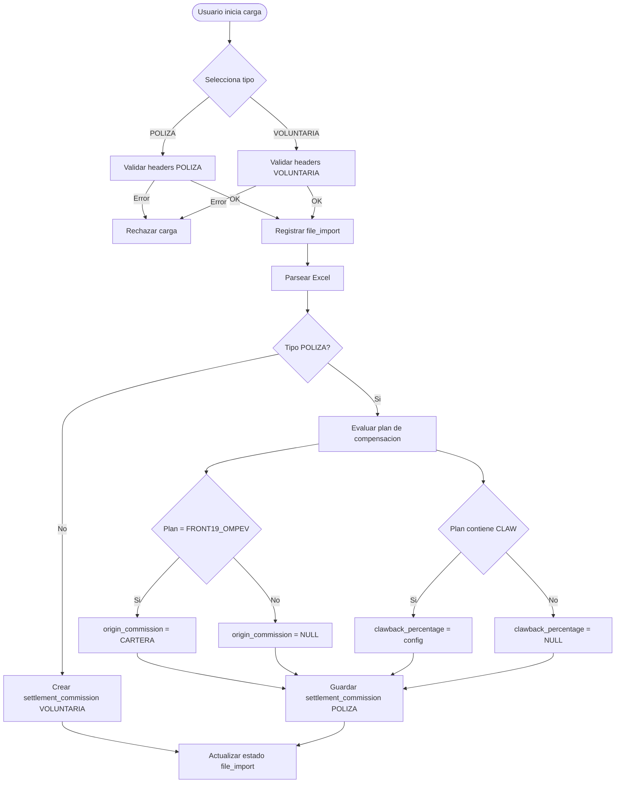
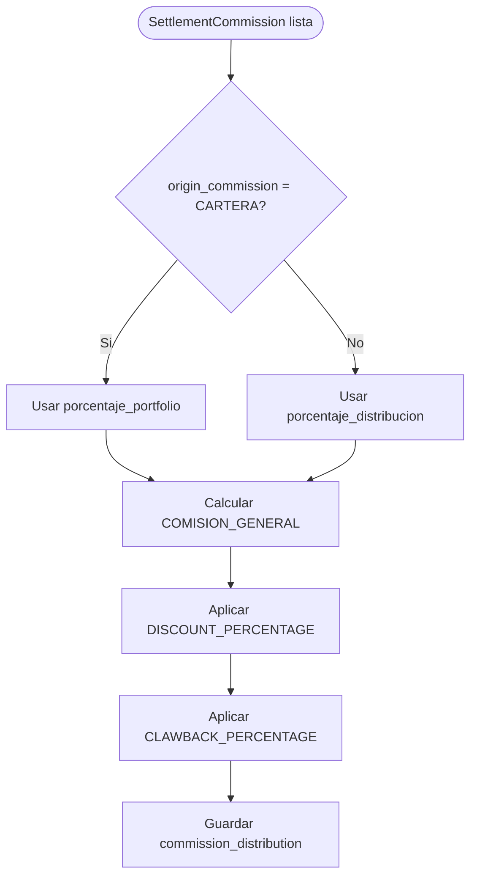
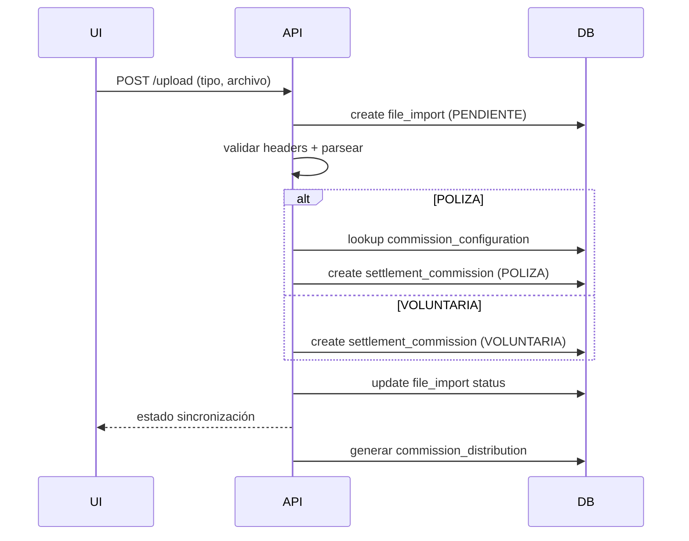
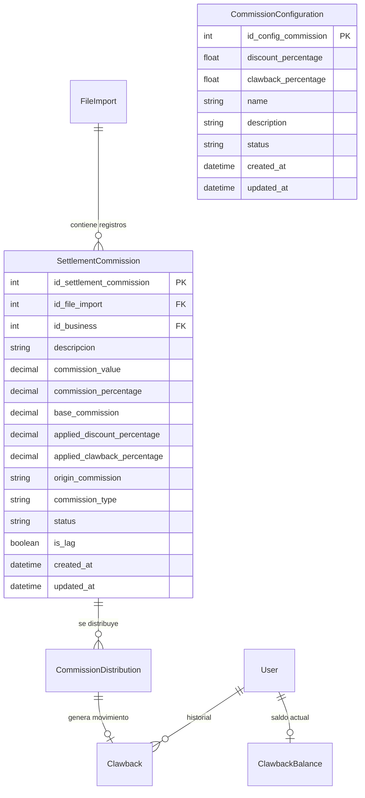
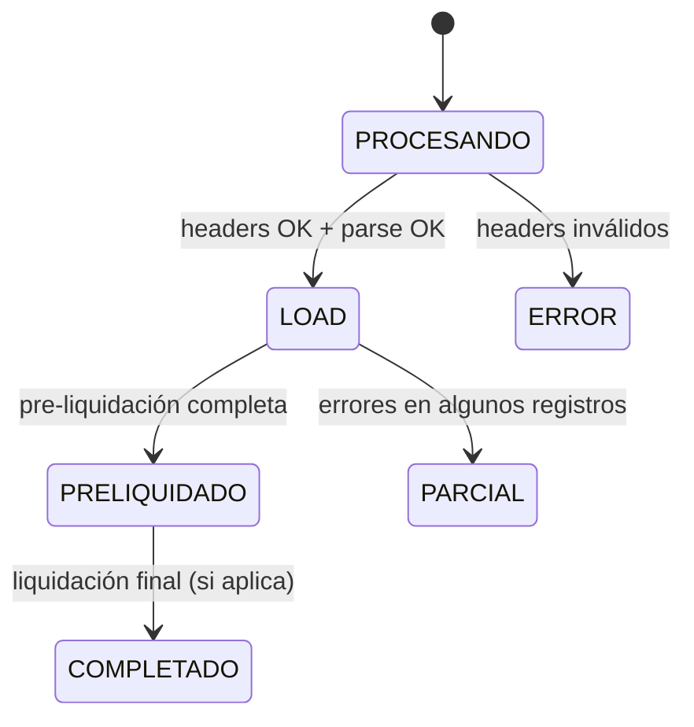

# Análisis: Sincronización de Comisiones (POLIZA / VOLUNTARIA)

## Objetivo
Actualizar el flujo de sincronización para soportar dos tipos de Excel (POLIZA y VOLUNTARIA), ajustar el modelo de datos en `settlement_commission`, y actualizar el cálculo y registro de `commission_distribution` para el proceso de liquidación.

## Tipos de Excel
1. `docs/Polizas.xlsx` → comisiones de póliza.
2. `docs/BASE DE VOLUNTARIAS SKANDIA.xlsx` → comisiones voluntarias.

El usuario debe seleccionar explícitamente el tipo de archivo (`POLIZA` o `VOLUNTARIA`) antes de cargar.

## Headers reales detectados (según archivos en `docs/`)

### POLIZA (`docs/Polizas.xlsx`)
- `Polizas Periodo`
- `Plan de Compensación`
- `Valor Comisión`
- `BASE`
- `Polizas Producto`
- `Contrato Largo`
- `Polizas Id Agente`
- `Polizas Nombre Agente`
- `Polizas Id Sociedad`
- `Nombre Sociedad`
- `Polizas Clasificación`

### VOLUNTARIA (`docs/BASE DE VOLUNTARIAS SKANDIA.xlsx`)
- `Nombre Franquicia`
- `Desde`
- `Hasta`
- `Nombre Fp`
- `Sub Grupo Fp`
- `Compania`
- `Producto`
- `Tipo de Comision`
- `Cto`
- `Base`
- `Com`

## Validación de headers
- El backend valida headers en función del tipo seleccionado.
- Si los headers no corresponden, se rechaza la carga.
- Se mantiene el flujo actual de validaciones y el registro de estado en `file_import`.

### Observación
En el requisito se menciona **"Plan de componesación"** / **"Plan de compoensación"**.  
En el Excel real el header es **"Plan de Compensación"** (con mayúscula y tilde).  
Se recomienda normalizar en código (trim + lower + quitar tildes) para evitar errores por variaciones.

## Reglas especiales en POLIZA
1. Si columna **"Plan de componesación"** == **"FRONT19_OMPEV"**:
   - Guardar `origin_commission = "CARTERA"` en `settlement_commission`.
2. Si columna **"Plan de compoensación"** contiene **"CLAW"**:
   - Obtener `clawback_percentage` desde `commission_configuration` y guardarlo en `settlement_commission`.
3. Si no cumple la regla de CLAW:
   - `clawback_percentage` queda vacío/nulo.

### Derivaciones con headers reales
- Columna real: **"Plan de Compensación"**
- Regla FRONT19_OMPEV debe evaluarse con igualdad estricta (normalizada).
- Regla CLAW debe evaluarse con `includes("CLAW")` en el valor normalizado.

## Mapeo de columnas → `settlement_commission`

### POLIZA
| Excel | `settlement_commission` | Notas |
| --- | --- | --- |
| `Contrato Largo` | `id_business` | buscar `business.contract`. Si no existe → marcar como no sincronizado/rezagado. |
| `Valor Comisión` | `commission_value` | monto de comisión (puede ser negativo). |
| `BASE` | `base_commission` | base para cálculo. |
| `Plan de Compensación` | `descripcion` | opcional: también se usa para `origin_commission` y CLAW. |
| `Polizas Producto` | `descripcion` | alternativa si se define `descripcion` como producto. |
| `Polizas Periodo` | `descripcion` | opcional si se requiere periodizar el registro. |
| (derivado) | `commission_type = POLIZA` | fijo. |
| (derivado) | `origin_commission` | `CARTERA` si `Plan de Compensación == FRONT19_OMPEV`. |
| (derivado) | `discount_percentage` | snapshot desde `commission_configuration`. |
| (derivado) | `clawback_percentage` | snapshot si `Plan` contiene `CLAW`. |

### VOLUNTARIA
| Excel | `settlement_commission` | Notas |
| --- | --- | --- |
| `Cto` | `id_business` | buscar `business.contract`. |
| `Com` | `commission_value` | monto de comisión. |
| `Base` | `base_commission` | base para cálculo. |
| `Tipo de Comision` | `descripcion` | campo principal recomendado. |
| `Producto` | `descripcion` | alternativa si se prefiere producto. |
| (derivado) | `commission_type = VOLUNTARIA` | fijo. |
| (derivado) | `origin_commission` | `NULL` siempre (salvo definición futura). |
| (derivado) | `discount_percentage` | snapshot desde `commission_configuration`. |
| (derivado) | `clawback_percentage` | siempre `NULL` (solo POLIZA aplica). |

### Campo `commission_percentage`
No existe un campo explícito de porcentaje en ninguno de los 2 excels.  
Se recomienda dejar `commission_percentage` en `NULL` hasta definir fuente real.

## Cambios en modelo de datos

### Normalización de naming
Unificar todo a **commission** (no `commision`, `comission`, `percentaje`, etc.) en nombres de tablas, columnas y variables.

### `settlement_commission`
- **Agregar**: `commission_type` (`POLIZA` | `VOLUNTARIA`)
- **Eliminar**: `poliza`, `ramo`, `producto`, `recibo`, `fecha_pago`
- **Agregar**:
  - `descripcion`
  - `clawback_percentage`
  - `discount_percentage`

### `commission_configuration` (antes `Discount`)
Tabla de configuración sin relaciones:
- `clawback_percentage` (número)
- `discount_percentage` (número)
- `name`, `description`, `status`, `created_at`, `updated_at`

### `product_percentage_commission_category`
Agregar:
- `porcentaje_portfolio` (decimal)

## Reglas para cargar `settlement_commission`
1. Al registrar una comisión:
   - Leer `discount_percentage` de `commission_configuration` y guardar snapshot en `settlement_commission`.
2. En POLIZA con CLAW:
   - Leer `clawback_percentage` de `commission_configuration` y guardar snapshot en `settlement_commission`.

### Selección de `commission_configuration`
Recomendación:
- usar el registro `status = ACTIVE` más reciente.
- si no existe, rechazar carga o usar valores por defecto (definir con negocio).

## Normalización de porcentajes
Los porcentajes deben persistirse como **decimales** (0.10 para 10%).  
Si el Excel trae números enteros (ej. 10 o 12), convertir: `pct = value / 100`.

Regla sugerida:
- Si `value > 1`, tratar como porcentaje (dividir por 100).
- Si `0 <= value <= 1`, tratar como decimal válido.

## Consideraciones de datos reales
- En `Polizas.xlsx` se observan valores negativos en `Valor Comisión`.  
  Debe permitirse el signo negativo y propagarse a cálculos.
- En `BASE DE VOLUNTARIAS SKANDIA.xlsx`, `Desde/Hasta` vienen como números (serial Excel).  
  Si se necesita fecha, convertir usando serial Excel → Date.

## Variables configurables (origen de datos)
- `DISCOUNT_PERCENTAGE` ← `settlement_commission.discount_percentage`
- `VALOR_COMISION_BASE` ← `settlement_commission.base_commission`
- `PRODUCT_PERCENTAGE_COMMISSION_CATEGORY` ← `product_percentage_commission_category` (según `id_category`)
- `CLAWBACK_PERCENTAGE` ← `settlement_commission.clawback_percentage`
- `TOTAL_COMISION` ← `commission_distribution.commission_value_final`

## Cálculos para `commission_distribution`

### Caso 1: Origen CARTERA
**Condición:** `settlement_commission.origin_commission = "CARTERA"`  
**Porcentaje usado:** `product_percentage_commission_category.porcentaje_portfolio`

```
COMISION_GENERAL = VALOR_COMISION_BASE * PORCENTAJE_PORTFOLIO
COMISION_GENERAL_DESPUES_DE_DESCUENTO = COMISION_GENERAL * DISCOUNT_PERCENTAGE
CLAWBACK = COMISION_GENERAL_DESPUES_DE_DESCUENTO * CLAWBACK_PERCENTAGE
TOTAL_COMISION = COMISION_GENERAL_DESPUES_DE_DESCUENTO - CLAWBACK
```

### Caso 2: Origen por `Business.id_client_origin`
**Condición:** origen en `Business.id_client_origin` (Vortex, Propio, Asesoría Gratuita)  
**Porcentaje usado:** `product_percentage_commission_category.porcentaje_distribucion`

```
COMISION_GENERAL = VALOR_COMISION_BASE * PORCENTAJE_DISTRIBUCION
COMISION_GENERAL_DESPUES_DE_DESCUENTO = COMISION_GENERAL * DISCOUNT_PERCENTAGE
CLAWBACK = COMISION_GENERAL_DESPUES_DE_DESCUENTO * CLAWBACK_PERCENTAGE
TOTAL_COMISION = COMISION_GENERAL_DESPUES_DE_DESCUENTO - CLAWBACK
```

## Diagrama de flujo: Carga y sincronización



## Diagrama de flujo: Cálculo de distribución



## Diagrama de secuencia: Registro y distribución



## Ambigüedades a confirmar
1. En el texto “CASO 1” se menciona `SETTLEMENT_COMMISSION.type_commission = 'CARTERA'`.  
   - Se asume que la condición real es `origin_commission = "CARTERA"` (según regla del plan FRONT19_OMPEV).
2. Definir si `commission_type` debe reflejar `POLIZA/VOLUNTARIA` y `origin_commission` la lógica de `CARTERA`.
3. Precisar si los porcentajes en el Excel están en formato porcentaje (0-100) o decimal (0-1).
4. Definir qué columna del Excel alimenta `descripcion` (Plan, Producto, Tipo de Comisión o Periodo).
5. Confirmar si `commission_percentage` se elimina o queda `NULL`.
## Cambios específicos en pre-liquidación

### Estado actual (código existente)
En `src/features/pre-liquidacion/services/pre-liquidacion.service.ts`:
- `valorComision` se usa como base para cálculo.
- `discount` se obtiene de la tabla `Discount`.
- `comission_distribution` guarda `valueComission`, `valueComissionFinal`, `totalDiscount`, `idDiscount`.

### Estado requerido (nuevo flujo)
1. **Fuente de base de cálculo**: usar `settlement_commission.base_commission`.
2. **Descuento**:
   - tomar `settlement_commission.discount_percentage`.
   - no depender de `Discount` (tabla renombrada y sin relación).
3. **Clawback**:
   - aplicar solo si `settlement_commission.clawback_percentage` no es `NULL`.
4. **Porcentaje por rol**:
   - si `origin_commission = CARTERA` usar `porcentaje_portfolio`.
   - caso contrario usar `porcentaje_distribucion`.
5. **Snapshots**:
   - `commission_distribution.applied_discount_percentage` ← `settlement_commission.discount_percentage`.
   - `commission_distribution.id_config_commission` opcional si se mantiene vínculo a config.

### Fórmula final
```
COMISION_GENERAL = BASE * PORCENTAJE
COMISION_GENERAL_DESPUES_DE_DESCUENTO = COMISION_GENERAL * DISCOUNT_PERCENTAGE
CLAWBACK = COMISION_GENERAL_DESPUES_DE_DESCUENTO * CLAWBACK_PERCENTAGE
TOTAL_COMISION = COMISION_GENERAL_DESPUES_DE_DESCUENTO - CLAWBACK
```

Si `CLAWBACK_PERCENTAGE` es `NULL` o 0, el clawback se omite.

### Impacto por eliminación de `fecha_pago`
Actualmente la pre-liquidación filtra por `settlement_commission.fechaPago`.  
Si el campo se elimina, hay que definir un sustituto:
- Usar `file_import.load_date`.
- O persistir una fecha derivada de Excel (`Desde/Hasta` o `Polizas Periodo`).
- O introducir un nuevo campo `commission_date` o `period`.

## Estados y contadores

### `file_import`
- `total_record`, `success_record`, `error_record`, `sincronizado_record`,
  `rezagado_record`, `no_sincronizado_record`.

### Reglas sugeridas
- **SINCRONIZADO**: `id_business` encontrado y validaciones OK.
- **NO_SINCRONIZADO**: `id_business` no encontrado o error crítico de datos.
- **REZAGADO**: regla actual aplicada (si depende de fechas/periodo).
- **ERROR**: error de parsing (monto inválido, fechas inválidas, headers erróneos).

## Estrategia de migración de nombres

### Objetivo
Normalizar `comission` → `commission` y `percentaje` → `percentage` en **nombres de tablas, columnas y modelos Prisma**.

### Impacto directo
- `comission_distribution` → `commission_distribution`
- `product_percentaje_commision` → `product_percentage_commission`
- `product_percentaje_commision_category` → `product_percentage_commission_category`
- `id_percentaje_commision_category` → `id_percentage_commission_category`
- `value_comission` → `commission_value`
- `value_comission_final` → `commission_value_final`

### Recomendación
Ejecutar migración con `ALTER TABLE ... RENAME` para preservar data, luego alinear `@map(...)` en Prisma.

## ERD propuesto (focus en nuevas tablas)



## Diagrama de estado: `file_import`


