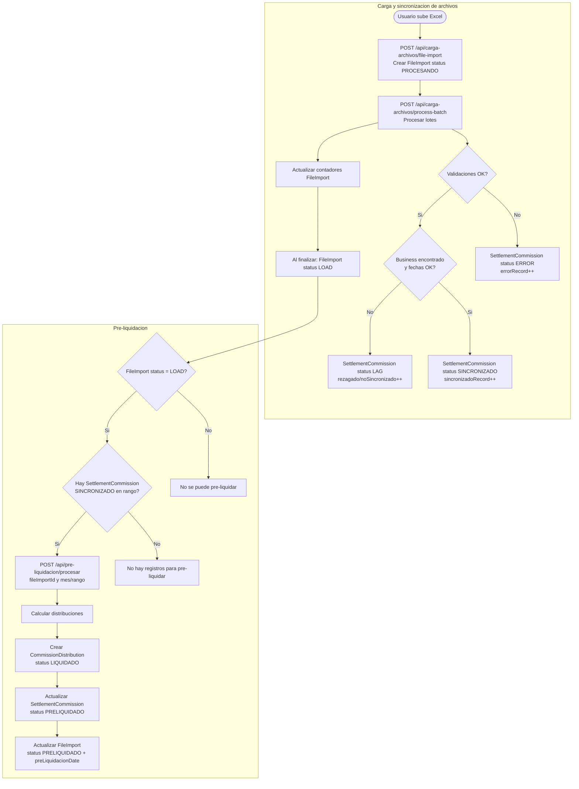

# Flujo de Pre-liquidacion (Sincronizacion + Pre-liquidacion)

```mermaid
flowchart TD
    %% Carga y sincronizacion
    subgraph Carga["Carga y sincronizacion de archivos"]
        A([Usuario sube Excel]) --> B[POST /api/carga-archivos/file-import\nCrear FileImport status PROCESANDO]
        B --> C[POST /api/carga-archivos/process-batch\nProcesar lotes]
        C --> D{Validaciones OK?}
        D -->|No| E[SettlementCommission status ERROR\nerrorRecord++]
        D -->|Si| F{Business encontrado\ny fechas OK?}
        F -->|Si| G[SettlementCommission status SINCRONIZADO\nsincronizadoRecord++]
        F -->|No| H[SettlementCommission status LAG\nrezagado/noSincronizado++]
        C --> I[Actualizar contadores FileImport]
        I --> J[Al finalizar: FileImport status LOAD]
    end

    %% Pre-liquidacion
    subgraph Preliq["Pre-liquidacion"]
        J --> K{FileImport status = LOAD?}
        K -->|No| Kx[No se puede pre-liquidar]
        K -->|Si| L{Hay SettlementCommission\nSINCRONIZADO en rango?}
        L -->|No| Lx[No hay registros para pre-liquidar]
        L -->|Si| M[POST /api/pre-liquidacion/procesar<br/>fileImportId y mes/rango]
        M --> N[Calcular distribuciones]
        N --> O[Crear CommissionDistribution\nstatus LIQUIDADO]
        O --> P[Actualizar SettlementCommission\nstatus PRELIQUIDADO]
        P --> Q[Actualizar FileImport\nstatus PRELIQUIDADO + preLiquidacionDate]
    end
```
