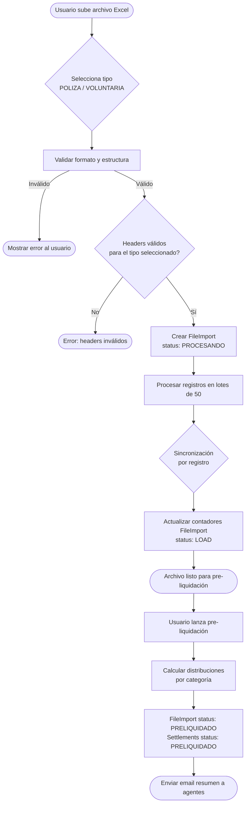
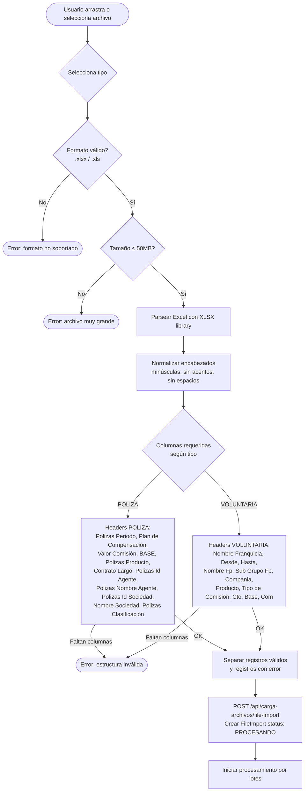
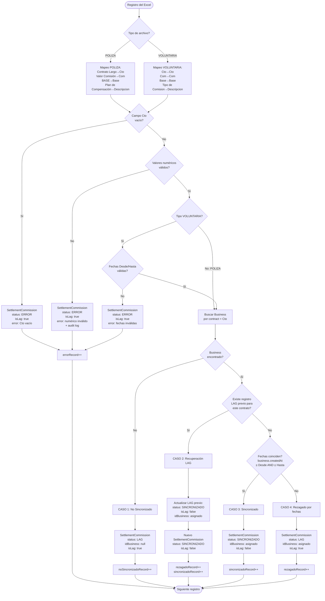
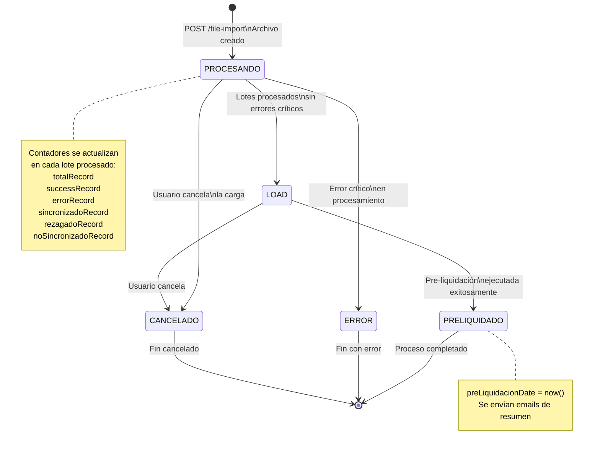
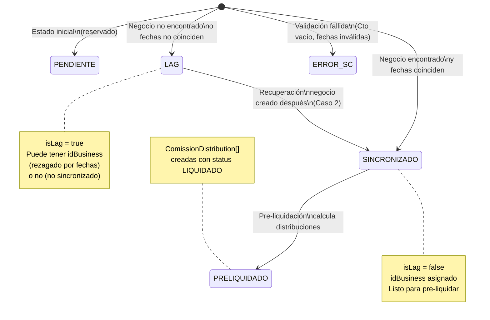
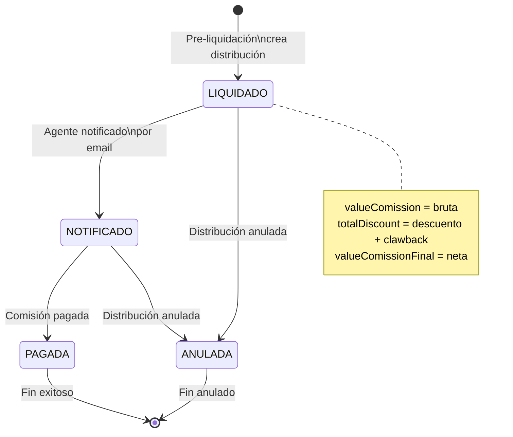
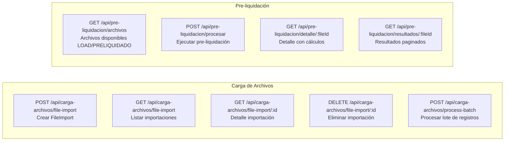

# Flujo de Sincronización y Pre-liquidación

Diagramas de flujo detallados del proceso de carga de archivos, sincronización de comisiones y pre-liquidación.
Este documento preserva el flujo actual de estados (`PROCESANDO`, `LOAD`, `PRELIQUIDADO`, etc.)
y los contadores de `file_import`. La única adaptación es soportar dos tipos de Excel
(`POLIZA` y `VOLUNTARIA`) manteniendo las mismas reglas de **lag / no sincronizado / sincronizado**.

## 1. Flujo General del Sistema (adaptado a 2 tipos de Excel)



## 2. Validación y Carga del Archivo Excel (por tipo)



## 3. Sincronización - Detalle por Registro (mantener estados y contadores)



Notas:
- En POLIZA se guardan snapshots: `commission_type = POLIZA`, `origin_commission = CARTERA` si Plan = FRONT19_OMPEV, y `clawback_percentage` si Plan contiene `CLAW`.
- En VOLUNTARIA se valida rango de fechas; POLIZA no aplica validación de fechas.
- En ambos tipos se guardan `discount_percentage` (snapshot) y `descripcion` según el tipo.

## 4. Transiciones de Estado - FileImport



## 5. Transiciones de Estado - SettlementCommission



## 6. Transiciones de Estado - ComissionDistribution



## 7. Pre-liquidación - Cálculo de Distribuciones (sin romper estados)

```mermaid
flowchart TD
    Start([Usuario selecciona archivo\nen estado LOAD]) --> SelectRange[Seleccionar rango de fechas\no mes: YYYY-MM]
    SelectRange --> FetchSC[Obtener SettlementCommissions\nstatus = SINCRONIZADO\nen rango de fechas]
    FetchSC --> HasRecords{Hay registros\nsincronizados?}
    HasRecords -->|No| NoRecords([No hay registros\npara pre-liquidar])
    HasRecords -->|Sí| LoopSC[Para cada SettlementCommission]

    LoopSC --> GetBiz[Obtener Business\ny ProductPercentageCommission]
    GetBiz --> GetCategories[Obtener categorías activas\nProductPercentageCommissionCategory\nGENERAL, AGENCIA, LIDER, COACH]
    GetCategories --> GetSnapshots["Obtener discount_percentage y clawback_percentage\n(guardados en settlement_commission)"]
    GetSnapshots --> LoopCat[Para cada categoría]

    LoopCat --> CalcGross["comisiónBruta =\nbase_commission × porcentaje\n(porcentaje_portfolio si origin_commission=CARTERA\nsino porcentaje_distribucion)"]
    CalcGross --> CalcDiscount["totalDiscount =\ncomisiónBruta × (discount% + clawback%)"]
    CalcDiscount --> CalcNet["comisiónFinal =\ncomisiónBruta - totalDiscount"]
    CalcNet --> CreateCD[Crear CommissionDistribution\nvalueComission: bruta\ntotalDiscount: descuento + clawback\nvalueComissionFinal: neta\nstatus: LIQUIDADO]
    CreateCD --> MoreCats{Más categorías?}
    MoreCats -->|Sí| LoopCat
    MoreCats -->|No| UpdateSC[Actualizar SettlementCommission\nstatus: PRELIQUIDADO]
    UpdateSC --> MoreSC{Más registros?}
    MoreSC -->|Sí| LoopSC
    MoreSC -->|No| UpdateFI[Actualizar FileImport\nstatus: PRELIQUIDADO\npreLiquidacionDate: now]
    UpdateFI --> GroupByUser[Agrupar resultados por usuario]
    GroupByUser --> SendEmail([Enviar email resumen\na cada agente\nfire-and-forget])
```



## 8. Modelo de Datos - Entidades del Flujo (con 2 tipos de Excel)

```mermaid
erDiagram
    FileImport ||--o{ SettlementCommission : "contiene"
    Business ||--o{ SettlementCommission : "referenciado por"
    SettlementCommission ||--o{ CommissionDistribution : "genera"
    ProductPercentageCommissionCategory ||--o{ CommissionDistribution : "define %"
    %% CommissionConfiguration es tabla desconectada (sin FK)
    CommissionDistribution ||--o| Clawback : "retención opcional"
    User ||--o{ FileImport : "carga"
    User ||--o{ Business : "propietario"
    User ||--o{ Clawback : "dueño clawback"
    User ||--|| ClawbackBalance : "saldo neto"

    FileImport {
        int id PK
        string name_file
        string status "PROCESANDO | LOAD | ERROR | CANCELADO | PRELIQUIDADO"
        int total_record
        int success_record
        int error_record
        int sincronizado_record
        int rezagado_record
        int no_sincronizado_record
        datetime pre_liquidacion_date
    }

    SettlementCommission {
        int id PK
        int id_file_import FK
        int id_business FK "nullable"
        string descripcion
        decimal commission_value
        decimal commission_percentage "nullable"
        decimal base_commission
        decimal discount_percentage "snapshot"
        decimal clawback_percentage "snapshot"
        string origin_commission "CARTERA | NULL"
        string commission_type "POLIZA | VOLUNTARIA"
        string status "PENDIENTE | SINCRONIZADO | LAG | ERROR | PRELIQUIDADO"
        boolean is_lag
        string error "nullable"
    }

    CommissionDistribution {
        int id PK
        int id_settlement_commission FK
        int id_ppc_category FK
        decimal commission_value "bruta"
        decimal commission_value_final "neta"
        decimal total_discount
        decimal applied_discount_percentage "snapshot"
        string status "LIQUIDADO | NOTIFICADO | PAGADA | ANULADA"
    }

    CommissionConfiguration {
        int id PK
        decimal discount_percentage
        decimal clawback_percentage
        string status "ACTIVE | INACTIVE"
    }

    Clawback {
        int id PK
        int id_user FK
        int id_commission_distribution FK
        decimal value_clawback
        decimal porcentaje_applied
        string state "RETENIDO | LIBERADO | APLICADO | CANCELADO"
    }

    ClawbackBalance {
        int id_user PK/FK
        decimal total_amount
        datetime updated_at
    }
```

## 9. Resumen de Endpoints API



## Leyenda

| Símbolo | Significado |
|---------|-------------|
| `([...])` | Inicio / fin / evento externo |
| `[...]` | Proceso / acción |
| `{...}` | Decisión / condición |
| `-->` | Flujo secuencial |
| `-->❘Sí❘` | Rama condicional verdadera |
| `-->❘No❘` | Rama condicional falsa |

## Cómo ver los diagramas

Pegar el bloque de código mermaid en [mermaid.live](https://mermaid.live) o en cualquier visor que soporte Mermaid (GitHub, GitLab, VS Code con extensión Markdown Mermaid).
