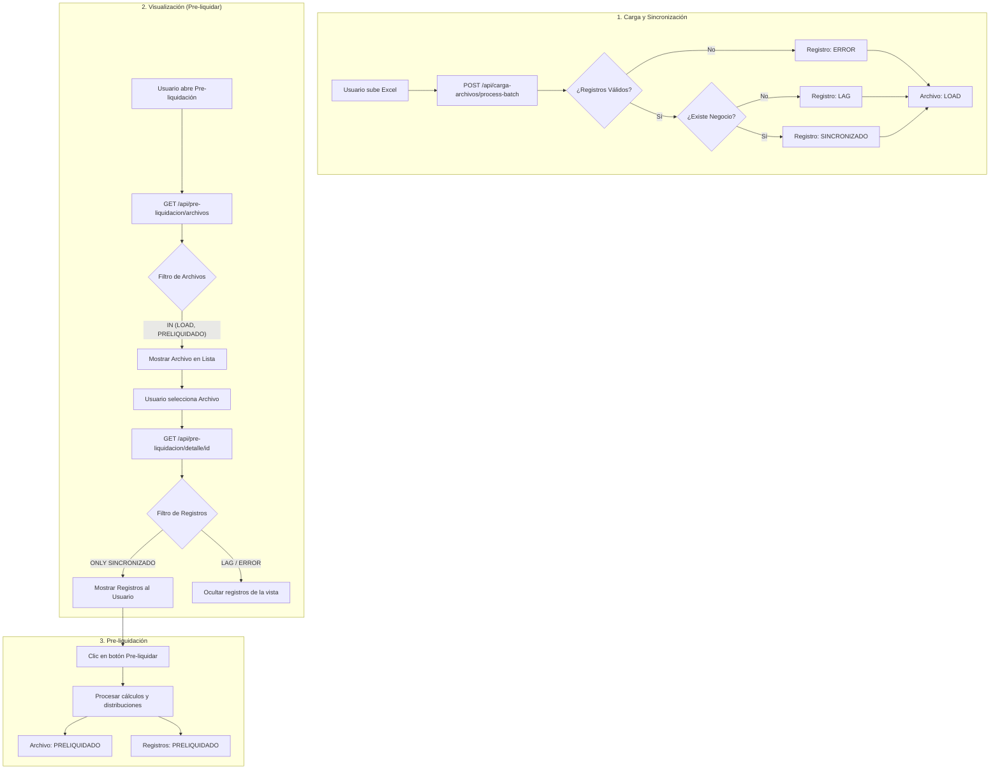

# Spec: Fix Pre-liquidation Visibility & Filtering

## Purpose
Ensure that synchronized files (status `LOAD`) are visible in the dashboard and that the detail view correctly filters for actionable records (`SINCRONIZADO`).

## Problem Description
1. **Visibility Bug**: Newly uploaded files are marked as `LOAD`, but the API only searches for `COMPLETADO` or `PRELIQUIDADO`.
2. **Noise in Detail**: The pre-liquidation detail view shows all records, including `LAG` and `ERROR`, which cannot be processed for commission distribution.

## Full Business Flow

## Requirements
1. **FR-01**: The system SHALL include files with status `LOAD` in the `GET /api/pre-liquidacion/archivos` endpoint.
2. **FR-02**: The system SHALL filter `SettlementCommission` records to show ONLY `SINCRONIZADO` status in the pre-liquidation detail view.
3. **FR-03**: The pre-liquidation process SHALL only be available for files in `LOAD` state.

## Technical Design
- **API Archivos**: Modify `src/app/api/pre-liquidacion/archivos/route.ts` Prisma query.
- **Service Detail**: Modify `obtenerDetallePreLiquidacion` in `src/features/pre-liquidacion/services/pre-liquidacion.service.ts` to change the `where` clause for records.
