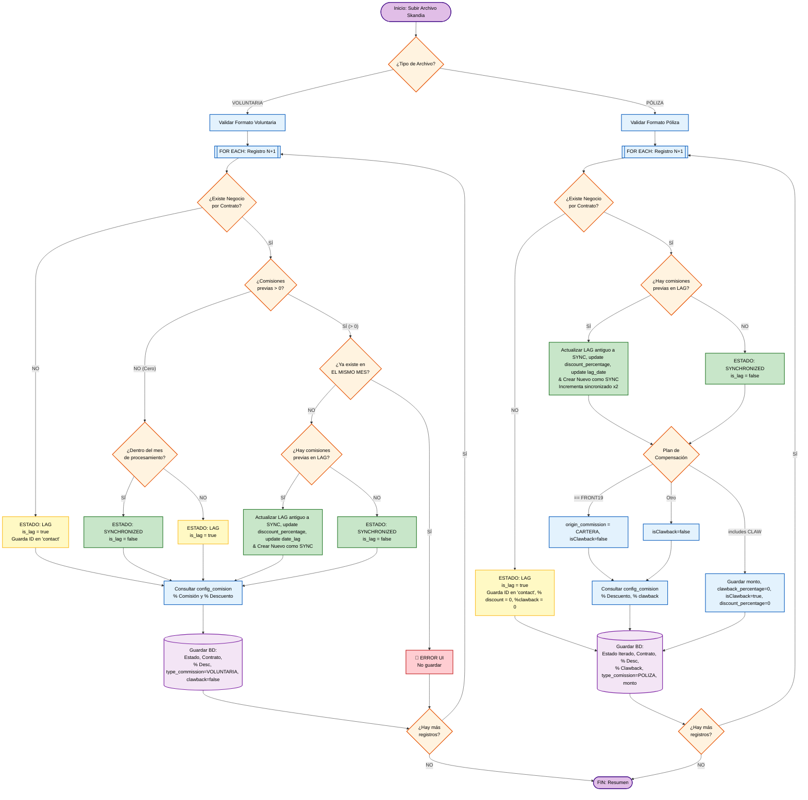

```mermaid

flowchart TD
    %% Estilos de los nodos
    classDef start_end fill:#e1bee7,stroke:#4a148c,stroke-width:2px,color:#000
    classDef decision fill:#fff3e0,stroke:#e65100,stroke-width:2px,color:#000
    classDef state_sync fill:#c8e6c9,stroke:#2e7d32,stroke-width:2px,color:#000
    classDef state_lag fill:#fff9c4,stroke:#fbc02d,stroke-width:2px,color:#000
    classDef state_error fill:#ffcdd2,stroke:#c62828,stroke-width:2px,color:#000
    classDef process fill:#e3f2fd,stroke:#1565c0,stroke-width:2px,color:#000
    classDef db fill:#f3e5f5,stroke:#7b1fa2,stroke-width:2px,color:#000

    %% INICIO Y TIPO
    START([Inicio: Subir Archivo Skandia]):::start_end --> TYPE{¿Tipo de Archivo?}:::decision

    %% RAMA VOLUNTARIA
    TYPE -- VOLUNTARIA --> V_INIT[Validar Formato Voluntaria]:::process
    V_INIT --> LOOP_V[[FOR EACH: Registro N+1]]:::process

    LOOP_V --> V_BUSCAR{¿Existe Negocio<br/>por Contrato?}:::decision

    %% Negocio NO existe
    V_BUSCAR -- NO --> V_LAG_1[ESTADO: LAG<br/>is_lag = true<br/>Guarda ID en 'contact']:::state_lag

    %% Negocio SÍ existe
    V_BUSCAR -- SÍ --> V_COMIS{¿Comisiones<br/>previas > 0?}:::decision

    %% 0 Comisiones
    V_COMIS -- NO (Cero) --> V_FECHA{¿Dentro del mes<br/>de procesamiento?}:::decision
    V_FECHA -- SÍ --> V_SYNC_1[ESTADO: SYNCHRONIZED<br/>is_lag = false]:::state_sync
    V_FECHA -- NO --> V_LAG_2[ESTADO: LAG<br/>is_lag = true]:::state_lag

    %% > 0 Comisiones
    V_COMIS -- SÍ (> 0) --> V_MES{¿Ya existe en<br/>EL MISMO MES?}:::decision
    V_MES -- SÍ --> V_ERR[🛑 ERROR UI<br/>No guardar]:::state_error

    V_MES -- NO --> V_HAY_LAG{¿Hay comisiones<br/>previas en LAG?}:::decision
    V_HAY_LAG -- SÍ --> V_REC_LAG[Actualizar LAG antiguo a SYNC, update disccount_percentage, update date_lag<br/>& Crear Nuevo como SYNC]:::state_sync
    V_HAY_LAG -- NO --> V_SYNC_3[ESTADO: SYNCHRONIZED<br/>is_lag = false]:::state_sync

    %% Confluencia Voluntaria
    V_LAG_1 & V_SYNC_1 & V_LAG_2 & V_REC_LAG & V_SYNC_3 --> GET_CONF_V[Consultar config_comision<br/>% Comisión y % Descuento]:::process
    GET_CONF_V --> SAVE_V[(Guardar BD:<br/>Estado, Contrato,<br/>% Desc, type_commission=VOLUNTARIA, clawback=false)]:::db

    %% Flujo de retorno Voluntaria
    SAVE_V --> NEXT_V{¿Hay más<br/>registros?}:::decision
    V_ERR --> NEXT_V
    NEXT_V -- SÍ --> LOOP_V
    NEXT_V -- NO --> END_PROC([FIN: Resumen]):::start_end

    %% ========================================
    %% RAMA PÓLIZA
    %% ========================================
    TYPE -- PÓLIZA --> P_INIT[Validar Formato Póliza]:::process
    P_INIT --> LOOP_P[[FOR EACH: Registro N+1]]:::process

    LOOP_P --> P_BUSCAR{¿Existe Negocio<br/>por Contrato?}:::decision

    %% Negocio NO existe
    P_BUSCAR -- NO --> P_LAG_1[ESTADO: LAG<br/>is_lag = true<br/>Guarda ID en 'contact', % discount = 0, %clawback = 0]:::state_lag

    %% Negocio SÍ existe
    P_BUSCAR -- SÍ --> P_HAY_LAG{¿Hay comisiones<br/>previas en LAG?}:::decision

    P_HAY_LAG -- SÍ --> P_REC_LAG[Actualizar LAG antiguo a SYNC, update discount_percentage, update lag_date<br/>& Crear Nuevo como SYNC<br/>Incrementa sincronizado x2]:::state_sync
    P_HAY_LAG -- NO --> P_SYNC_3[ESTADO: SYNCHRONIZED<br/>is_lag = false]:::state_sync

    P_LAG_1 --> SAVE_P

    P_REC_LAG & P_SYNC_3 --> P_PLAN{Plan de<br/>Compensación}:::decision

    P_PLAN -- "== FRONT19" --> P_CART[origin_commission = CARTERA, isClawback=false]:::process
    P_PLAN -- "includes CLAW" --> P_CLAW[Guardar monto, clawback_percentage=0, isClawback=true, discount_percentage=0]:::process
    P_PLAN -- "Otro" --> P_NULL[isClawback=false]:::process

    %% Confluencia Póliza
    P_CART & P_NULL --> GET_CONF_P[Consultar config_comision<br/>% Descuento, % clawback]:::process

    GET_CONF_P --> SAVE_P
    P_CLAW --> SAVE_P[(Guardar BD:<br/>Estado Iterado, Contrato, % Desc,<br/>% Clawback, type_comission=POLIZA, monto)]:::db

    %% Flujo de retorno Póliza
    SAVE_P --> NEXT_P{¿Hay más<br/>registros?}:::decision
    NEXT_P -- SÍ --> LOOP_P
    NEXT_P -- NO --> END_PROC


```
