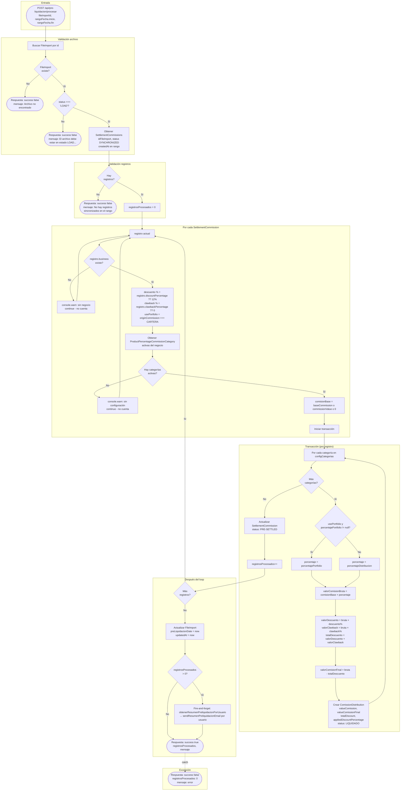

# Exploration: pre-liquidacion-flow

## Diagrama: Flujo completo de pre-liquidación (todos los casos)



### Casos resumidos

| Caso | Condición | Resultado |
|------|-----------|-----------|
| Archivo no existe | FileImport no encontrado | `success: false`, "Archivo no encontrado" |
| Archivo no en LOAD | status !== 'LOAD' | `success: false`, "El archivo debe estar en estado LOAD..." |
| Sin registros en rango | 0 SettlementCommission SYNCHRONIZED en rango | `success: false`, "No hay registros sincronizados..." |
| Registro sin negocio | registro.business == null | Se omite (continue), no incrementa contador |
| Registro sin categorías | 0 ProductPercentageCommissionCategory activas | Se omite (continue), no incrementa contador |
| Registro válido | business + categorías activas | Transacción: N ComissionDistribution + SettlementCommission → PRE-SETTLED |
| Porcentaje por categoría | originCommission === 'CARTERA' y porcentajePortfolio != null | Usa `porcentajePortfolio`; si no, `porcentajeDistribucion` |
| Descuento/Clawback | Snapshot en SettlementCommission | discountPercentage (fallback 12%), clawbackPercentage (fallback 0) |
| Tras procesar | Siempre | FileImport.preLiquidacionDate actualizado |
| Emails | registrosProcesados > 0 | Resumen por usuario (fire-and-forget) |

### Fórmulas por categoría (dentro de la transacción)

```
porcentaje     = usePortfolio && config.porcentajePortfolio != null ? porcentajePortfolio : porcentajeDistribucion
bruta          = comisionBase × porcentaje
valorDescuento = bruta × descuentoPorcentaje
valorClawback  = bruta × clawbackPorcentaje
totalDescuento = valorDescuento + valorClawback
valorFinal     = bruta - totalDescuento
```

---

## Documentation References (docs/)

La documentación existente del proyecto describe el flujo de pre-liquidación en:

| Documento | Contenido relevante |
|------------|---------------------|
| **`docs/preliquidacion-flow.md`** | Flujo resumido: Carga (FileImport PROCESANDO → LOAD) → Pre-liquidación (POST `/api/pre-liquidacion/procesar` con fileImportId y rango) → Calcular distribuciones → Crear CommissionDistribution (status LIQUIDADO) → Actualizar SettlementCommission a PRELIQUIDADO → Actualizar FileImport (PRELIQUIDADO + preLiquidacionDate). Condición: FileImport status = LOAD y existencia de SettlementCommission SINCRONIZADO en rango. |
| **`docs/sync-preliquidacion-flow.md`** | Flujo detallado: estados FileImport (PROCESANDO, LOAD, PRELIQUIDADO), SettlementCommission (SINCRONIZADO → PRELIQUIDADO), ComissionDistribution (LIQUIDADO con valueComission = bruta, totalDiscount = descuento + clawback, valueComissionFinal = neta). Sección 7: Pre-liquidación — obtener SettlementCommissions SINCRONIZADO en rango; por cada uno obtener Business, categorías activas (GENERAL, AGENCIA, LIDER, COACH), snapshots discount_percentage y clawback_percentage desde settlement_commission; por categoría: comisiónBruta = base × porcentaje (porcentaje_portfolio si origin_commission=CARTERA, sino porcentaje_distribucion); totalDiscount = bruta × (discount% + clawback%); comisiónFinal = bruta - totalDiscount; crear CommissionDistribution; actualizar SettlementCommission a PRELIQUIDADO; actualizar FileImport y preLiquidacionDate; enviar email resumen por usuario. Incluye ERD (CommissionDistribution → Clawback opcional, User → ClawbackBalance) y endpoints (GET archivos, POST procesar, GET detalle/:fileId, GET resultados/:fileId). |
| **`docs/commission-sync-analysis.md`** | “Cambios específicos en pre-liquidación”: estado actual (valorComision como base, discount desde tabla Discount) vs estado requerido (base_commission, discount_percentage y clawback_percentage desde settlement_commission; porcentaje por rol según origin_commission = CARTERA). Fórmula documentada: COMISION_GENERAL = BASE × PORCENTAJE; COMISION_GENERAL_DESPUES_DE_DESCUENTO = COMISION_GENERAL × DISCOUNT_PERCENTAGE; CLAWBACK = COMISION_GENERAL_DESPUES_DE_DESCUENTO × CLAWBACK_PERCENTAGE; TOTAL_COMISION = COMISION_GENERAL_DESPUES_DE_DESCUENTO - CLAWBACK. Nota: en el código actual el clawback se aplica sobre la bruta (bruta × clawback%), no sobre “después de descuento”; totalDiscount = descuento + clawback y valorComisionFinal = bruta - totalDescuento. También menciona impacto por eliminación de fecha_pago (filtro por rango de fechas usa createdAt en el código). |

## Current State

- **Entry point**: Pre-liquidación se dispara con `POST /api/pre-liquidacion/procesar` (body: `fileImportId`, `rangoFecha: { inicio, fin }`). Lógica en `src/features/pre-liquidacion/services/pre-liquidacion.service.ts`. Coincide con `docs/sync-preliquidacion-flow.md` §7 y `docs/preliquidacion-flow.md`.
- **Precondiciones**: FileImport debe existir y tener `status === 'LOAD'`. Se consultan `SettlementCommission` con `status === 'SYNCHRONIZED'` y `createdAt` en el rango (no se usa `fechaPago`; ver commission-sync-analysis.md sobre sustitución).
- **Input values**: De `SettlementCommission` (snapshot en carga): `baseCommission` o `commissionValue`, `discountPercentage`, `clawbackPercentage`. Porcentajes por categoría de `ProductPercentageCommissionCategory`: `porcentajePortfolio` si `originCommission === 'CARTERA'`, si no `porcentajeDistribucion`. Alineado con docs (snapshots en settlement_commission; CARTERA → portfolio).
- **Formulas (implementación actual)**:
  - `valorComisionBruta = base × porcentajeCategoria`
  - `valorDescuento = valorComisionBruta × discountPercentage`
  - `valorClawback = valorComisionBruta × clawbackPercentage`
  - `totalDescuento = valorDescuento + valorClawback`
  - `valorComisionFinal = valorComisionBruta - totalDescuento`
  - Es decir: descuento y clawback se aplican sobre la **bruta** por categoría; la fórmula en commission-sync-analysis (clawback sobre “después de descuento”) no está implementada así.
- **Output**: Se crean filas en `ComissionDistribution` con `valueComission` (bruta), `valueComissionFinal` (neta), `totalDiscount`, `appliedDiscountPercentage`, `status: 'LIQUIDADO'`. `SettlementCommission` pasa a `PRE-SETTLED` (en docs se nombra PRELIQUIDADO). Se actualiza `FileImport.preLiquidacionDate` (y en docs se menciona status PRELIQUIDADO; en código el estado del archivo no se cambia a PRELIQUIDADO en la ruta actual, solo la fecha). Tras procesar, se envía email de resumen por usuario (fire-and-forget), como en sync-preliquidacion-flow.
- **Clawback persistence**: El esquema Prisma define `Clawback` (historial por distribución) y `ClawbackBalance` (saldo por usuario), y el ERD en sync-preliquidacion-flow los muestra como “retención opcional” y “saldo neto”. Durante la pre-liquidación **no** se escribe en estas tablas; el clawback solo reduce la comisión neta en el cálculo. No se crea fila en `Clawback` ni se actualiza `ClawbackBalance`.

## Affected Areas

- `src/features/pre-liquidacion/services/pre-liquidacion.service.ts` — Where distribution and clawback math are computed; would be extended to create `Clawback` and update `ClawbackBalance` when `valorClawback > 0`.
- Load-file process: `process-batch` and poliza/voluntaria processors — Supply `discountPercentage` and `clawbackPercentage` snapshots on `SettlementCommission`; no change required for “balance affected” unless we add new fields.
- `prisma/schema.prisma` — `Clawback` and `ClawbackBalance` models already exist; no schema change needed for approach 2 (create Clawback + update balance).

## Approaches

1. **Leave as-is** — Clawback remains a mathematical deduction only; no `Clawback` or `ClawbackBalance` persistence.
   - Pros: No code change; current behavior is consistent.
   - Cons: No audit trail or balance for clawback; reporting and “balance affected when clawback” cannot be implemented.
   - Effort: None.

2. **Implement Clawback row creation and ClawbackBalance update** — When `valorClawback > 0`, create a `Clawback` record linked to the new `ComissionDistribution` and the user; create or update `ClawbackBalance` for that user (e.g. increase balance by `valorClawback`).
   - Pros: Full history and per-user balance; enables reporting and future “balance affected” flows (e.g. release, apply).
   - Cons: Requires transaction boundaries (distribution + Clawback + ClawbackBalance); initial state for `Clawback.state` and balance semantics must be defined.
   - Effort: Medium.

3. **Only create Clawback history (no balance)** — Create `Clawback` rows when `valorClawback > 0`, but do not read or write `ClawbackBalance`.
   - Pros: Audit trail without changing balance logic; smaller change.
   - Cons: “Balance affected when clawback” still not implemented; balance table remains unused for pre-liquidación.
   - Effort: Low–Medium.

## Recommendation

For the goal “balance affected when clawback,” use **Approach 2** in a dedicated change: implement `Clawback` row creation and `ClawbackBalance` update during pre-liquidación when `valorClawback > 0`. Define `Clawback.state` (e.g. `RETENIDO`) and whether balance is increased at pre-liquidación and later decreased on release/apply. Keep this exploration scoped to the pre-liquidación flow; spec and design can detail transaction scope and idempotency.

## Risks

- Transaction scope: Creating `ComissionDistribution`, `Clawback`, and updating `ClawbackBalance` must be atomic to avoid inconsistent state.
- Existing data: No backfill of `Clawback`/`ClawbackBalance` for already pre-liquidated records unless a separate migration or job is added.
- Semantics: Clarify whether “balance” increases at pre-liquidación (retention) and how release/apply dates and states interact with reporting.
- **Doc/code alignment**: `docs/commission-sync-analysis.md` describe clawback aplicado sobre “comisión después de descuento”; el código aplica descuento y clawback sobre la bruta y suma ambos en `totalDiscount`. Cualquier actualización de docs (p. ej. preliquidación) debería reflejar la fórmula real o un cambio de spec si se adopta la fórmula del análisis.

## Ready for Proposal

Yes. The exploration is scoped, aligned with `docs/preliquidacion-flow.md`, `docs/sync-preliquidacion-flow.md` and `docs/commission-sync-analysis.md`, and the recommended approach (2) is clear; the orchestrator can hand off to **sdd-propose** to produce the change proposal.
