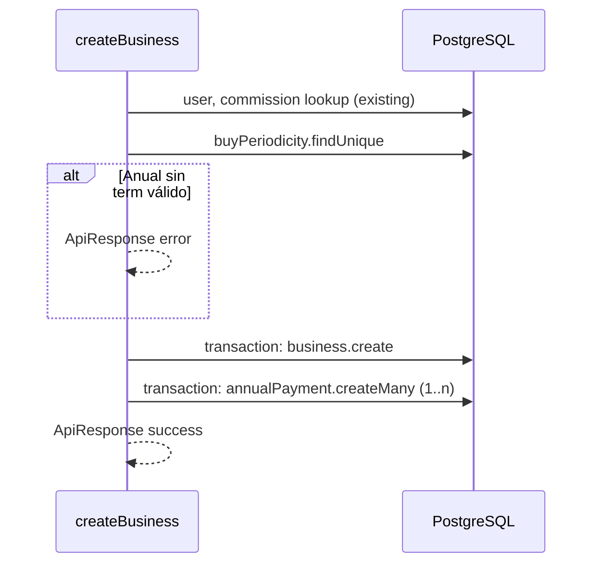

# Design: Annual payment rows on create (H1)

## Technical Approach

Mirror the proposal: introduce **`AnnualPayment`** in Prisma, then wrap **`business.create`** + conditional **`annualPayment.createMany`** in **`prisma.$transaction`**. Detect **Anual** via **`buyPeriodicity.name === 'Anual'`** (`prisma/seeds/buy-periodicity.ts`). Keep **`determineBusinessStatus(contract)`** and **`findProductPercentageCommission`** exactly before the transactional block so behavior matches today until insert. Validation: **`term`** required iff periodicity resolves to Anual—done **after** loading `BuyPeriodicity` by `idBuyPeriodicity` (Zod stays sync; avoids async discriminated schemas).



## Architecture Decisions

| Decision | Choice | Alternatives | Rationale |
| --- | --- | --- | --- |
| Estado fila anualidad | Prisma **`enum`** `AnnualPaymentStatus` (`SIN_FONDEAR`, `FONDEADO`) | `String` como `business.status` | Integridad en BD; valores acotados y legibles en SQL |
| Borrado negocio | **`onDelete: Cascade`** desde `AnnualPayment` → `Business` | Restrict, SetNull | H1 sin negocio huérfano; filas solo viven con el negocio |
| Unicidad | `@@unique([idBusiness, installmentIndex])` | Solo índice | Garantiza 1…n sin duplicados |
| Constante nombre | **`'Anual'`** literal en código de negocio | ID fijo por env | Alineado a PRD y seed; documentar en comentario |
| Validación `term` | Imperativa tras `findUnique` periodicidad | `z.superRefine` async | Patrón actual ya usa early returns; menos fricción con Zod |
| Techo **`term`** | **25** (oficial); misma regla en **form** y **Zod server** (`createBusiness`) vía constante compartida en fase implementación | Solo UI o solo server | Evita drift; rechazar `term` &gt; 25 antes de persistir |

## Data Flow

```
Form → createBusiness(input)
  → validate Zod base (incl. term en 1…25 cuando aplica)
  → user + commission (unchanged)
  → buyPeriodicity by idBuyPeriodicity
  → if Anual: require term (entero **1…25**) else skip annual rows
  → $transaction:
        business.create
        if Anual: createMany [{ index 1..term, status SIN_FONDEAR, dateAnchored null }, ...]
  → return business
```

## File Changes

| File | Action | Description |
| --- | --- | --- |
| `prisma/schema.prisma` | Modify | `AnnualPayment` model, `annualPayments` en `Business`, enum; `@@map("annual_payment")` |
| `prisma/migrations/*/migration.sql` | Create | Tabla + FK + unique + índices |
| `src/features/negocios/actions/create-business.ts` | Modify | Transaction, lookup periodicidad, `createMany` |
| `src/features/negocios/types/annual-payment.types.ts` | Create | Re-export enum o const keys para tests (opcional, mínimo) |
| `prisma/seeds/business.ts` | Modify | Si hay negocios Anual en seed, asegurar **n** filas o ajustar term |
| `src/features/negocios/__tests__/actions/create-business.test.ts` | Create | Mock `prisma`/`$transaction`; casos Anual / no Anual / error |
| `src/features/negocios/lib/business-form-schemas.ts` | Modify | Aline **`terms.max(25)`** con servidor (hoy sigue en 1200 hasta implementación) |
| `src/features/negocios/lib/business-term-limits.ts` | Create | **Implementación:** `BUSINESS_TERM_MAX = 25` exportado para form + action |

## Interfaces / Contracts

- **Input:** sin cambio de firma `CreateBusinessInput`; `term` sigue opcional en tipo base pero **runtime** rechaza Anual sin `term`.
- **`AnnualPaymentStatus` (display, errores/UI futuros):** `SIN_FONDEAR` → **"SIN FONDEAR"**; `FONDEADO` → **"FONDEADO"** (mismo texto que valor enum; sin i18n extra en H1).
- **Output:** `ApiResponse<Business>` sin cambios; cliente no recibe `annualPayments` en H1 (opcional futuro: `include` no requerido).

```prisma
// Sketch (names follow Prisma conventions)
enum AnnualPaymentStatus {
  SIN_FONDEAR
  FONDEADO
}
model AnnualPayment {
  id                Int                   @id @default(autoincrement()) @map("id_annual_payment")
  idBusiness        Int                   @map("id_business")
  installmentIndex  Int                   @map("installment_index")
  status            AnnualPaymentStatus   @default(SIN_FONDEAR)
  dateAnchored      DateTime?             @map("date_anchored")
  createdAt         DateTime              @default(now()) @map("created_at")
  updatedAt         DateTime              @updatedAt @map("updated_at")
  business          Business              @relation(...)
  @@unique([idBusiness, installmentIndex])
  @@map("annual_payment")
}
```

## Testing Strategy

| Layer | What | Approach |
| --- | --- | --- |
| Unit | `createBusiness` ramas Anual / no Anual / error term | `vi.mock('@/lib/prisma')`, assert `transaction` crea **n** inserts o ninguno |
| Integration | Opcional | Vitest + DB test si existe patrón en repo; si no, omitir en H1 |
| E2E | Fuera | H1 es persistencia server action |

## Migration / Rollout

1. **`prisma migrate dev`** en dev; **`migrate deploy`** en QA/prod en ventana acordada.  
2. Sin feature flag: comportamiento nuevo solo en **create** posterior al deploy.  
3. Negocios Anual **históricos** sin filas: sin backfill en H1 (riesgo aceptado en proposal).

## Closed decisions (product / UX)

| Tema | Decisión |
| --- | --- |
| Techo **`term`** | **25**. Validación **server-side** debe **repetir** la misma cota que la UI (constante única recomendada al implementar). |
| Labels `AnnualPaymentStatus` | **`SIN_FONDEAR` → "SIN FONDEAR"**, **`FONDEADO` → "FONDEADO"** para mensajes/display; no bloquea H1 de persistencia. |
