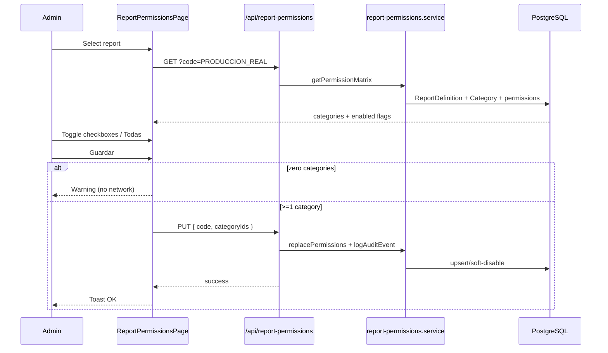
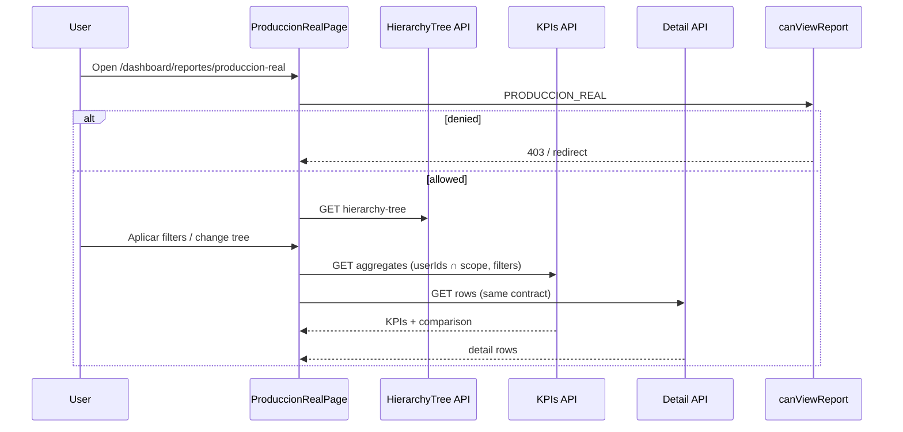

## Context

See `proposal.md` for motivation (COM-80 + COM-81).

Today:
- **Reportes** exists in `menu-items.tsx` but pages under `/dashboard/reportes/**` are missing.
- Visibility uses static `RolePermissions.reportes` (`all` / `business` / `personal`) — not by `Category`.
- Production dashboard already provides reusable hierarchy tree (`HierarchyTreePanel` + BFS service), filter draft/apply pattern, TRM proxy, and currency classifier (`idCurrency === 1` ⇒ COP).
- Excel export exists for negocios (`xlsx-js-style`) but must not be reused blindly (PII / different sheets).
- MFUND rule already encoded as SKANDIA + MFUND in negocios helpers.
- Soft delete + `logAuditEvent` are mandatory for mutations; Prisma stays in feature services.

Constraints: Feature-Based Architecture under `src/features/`; API routes never call Prisma; Bogotá date helpers for business dates; identifiers in English, UI strings in Spanish.

## Goals / Non-Goals

**Goals:**
- Persist report↔category visibility with stable codes; Admin UI full CA coverage.
- Ship Producción Real with filters, hierarchy, KPIs, comparison, table, Excel.
- Enforce permission on nav **and** every report API.
- Reuse dashboard hierarchy UX/contracts rather than inventing a new tree.
- Seed Performance Leader → `PRODUCCION_REAL` so CA1 works after deploy.

**Non-Goals:**
- Replacing the production dashboard or its charts.
- Configurable report definitions beyond catalog metadata (code, title, route, active).
- Multi-currency beyond COP vs foreign-as-USD classifier already used by the dashboard.
- Payment-level P&L accounting beyond the stated 2ª+ Anualidad exclusion on KPI Único.

## Decisions

### D1 — Domain split: `report-permissions` + `reports`

| Option | Pros | Cons |
|--------|------|------|
| A. Single `reports` feature | Fewer folders | Mixes admin config with heavy analytics |
| **B. `report-permissions` + `reports` (chosen)** | Matches Screaming Architecture; COM-80 vs COM-81 boundaries; permissions reusable by future reports | Two features to wire |

**Rationale:** Admin configuration is a distinct capability from the Producción Real analytics surface. Nav/authz helpers live in `report-permissions`; report UI/services in `reports` (subfolder or module `produccion-real`).

```
src/features/report-permissions/
  components/ hooks/ lib/ services/ types/ __tests__/
src/features/reports/
  produccion-real/
    components/ hooks/ lib/ services/ types/ mappers/ __tests__/
```

Pages:
- `src/app/dashboard/admin/report-permissions/page.tsx`
- `src/app/dashboard/reportes/produccion-real/page.tsx`

### D2 — Data model

```prisma
model ReportDefinition {
  id          Int      @id @default(autoincrement())
  code        String   @unique @db.VarChar(50)   // PRODUCCION_REAL
  name        String   @db.VarChar(150)          // Producción Real
  description String?
  routePath   String   @map("route_path") @db.VarChar(200)
  status      Boolean  @default(true)
  createdAt   DateTime @default(now()) @map("created_at")
  updatedAt   DateTime @updatedAt @map("updated_at")
  permissions CategoryReportPermission[]
  @@map("report_definition")
}

model CategoryReportPermission {
  id         Int              @id @default(autoincrement())
  idReport   Int              @map("id_report")
  idCategory Int              @map("id_category")
  status     Boolean          @default(true)
  createdAt  DateTime         @default(now()) @map("created_at")
  updatedAt  DateTime         @updatedAt @map("updated_at")
  report     ReportDefinition @relation(...)
  category   Category         @relation(...)
  @@unique([idReport, idCategory])
  @@map("category_report_permission")
}
```

- Soft delete = `status = false` (never `delete()`).
- Save replaces enablement set: enable selected rows (upsert `status=true`); soft-disable previously enabled not in selection.
- Seed: insert `PRODUCCION_REAL`; enable Category name **Performance Leader**.
- Update `prisma/ERD.md`.

**Alternative rejected:** Store permissions as JSON on Category — harder to query, audit, and index.

### D3 — Authorization model

```
canViewReport(user, reportCode):
  if role in ADMIN_BYPASS → true
  if !user.idCategory → false
  else active CategoryReportPermission for (reportCode, idCategory)
```

- Menu builder loads authorized report codes (session enrichment or lightweight API) and filters **Reportes** sub-items by `reportCode` on `MenuItem` (stop matching by Spanish title alone).
- Every Producción Real API calls `canViewReport` before work.
- Admin APIs require `permissions.administracion`.

**ADMIN bypass:** Yes for report viewing and Admin config. Static `RolePermissions.reportes` may remain for legacy stubs but MUST NOT grant `PRODUCCION_REAL` without category permission (except ADMIN bypass).

### D4 — Admin UI flow (COM-80)

Layout mirrors other Admin pages (`DashboardLayout` + `Card`):
1. Left/top: report selector (list of `ReportDefinition`).
2. Checkboxes for active categories + **Todas**.
3. Empty state label **Sin categorías habilitadas** when none checked.
4. **Guardar** → validate ≥1 category → PUT API → toast **Permisos actualizados correctamente**; else warning **Debe seleccionar al menos una categoría**.



Audit actions (examples): `REPORT_PERMISSION_UPDATED` (and created/deactivated if split).

### D5 — Producción Real UI composition (COM-81)

Match provided mockups (assets under Cursor project `assets/`):
1. **Filter bar:** Desde, Hasta, Tipo de Aporte (multi), Compañía, Moneda, Limpiar, Aplicar, Descargar Excel (green).
2. **Left card JERARQUÍA:** search “Buscar Money Strategist…”, checkbox tree — **reuse** `HierarchyTreePanel` / `HierarchySelectionContext` (extract shared module if needed to avoid tight coupling; prefer import + thin adapters first).
3. **KPI row:** Producción Real (star), Regular, Única, Fondeado + % conversión.
4. **Comparativa:** proportional horizontal bars Regular vs Única.
5. **Detalle:** continuous scroll table with required columns.

Draft vs applied: clone dashboard filter context pattern (local to reports feature).



### D6 — Filter & aggregation contracts

| Filter | Semantics |
|--------|-----------|
| Dates | Inclusive range on `Business.createdAt` via `parseBogotaInclusiveUtcRange` / `dateOnlyToBogotaNoonUtc` (do **not** copy brittle `new Date(yyyy-mm-dd)` from dashboard parse helper) |
| Tipo Aporte | Multi `ContributionType[]`; empty = Todas |
| Compañía | Multi company IDs; empty = Todas; catalog includes SKANDIA |
| Moneda | `ALL_TRM` \| `FOREIGN` \| `COP` |
| Hierarchy | `selectedUserIds` from tree; server intersects with `getSubordinateUserIds` / bypass roles |

**MFUND exclusion (global):**
`NOT (company.name = 'SKANDIA' AND product.name = 'MFUND')` on every query path (KPI, table, Excel). Prefer shared predicate helper in `reports/produccion-real/lib/`.

**KPI definitions** (after filters + hierarchy + currency inclusion + MFUND):

| KPI | Formula |
|-----|---------|
| Producción Real | `sum(value)`, `count(*)` |
| Regular | same where `contributionType = REGULAR` |
| Único | where `contributionType = UNICO` **and** exclude 2ª+ Anualidad: do not include businesses whose counted production event is a `Payment` with `installmentIndex >= 2`. At business-row grain (table by `Business`), Único rows are UNICO products; additionally exclude any business that only exists as renewal via `installmentIndex >= 2` if such rows appear in scope. Defensive: never add Regular 2ª+ payments into Único totals. |
| Fondeado | `status = FONDEADO` sum; `% = fondeado / produccionReal * 100` (0 if denom 0) |

**Currency:**
- `ALL_TRM`: include all currencies; display USD = foreignUSD + COP/TRM (reuse TRM endpoint pattern + classifier).
- `FOREIGN`: filter `idCurrency != COP`; no TRM.
- `COP`: filter COP only; no TRM.

### D7 — Hierarchy reuse strategy

1. **Preferred:** Import existing `HierarchyTreePanel`, selection context, and `/api/production-dashboard/hierarchy-tree` (or extract service to shared if coupling becomes painful).
2. Wire `selectedUserIds` into Producción Real queries exactly like heatmap/KPI dashboard consumers.
3. Do not fork checkbox cascade logic.

### D8 — Excel export

- `POST /api/reports/produccion-real/export` (authz + Zod + same filter body as screen).
- Library: existing `xlsx-js-style`.
- Sheets: **Resumen KPI**, **Regular vs Única**, **Detalle** (Spanish headers matching UI).
- Empty set → clear 404/message pattern like negocios export.
- Audit: `REPORT_EXPORTED` (details include report code + filter summary).
- Column set = table columns only (minimize PII vs full negocios export).

### D9 — API surface (illustrative)

| Method | Path | Role |
|--------|------|------|
| GET | `/api/report-permissions` | Admin: list reports + matrix |
| PUT | `/api/report-permissions` | Admin: replace categories for a report |
| GET | `/api/reports/me` | Session: authorized report codes for nav |
| GET | `/api/reports/produccion-real/kpis` | Aggregates |
| GET | `/api/reports/produccion-real/detail` | Table rows (cursor/limit for scroll) |
| POST | `/api/reports/produccion-real/export` | Excel |
| GET | hierarchy | Reuse production-dashboard hierarchy-tree |
| GET | TRM | Reuse production-dashboard TRM (or thin alias) |

All Prisma access in `*.service.ts` under features.

### D10 — Navigation changes

- Extend `MenuItem` with optional `reportCode?: string`.
- Replace generic Reportes stubs visibility with authorized codes; add **Producción Real** sub-item.
- **Locked:** Hide legacy stubs (`negocio`, `personales`) entirely — menu only shows authorized catalog reports.
- Admin sub-item **Permisos de Reportes** always when Administración visible.

## Risks / Trade-offs

| Risk | Mitigation |
|------|------------|
| Coupling to production-dashboard components | Thin adapters; extract shared hierarchy package only if imports cycle |
| Ambiguity of 2ª+ Anualidad at business grain | Spec + unit tests on helper; confirm with product if payment-level export ever needed |
| TRM outage when Moneda=Todas | Reuse dashboard manual TRM fallback UX |
| Users without `idCategory` never see reports | Document; Admin must assign category; Performance Leader seed covers primary audience |
| Large detail sets / Excel size | Cursor pagination for table; row cap on export with clear error |
| Legacy `RolePermissions.reportes` confusion | Nav switches to category permissions for this report; document migration |
| Date helper debt in dashboard parsers | New report uses Bogotá helpers only; do not copy broken patterns |

## Migration Plan

1. Migrate schema + seed report + Performance Leader permission.
2. Deploy Admin UI + APIs (COM-80).
3. Deploy Producción Real UI/APIs + nav wiring (COM-81).
4. Verify Performance Leader sees menu; other categories need Admin enablement.
5. Update `prisma/ERD.md` in same PR as schema.

**Rollback:** Soft-disable permissions / hide menu entries / revert UI routes. Additive tables can remain unused.

## Locked Decisions (apply time)

1. **Legacy Reportes stubs** (`/reportes/negocio`, `/reportes/personales`): **HIDE** entirely — menu only shows authorized catalog reports (e.g. Producción Real). Do not show dead stub links to any role.
2. **2ª+ Anualidad exclusion:** Defensive at negocio level via `installmentIndex >= 2` (D6). Implement in COM-81 batch; document in types/comments when scaffolding.
3. **Detail pagination:** Cursor / infinite scroll (COM-81 batch).

## Open Questions

_(Resolved — see Locked Decisions above.)_

## UI reference notes

Mockups supplied in Cursor assets (filters bar, hierarchy card, KPI cards, comparison bars, detail table). Design must preserve: green Excel button, hierarchy search placeholder, KPI iconography (star / 1A), continuous table scroll feeling.
