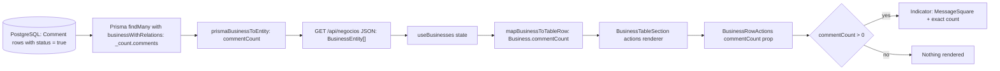
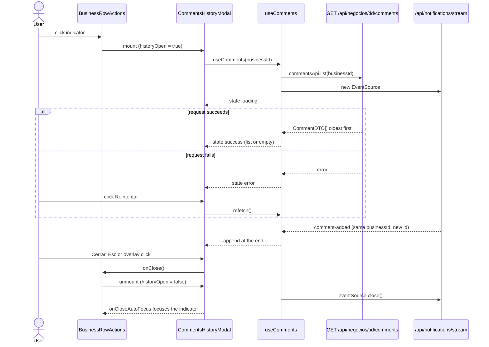
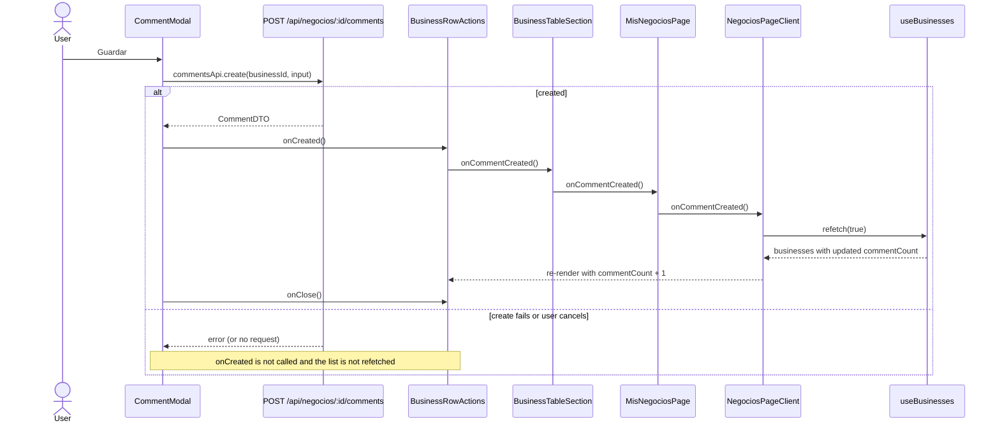
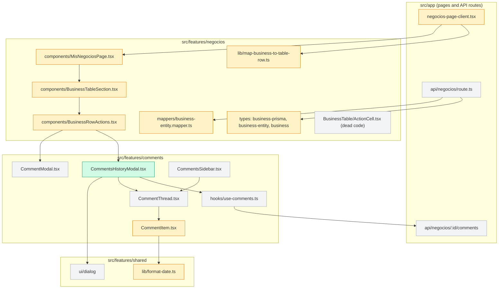
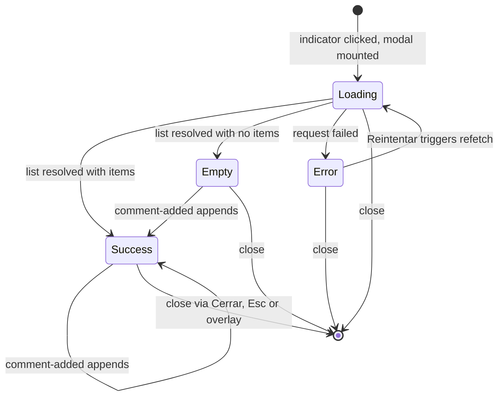

# Design: Comments indicator in the Business List Actions column

> Change: `comments-indicator-in-actions`
> Status: DRAFTED, all design questions answered (OQ1-OQ4 resolved below); awaiting the user's explicit go-ahead to run tasks
> Inputs: `proposal.md`, `specs/negocios/spec.md` (R1-R3, R7, R8, R10), `specs/contract-comments/spec.md` (R4-R6, R11), decisions (a)-(e) and OQ1-OQ4 in `state.yaml`.
> Every claim below was checked against the code on branch `feat/comments-indicator-in-business-list`. Where the code contradicts the spec, the section "Spec discrepancies found during design" records it.

## Technical Approach

The count is a filtered Prisma relation count added to the `_count` selection that the list query already uses, so it adds no request, endpoint, or migration. It travels through the two existing mapping layers (`BusinessEntity`, then the table-row `Business`) as a required `commentCount: number`. `BusinessRowActions` then renders a ghost button with an icon and the count. Clicking it mounts a new read-only `CommentsHistoryModal` in the `comments` feature. The modal reuses `useComments` (fetch plus SSE) and `CommentThread`/`CommentItem`, and it exists only while open.

A new shared formatter, `formatDateTimeBogota`, is placed next to `formatDateBogota` and fixes the timezone of `CommentItem`. The list refreshes after a comment is created by threading an `onCommentCreated` callback along the path `onUploadSuccess` already uses (page client, `MisNegociosPage`, `BusinessTableSection`, `BusinessRowActions`, `CommentModal.onCreated`).

## Spec discrepancies found during design (must be acknowledged before tasks)

| # | Spec statement | Verified fact | Design consequence |
|---|---|---|---|
| D1 | Fixture tests `fondear/__tests__/route.test.ts`, `fondear-aportes/__tests__/route.test.ts`, `features/negocios/__tests__/api/fondear-aportes.route.test.ts` build `_count` for `businessWithRelations` and need `comments`. | Their `_count: { payments: N }` objects mock each route's own pre-check query (`_count: { select: { payments: true } }`), cast `as never`. `prismaBusinessToEntity` is mocked in all three. | **No change** to these three files. Only `mock-prisma-business.ts` and three inline overrides in `business-entity.mapper.test.ts` need `comments`. |
| D2 | R11 (earlier draft): "the create-comment dialog thread (`CommentModal`)" renders `CommentItem`. | `CommentModal` renders only `CommentInput`. It has no thread and does not use `CommentItem` or `CommentThread`. The only timestamp it shows is `CommentInput.nowLabel()` (`toLocaleString('es-AR')` with no timezone), a "now" label for the draft. | **Resolved (OQ2)**: the R11 create-dialog scenario is dropped. `CommentItem` consumers are `CommentThread`, and through it `CommentsSidebar` and the new modal; R11 covers exactly those. `CommentInput.tsx` is not modified. |
| D3 | R4 (earlier draft): title fallback "Comentarios — Negocio #{id}" when the contract is null. | `mapBusinessToTableRow` turns a null contract into `'-'` (`contract: b.contract \|\| '-'`). `BusinessTableSection` passes `contract={row.contract ?? null}`, so `BusinessRowActions` never receives `null` from the list. Today `CommentModal` shows "-" as its locked contract label. | **Resolved (OQ1)**: the history modal title is "Comentarios — {contract}" with a contract and just "Comentarios" without one (null or the `'-'` placeholder), with no dash and no id fallback. The placeholder is mapped to "no contract" for the history modal only (Decision 7); "Agregar comentario" is out of scope and keeps its current "-" label. |
| D4 | R7 scenario "Privileged role: ADMIN, ANALISTA_SOPORTE, AGENTE, or COACH" (earlier draft). | `UserRole` has no `COACH`. It has ADMIN, DEFAULT, ASISTENTE_GERENCIA_OPERATIVA, ANALISTA_SOPORTE, AGENTE, CONSULTOR. `BusinessTableSection` treats `AGENTE` as the coach role (`isCoachRole = userRole === UserRole.AGENTE`). | **Resolved (OQ4)**: R7 now names `AGENTE` instead of "COACH". Tests still iterate over every real `UserRole` value. |
| D5 | Affected files list `BusinessTableSection.tsx` and `BusinessRowActions.tsx` for R10. | The list `refetch` lives in `src/app/dashboard/negocios/negocios-page-client.tsx` (`useBusinesses().refetch`) and reaches the table through `src/features/negocios/components/MisNegociosPage.tsx`. `onUploadSuccess` follows the same four-hop path. | Two more files are modified: `negocios-page-client.tsx` and `MisNegociosPage.tsx` (pass-through only). |
| D6 | R5 focus return "to the indicator". | `@radix-ui/react-dialog` 1.1.x modal content runs `onCloseAutoFocus` as `preventDefault(); context.triggerRef.current?.focus()`. Without a `DialogTrigger` (our case, because the dialog is mounted conditionally), focus does **not** return anywhere. Verified in `node_modules/@radix-ui/react-dialog/dist/index.mjs` lines 146-149. | The modal takes a `returnFocusRef` and handles `onCloseAutoFocus` explicitly (Decision 4). |
| D7 | Spec suggests the name `BusinessCommentsHistoryModal`. | Spec marks the name as indicative. | The final name is `CommentsHistoryModal` (Decision 3). |

## Architecture Decisions

### Decision 1: Count source is a filtered `_count` relation in `businessWithRelations`

**Choice**: In `src/features/negocios/types/business-prisma.types.ts`, add `comments: { where: { status: true } }` to `_count.select` of `businessWithRelations`, next to the existing `supports: { where: { status: true } }`. `PrismaBusinessWithRelations` then infers `_count.comments: number` automatically.
**Alternatives considered**:
- Per-row `GET /api/negocios/{id}/comments/count`. Rejected: N requests per page and a new endpoint (forbidden by R1).
- A separate `prisma.comment.groupBy({ by: ['businessId'] })` in the list route, merged by id. Rejected: it adds a second query, merging logic, and more Prisma code in a route handler that already breaks the "no Prisma in routes" rule. It also diverges from the established `supports` pattern.
- A list-only include, leaving `businessWithRelations` untouched. Rejected: the mapper is typed against `PrismaBusinessWithRelations`, so it would need a second payload type and a second mapper overload.
**Rationale**: This follows the exact pattern already used for active supports and needs one line of production code. The cost is one correlated subquery per row (page size at most 100, `Comment @@index([businessId, createdAt])`).
**Blast radius (verified)**: `businessWithRelations` is also used by `GET /api/negocios/[id]` and `PUT /api/negocios/[id]`, `cancel`, `fondear`, `fondear-aportes`, `mark-novedad`, `business-novedad.service.ts`, `business-date-anchored.service.ts`, and `business-get-by-id.server.ts` (detail and edit pages). Each of these queries gains one count subquery. Each response entity gains `commentCount`. No behavior changes.

### Decision 2: `commentCount` is a required `number` on both client shapes; the `BusinessRowActions` prop is optional

**Choice**:
- `BusinessEntity.commentCount: number` (`business-entity.types.ts`), mapped as `commentCount: prisma._count.comments` in `prismaBusinessToEntity`.
- Table-row `Business.commentCount: number` (`business.types.ts`), mapped as `commentCount: b.commentCount` in `mapBusinessToTableRow`.
- `BusinessRowActionsProps.commentCount?: number`. A missing, non-integer, or non-positive value means "no indicator" (R3).
**Alternatives considered**: An optional field everywhere. Rejected: the mapper always produces it, and a required field makes the compiler point to every fixture that builds these shapes. An optional prop on the leaf component stays, because R3 requires that a missing value renders nothing, and existing `BusinessRowActions` tests render without it.
**Rationale**: Strict types where the data always exists, and defensive handling at the UI edge.
**Compile-time fallout (verified list, non-cast object literals)**:
- `src/features/negocios/__tests__/fixtures/mock-prisma-business.ts` (line 38, `_count`). The five derived fixtures spread it and inherit the field.
- `src/features/negocios/__tests__/mappers/business-entity.mapper.test.ts` (inline `_count` overrides at lines 214, 228, 242).
- `src/features/negocios/__tests__/fixtures/mock-business.ts` (`createMockBusiness` entity around line 85, table-row builder around line 210).
- `src/features/shared/__tests__/fixtures/mockBusinessData.tsx` (6 `Business` literals; also used by `src/stories/DataTable.stories.tsx`).
- `src/features/negocios/__tests__/lib/map-business-to-table-row.test.ts` (`createBusinessEntity`).
- `src/features/negocios/components/__tests__/BusinessTableSection.novedad.test.tsx` and `BusinessTableSection.date-anchored.test.tsx` (`buildBusiness`).
- `src/app/dashboard/negocios/__tests__/negocios-page-client.fondear-confirmation.test.tsx` (`createBusinessRow`).
- Not affected: objects cast with `as BusinessEntity` or `as unknown as BusinessEntity` (`BusinessRowActions.tsx` line 257, `NovedadManageTrigger.tsx`, `BusinessViewModal.novedad-refresh.test.tsx`, `use-businesses.test.ts`), mocks of `prismaBusinessToEntity`, and `create-business.ts` (it uses Prisma's `Business`, not the table row). `ActionCell.tsx` and `action-cell.test.tsx` declare their own props and stay untouched (R8).

### Decision 3: Read-only modal is `CommentsHistoryModal` in `src/features/comments/components/`

**Choice**: Create `src/features/comments/components/CommentsHistoryModal.tsx`:

```tsx
interface CommentsHistoryModalProps {
  businessId: number
  /** Business contract number; null or empty means the business has no contract */
  contract: string | null
  open: boolean
  onClose: () => void
  /** Element that receives focus when the dialog closes (the row indicator) */
  returnFocusRef?: React.RefObject<HTMLElement | null>
}
```

Composition:
- `const { state, refetch } = useComments(businessId)`. Mounting the component starts the fetch and the SSE subscription. Unmounting closes the `EventSource` through the hook's existing cleanup.
- `<Dialog open={open} onOpenChange={(next) => { if (!next) onClose() }}>`. This is the same contract as `CommentModal`, so Esc and overlay click close through Radix.
- `<DialogContent className="sm:max-w-lg flex max-h-[85vh] flex-col overflow-hidden" onCloseAutoFocus={...}>`, then `DialogHeader`/`DialogTitle` with `Comentarios — {contract}` when `contract` is a non-empty string and just `Comentarios` otherwise (no dash, no id fallback).
- Body `<div className="min-h-0 flex-1 overflow-y-auto">`, which switches on `state.status`:
  - `idle` and `loading`: `<p>Cargando comentarios…</p>`, the same copy as `CommentsSidebar`.
  - `error`: `<p className="text-destructive">{state.error}</p>` plus `<Button variant="outline" size="sm" onClick={() => void refetch()}>Reintentar</Button>`.
  - `success`: `<CommentThread comments={state.data} />`. `CommentThread` already renders the empty message "Todavía no hay comentarios en este contrato." for `[]`, so "empty" is a UI view of `success([])` and needs no new branch.
- `DialogFooter`, then `<DialogClose asChild><Button variant="outline">Cerrar</Button></DialogClose>`.
- No `CommentInput`, no `createComment` usage, so the modal is read-only (R4).

The modal builds its own title from `contract` (a one-line conditional). It does not know about the table-row `'-'` placeholder: `BusinessRowActions` maps the placeholder to `null` before passing it (Decision 7), which keeps the `comments` feature free of any import from `negocios` (the dependency goes `negocios` to `comments`, never the other way). The existing `commentContract` variable of `BusinessRowActions` is not touched, so "Agregar comentario" behaves exactly as today.

**Alternatives considered**:
- Repurposing `CommentModal`. Rejected: forbidden by R8, and it mixes create and read responsibilities (SRP).
- Reusing `CommentsSidebar` in a `readOnly` mode inside the table. Rejected: it is a `Sheet` with its own trigger button and auto-open logic, and it always mounts `useComments`.
- Placing the modal in `features/negocios`. Rejected: it renders comment-domain UI only. The `comments` feature already owns `CommentModal` and `CommentsSidebar`, and `negocios` already imports from `comments` (Screaming Architecture: the folder states the domain).
- Name `BusinessCommentsHistoryModal`. Rejected: sibling components (`CommentModal`, `CommentsSidebar`, `CommentThread`) carry no `Business` prefix because the feature is already scoped to a business.
- A separate container/presentational split with a `useCommentsHistory` hook. Rejected for now: `useComments` already is the container hook. The component only switches on `AsyncState` and stays about 80 lines.
**Rationale**: Maximum reuse (hook, thread, item, dialog primitive) and one responsibility per component. Conditional mounting gives the R5 resource guarantees.

### Decision 4: Explicit focus return through `onCloseAutoFocus`

**Choice**: `DialogContent onCloseAutoFocus={(event) => { if (returnFocusRef?.current) { event.preventDefault(); returnFocusRef.current.focus() } }}`. `BusinessRowActions` holds `const historyTriggerRef = useRef<HTMLButtonElement>(null)` on the indicator `Button` (React 19 passes `ref` as a normal prop to the function component `Button`, and `TooltipTrigger asChild` merges it through `Slot`).
**Alternatives considered**:
- Relying on Radix's default behavior. Rejected: verified (D6) that it focuses `context.triggerRef`, which is null without `DialogTrigger`.
- Using `DialogTrigger asChild` around the indicator. Rejected: the dialog would then have to stay mounted while closed, or move into the row, which conflicts with R5 "mounted only while open".
- Calling `ref.focus()` in the parent close handler. Rejected: it races with Radix's unmount focus `setTimeout`.
**Rationale**: Deterministic focus return through the hook Radix provides for exactly this purpose. Focus moves into the dialog on open through Radix's default `onOpenAutoFocus` (the first focusable element).

### Decision 5: Shared formatter `formatDateTimeBogota` in `src/features/shared/lib/format-date.ts`

**Choice**: Add a second export to the module that already owns `BOGOTA_TZ` and `formatDateBogota`:

```ts
/**
 * Formats an instant (ISO timestamp or Date) as date and time in America/Bogota,
 * independent of the runtime timezone. Intended for timestamps (e.g. createdAt),
 * not for date-only business dates (use formatDateBogota for those).
 */
export function formatDateTimeBogota(iso: string | Date | null | undefined): string {
  if (!iso) return '—'
  const date = new Date(iso)
  if (Number.isNaN(date.getTime())) return '—'
  return date.toLocaleString('es-CO', {
    dateStyle: 'medium',
    timeStyle: 'short',
    timeZone: BOGOTA_TZ,
  })
}
```

Expected output for `2026-09-30T02:30:00Z`: `29 sept 2026, 9:30 p. m.` (ICU may insert U+00A0 or U+202F inside "p. m."). The date portion uses the same `es-CO` `dateStyle: 'medium'` as `formatDateBogota`, so comment dates match the dates shown in the list. `formatDateBogota` is not changed (R11).
`CommentItem` deletes its local `formatCommentDate` (es-AR, no timezone) and renders `{formatDateTimeBogota(comment.createdAt)}`.
**Alternatives considered**:
- Adding a `withTime` flag to `formatDateBogota`. Rejected: it changes the signature of a heavily used helper and mixes date-only noon anchoring with instant semantics (OCP/ISP).
- A new file `format-date-time.ts`. Rejected: it splits the single source of truth that `docs/DATE_HANDLING_CONVENTIONS.md` names. Keeping both helpers in one module keeps `BOGOTA_TZ` private.
- A fix local to `CommentItem` (`timeZone` option inline). Rejected: decision (d) requires a shared formatter, and the conventions doc forbids ad-hoc formatting.
- Keeping `es-AR` with a 24-hour clock. Rejected: the rest of the app formats with `es-CO`, and the spec example shows "9:30 p. m.".
**Rationale**: Single source of truth and the smallest API surface. The conventions doc gets a new row in "La convención" and in "Estado de migración" (`CommentItem.tsx` migrated), per the project's date rule.
**Test-mock note**: three `BusinessTableSection*.test.tsx` files `vi.mock('@/features/shared/lib/format-date')` with a factory that only defines `formatDateBogota`. They never render `CommentItem` (the modal is closed or mocked), so the missing export is never accessed. The new `BusinessTableSection.comments.test.tsx` mocks `BusinessRowActions` and is not affected either.

### Decision 6: List refresh (R10) reuses the `onUploadSuccess` callback path

**Choice**: New optional prop `onCommentCreated?: () => void`, threaded the same way as `onUploadSuccess`:
- `negocios-page-client.tsx`: `onCommentCreated={() => { void refetch(true) }}`. This is a background refetch, like the other row callbacks. It does **not** call `refetchStats`, because comments do not affect stats.
- `MisNegociosPage.tsx`: adds the prop to `MisNegociosPageProps`, destructures it, and passes it to `BusinessTableSection`.
- `BusinessTableSection.tsx`: adds the prop to `BusinessTableSectionProps` and passes `onCommentCreated={onCommentCreated}` to `BusinessRowActions` (row-independent, like `onUploadSuccess`).
- `BusinessRowActions.tsx`: `<CommentModal ... onCreated={onCommentCreated} />`.
`CommentModal` already calls `onCreated?.()` only after `await commentsApi.create(...)` resolves. A rejected create skips it, and Cancel or dismiss only calls `onClose`. The "failed or dismissed does not refetch" rule therefore holds with no change to `CommentModal`.
**Alternatives considered**:
- A list-level event bus or context (`BusinessListRefreshContext`). Rejected: it is a new mechanism, while R10 requires "the same mechanism family".
- Optimistic `commentCount + 1` in local row state. Rejected: it diverges from the server, duplicates state, and is not the behavior the user validated (refetch).
- Refreshing from the SSE `comment-added` event. Rejected: out of scope (decision (a): no live list).
**Rationale**: Zero new concepts, mirrors existing wiring, and each hop is a one-line pass-through.

### Decision 7: Map the table-row contract placeholder to "no contract" for the history modal only (OQ1, resolved)

**Choice**: Export `EMPTY_CONTRACT_PLACEHOLDER = '-'` from `src/features/negocios/lib/map-business-to-table-row.ts` and use it in the mapper (`contract: b.contract || EMPTY_CONTRACT_PLACEHOLDER`). `BusinessTableSection` keeps passing `contract={row.contract ?? null}` unchanged. In `BusinessRowActions`, derive `const historyContract = contract === EMPTY_CONTRACT_PLACEHOLDER ? null : contract` and pass it to `CommentsHistoryModal`. The history modal then shows "Comentarios" without a contract and "Comentarios — {contract}" with one (user decision, supersedes the earlier "Negocio #{id}" fallback of decision (c)).
`commentContract` and the `CommentModal` mount ("Agregar comentario") are not modified: for a contract-less business it keeps showing "-" as today (out of scope for this change).
**Alternatives considered**:
- Normalizing `'-'` to `null` in `BusinessTableSection`. Rejected: it would also change the "Agregar comentario" label from "-" to "Negocio #{id}", an unrequested behavior change in an unrelated dialog.
- Keeping `contract: string | null` on the table row and rendering '-' in the cell. Rejected: it changes the row contract for sorting, search, export, and other consumers. The blast radius is too large for this change.
- Checking `'-'` inside `CommentsHistoryModal`. Rejected: it leaks a negocios presentation detail into the `comments` feature and would invert the dependency direction (`comments` importing from `negocios`).
- No fix. Rejected: the title would read "Comentarios — -".
**Rationale**: Smallest correct fix with no change to existing dialogs, using a named constant owned by the mapper that creates the placeholder. The only new logic is one derived value in `BusinessRowActions` and one conditional in the modal title.

### Decision 8: Indicator UI in `BusinessRowActions`

**Choice**:
- Icon: lucide `MessageSquare`, the same icon as the detail-page "Comentarios" button in `CommentsSidebar`. `MessageSquarePlus` stays reserved for "Agregar comentario".
- Control: `<Button ref={historyTriggerRef} variant="ghost" size="sm" className="h-8 shrink-0 gap-1 px-2" aria-label={\`Ver comentarios (${commentCount})\`} onClick={() => setHistoryOpen(true)}>`, then `<MessageSquare className="h-4 w-4 text-muted-foreground" aria-hidden />` and `<span className="text-xs font-medium tabular-nums">{commentCount}</span>`. `size="sm"` (width follows content) replaces the fixed `h-8 w-8` icon size, so "145" and "1000" never clip (R2). `shrink-0` keeps neighbors intact inside the `inline-flex` group.
- Tooltip: `Tooltip`, `TooltipTrigger asChild`, `TooltipContent`, then `<p>Ver comentarios</p>`. Same structure as "Ver comprobantes".
- Placement: inside the existing `<div className="inline-flex items-center gap-1">`, after "Ver comprobantes" and before the "Más acciones" `DropdownMenu`.
- Visibility: `const showCommentsIndicator = Number.isInteger(commentCount) && (commentCount ?? 0) > 0`, rendered as `{showCommentsIndicator && (...)}`. At 0 or when missing, nothing is rendered: no wrapper, no spacer (R3).
- Roles and status: no `isReadOnly`, no `userRole`, and no status gate (R2, R7).
- Modal mount (sibling of the other modals): `{historyOpen && <CommentsHistoryModal businessId={businessId} contract={historyContract} open={historyOpen} onClose={() => setHistoryOpen(false)} returnFocusRef={historyTriggerRef} />}`.
**Alternatives considered**: A `Badge` overlay on an icon button (rejected: the absolute position overlaps neighbors at 3-4 digits, and it is harder to test), or a dropdown item "Ver comentarios" (rejected: the count would not be visible, which fails acceptance criterion 1).
**Rationale**: Consistent with existing row actions, accessible, and layout-safe for any count.

## Data Flow

### (a) Count data flow



### (b) Opening the history modal



### (c) Creating a comment refreshes the badge



### (d) Components and layer boundaries



Green is new, amber is modified, grey is untouched. `api/negocios/route.ts` is unchanged: it picks up the new count through the shared `businessWithRelations` constant.

### (e) Modal state machine



`Empty` is `AsyncState` `success` with `[]`, rendered by `CommentThread`'s built-in empty state. `comment-added` events that arrive while in `Loading` or `Error` are dropped by `useComments` (`prev.status !== 'success'`). This is existing hook behavior (see Risks).

## File Changes

Line counts are authored additions plus deletions and are approximate.

| # | File | Action | Description | Lines | WU |
|---|------|--------|-------------|------:|----|
| 1 | `src/features/negocios/types/business-prisma.types.ts` | Modify | `_count.select.comments: { where: { status: true } }` | 4 | 1 |
| 2 | `src/features/negocios/types/business-entity.types.ts` | Modify | `commentCount: number` with doc comment | 2 | 1 |
| 3 | `src/features/negocios/mappers/business-entity.mapper.ts` | Modify | `commentCount: prisma._count.comments` | 1 | 1 |
| 4 | `src/features/negocios/types/business.types.ts` | Modify | `commentCount: number` | 2 | 1 |
| 5 | `src/features/negocios/lib/map-business-to-table-row.ts` | Modify | propagate `commentCount`; export `EMPTY_CONTRACT_PLACEHOLDER` | 5 | 1 |
| 6 | `src/features/shared/lib/format-date.ts` | Modify | add `formatDateTimeBogota` | 20 | 1 |
| 7 | `src/features/comments/components/CommentItem.tsx` | Modify | drop `formatCommentDate`, use shared formatter | 11 | 1 |
| 8 | `docs/DATE_HANDLING_CONVENTIONS.md` | Modify | convention row and migration row | 3 | 1 |
| 9 | `src/features/negocios/__tests__/fixtures/mock-prisma-business.ts` | Modify | `_count.comments: 0` | 2 | 1 |
| 10 | `src/features/negocios/__tests__/mappers/business-entity.mapper.test.ts` | Modify | 3 `_count` overrides, R1 tests (12, 0) | 24 | 1 |
| 11 | `src/app/api/negocios/__tests__/business-list.route.test.ts` | Modify | assert `include._count.select.comments` filter | 18 | 1 |
| 12 | `src/features/negocios/__tests__/fixtures/mock-business.ts` | Modify | `commentCount: 0` (2 builders) | 2 | 1 |
| 13 | `src/features/shared/__tests__/fixtures/mockBusinessData.tsx` | Modify | `commentCount: 0` (6 rows) | 6 | 1 |
| 14 | `src/features/negocios/__tests__/lib/map-business-to-table-row.test.ts` | Modify | builder field, propagation test, placeholder test | 20 | 1 |
| 15 | `src/features/negocios/components/__tests__/BusinessTableSection.novedad.test.tsx` | Modify | builder field | 1 | 1 |
| 16 | `src/features/negocios/components/__tests__/BusinessTableSection.date-anchored.test.tsx` | Modify | builder field | 1 | 1 |
| 17 | `src/app/dashboard/negocios/__tests__/negocios-page-client.fondear-confirmation.test.tsx` | Modify | builder field | 1 | 1 |
| 18 | `src/features/shared/__tests__/lib/format-date.test.ts` | Create | formatter unit tests (UTC and Asia/Tokyo, null, invalid, `formatDateBogota` unchanged) | 45 | 1 |
| 19 | `src/features/comments/__tests__/CommentItem.test.tsx` | Modify | Bogotá date-time tests; other content unchanged | 22 | 1 |
| 20 | `src/features/comments/__tests__/CommentsSidebar.test.tsx` | Modify | R11 non-regression (Bogotá time in sidebar) | 12 | 1 |
| | **WU1 subtotal** | | count plumbing, formatter, `CommentItem` | **~202** | |
| 21 | `src/features/comments/components/CommentsHistoryModal.tsx` | Create | read-only modal (Decision 3, 4) | 80 | 2 |
| 22 | `src/features/comments/__tests__/CommentsHistoryModal.test.tsx` | Create | R4, R5, R6 (states, retry, title, read-only, SSE, close, focus, resources, fetch once) | 200 | 2 |
| | **WU2 subtotal** | | history modal | **~280** | |
| 23 | `src/features/negocios/components/BusinessRowActions.tsx` | Modify | indicator, modal mount, ref, `historyContract` (placeholder to null), `onCommentCreated` to `onCreated` | 48 | 3 |
| 24 | `src/features/negocios/components/BusinessTableSection.tsx` | Modify | `commentCount`, `onCommentCreated` (no contract change) | 6 | 3 |
| 25 | `src/features/negocios/components/MisNegociosPage.tsx` | Modify | `onCommentCreated` pass-through | 3 | 3 |
| 26 | `src/app/dashboard/negocios/negocios-page-client.tsx` | Modify | `onCommentCreated={() => { void refetch(true) }}` | 1 | 3 |
| 27 | `src/features/negocios/__tests__/components/BusinessRowActions.test.tsx` | Modify | R2, R3, R5 (mount/independence), R6 (badge not live), R7, R8, R10; contract passed to the history modal (`'-'` and null become no contract); `CommentModal` mock exposes `onCreated`/`onClose`; mock `CommentsHistoryModal` | 130 | 3 |
| 28 | `src/features/negocios/components/__tests__/BusinessTableSection.comments.test.tsx` | Create | count propagation, `onCommentCreated` forwarding, no comments request on render | 68 | 3 |
| | **WU3 subtotal** | | indicator, wiring, refresh | **~256** | |
| | **Total** | | 1 file created (source), 3 created (tests), 24 modified | **~738** | |

Explicitly **not** modified: `prisma/schema.prisma`, `prisma/ERD.md`, `src/app/api/negocios/route.ts`, `CommentModal.tsx`, `CommentThread.tsx`, `use-comments.ts`, `CommentInput.tsx` (OQ2: the create-dialog scenario was dropped), `BusinessTable/ActionCell.tsx`, `__tests__/components/action-cell.test.tsx`, and the three fondear/fondear-aportes route tests (D1). `CHANGELOG.md` and `package.json` change at archive time, per the project rule.

### Budget forecast and split proposal

- Forecast: **~738 changed lines** (~190 production code and docs, ~550 tests and fixtures), against a **400-line** review budget. That is about 1.85x the budget.
- Delivery (OQ3, decided by the user): **one PR with `size:exception` and three work-unit commits**, in the order below. The `size:exception` label needs maintainer approval before merge. The PR description MUST call out that `CommentsSidebar` (detail page) also changes its time format, because it shares `CommentItem` (R11).
- Proposed split into three autonomous work units, each green and deployable on its own:
  1. **WU1, count plumbing and Bogotá formatter (~202)**: the API starts returning `commentCount`; `CommentItem` shows Bogotá date and time. No new UI.
  2. **WU2, `CommentsHistoryModal` (~280)**: a new component, fully tested, not wired yet.
  3. **WU3, indicator, wiring and list refresh (~257)**: the user-visible feature.
- Rejected by the user: three chained PRs (each slice is under 400 lines).
- The test-to-code ratio is driven by the validated scenario count (about 60 scenarios). Trimming tests to fit the budget is not proposed.

## Interfaces / Contracts

```ts
// business-prisma.types.ts (inside businessWithRelations)
_count: {
  select: {
    payments: true,
    supports: { where: { status: true } },
    comments: { where: { status: true } },
  },
},

// business-entity.types.ts (BusinessEntity)
/** Number of active (status = true) comments on this business */
commentCount: number

// business.types.ts (table-row Business)
commentCount: number

// map-business-to-table-row.ts
export const EMPTY_CONTRACT_PLACEHOLDER = '-'

// format-date.ts
export function formatDateTimeBogota(iso: string | Date | null | undefined): string

// BusinessRowActionsProps (additions)
/** Active comment count; missing or <= 0 hides the indicator */
commentCount?: number
/** Called after a comment is created from "Agregar comentario" (list refetch) */
onCommentCreated?: () => void

// BusinessTableSectionProps and MisNegociosPageProps (addition)
onCommentCreated?: () => void

// CommentsHistoryModal (new): see Decision 3
```

The HTTP contract is unchanged except for the additive field `commentCount: number` on every `BusinessEntity` returned by the `negocios` endpoints that use `businessWithRelations`.

## Testing Strategy

Strict TDD (Vitest and Testing Library, jsdom). Each row is RED, then GREEN, then REFACTOR, in this order.

| Order | Layer / file | Requirements and scenarios | Approach |
|---|---|---|---|
| 1 | Mapper: `business-entity.mapper.test.ts`; query: `business-list.route.test.ts`; row: `map-business-to-table-row.test.ts` | R1: "Mapper exposes the active comment count" (12), "Business without comments maps to zero" (0, typed number), "Only active comments are counted" (assert `findMany` called with `include: expect.objectContaining({ _count: { select: expect.objectContaining({ comments: { where: { status: true } } }) } })`), "Count reaches the Actions column" (row-mapper part, 145); D3 placeholder constant | Pure unit tests. The route test reuses the existing `prisma.business.findMany` mock. "Count respects list visibility" is already covered by `buildBusinessListWhere` tests and `negocios-list-hierarchy.test.ts`; the count adds no scoping, so a cross-reference is enough. |
| 2 | Formatter: `src/features/shared/__tests__/lib/format-date.test.ts` (new) | R11, R4 Bogotá scenario | `formatDateTimeBogota('2026-09-30T02:30:00Z')` under `vi.stubEnv('TZ', 'UTC')` and `'Asia/Tokyo'`. Normalize U+00A0 and U+202F to spaces, then assert `/29 sept?\.? 2026/` and `/9:30\s?p\.\s?m\./` (ICU-tolerant). Also cover `null` and invalid input (both `'—'`), a `Date` input, and that `formatDateBogota` output is unchanged for one ISO and one date-only sample. |
| 3 | `CommentItem.test.tsx`, `CommentsSidebar.test.tsx` | R11: `CommentItem` Bogotá time in UTC and Tokyo runtimes; other content unchanged (existing 5 tests stay green, plus one test with a URL and line breaks); sidebar shows Bogotá time | Existing tests do not assert the date text, so they need no rewrite. New tests use the same normalization helper. |
| 4 | `CommentsHistoryModal.test.tsx` (new) | R4: oldest-first order, fields, Bogotá time, title with contract, title without contract (`null` and empty string both render just "Comentarios", no dash), loading, error with Reintentar, retry to loading to success, empty, read-only (no textbox, no "Guardar"), fetch on mount exactly once, long unbroken detail has `break-words`. R5: role `dialog` named by title, Cerrar, Esc (`userEvent.keyboard('{Escape}')`), overlay (`pointerDown` on the overlay element), focus into the dialog on open, focus returns to an external button via `returnFocusRef` (harness), `EventSource.close` on unmount, reopen fetches again. R6: append same business, ignore another business, dedupe id, malformed JSON keeps list, no update after close. | Real Radix `Dialog` (do not mock it, so focus and Esc are real). Mock `../lib/comments-api` (`list`). `FakeEventSource` copied from `use-comments.test.ts` (consider extracting it to `src/features/comments/__tests__/fixtures/fake-event-source.ts` only if both files need it, as a refactor step). Scroll and 360 px layout cannot be measured in jsdom: assert the structural classes (`max-h-[85vh]`, `overflow-y-auto`, `min-h-0`) and put the visual check in manual QA. |
| 5 | `BusinessRowActions.test.tsx` | R2: counts 1, 12, 145, 1000 (exact text, aria-label), tooltip text, every status, Enter/Space opens. R3: 0, missing prop, no extra child (compare the children count of the actions group with and without the prop at 0). R5: not mounted while closed, opens on click, two rows independent. R6: badge unchanged while the modal is open. R7: CONSULTOR sees the indicator and has no "Agregar comentario"; all `UserRole` values; `userRole` undefined. R4 title input: a row contract of `'-'` or null reaches the (mocked) history modal as `contract: null`, a real contract reaches it unchanged, and the "Agregar comentario" dialog still receives its existing label. R8: existing actions present with the indicator; "Agregar comentario" opens `CommentModal`; after closing history, opening "Ver comprobantes" mounts only the sheet. R10: the mocked `CommentModal` triggers `onCreated`, so `onCommentCreated` is called once; Cancel/close does not call it. | Mock `@/features/comments/components/CommentsHistoryModal` (renders `data-testid="comments-history-modal"`, plus a close button calling `onClose`). Extend the existing `CommentModal` mock to render buttons that call `onCreated` and `onClose`. Mock `ViewComprobantesSheet` for the one-dialog scenario if it is not already isolated. |
| 6 | `BusinessTableSection.comments.test.tsx` (new) | R1 "Count reaches the Actions column" (145 reaches the `BusinessRowActions` props), "no extra requests" (`commentsApi.list` not called, no `EventSource` constructed during render), R10 (`onCommentCreated` forwarded unchanged). The contract placeholder is handled in `BusinessRowActions` (row 5), not here | Real `DataTable` (as in `BusinessTableSection.novedad.test.tsx`). `vi.mock('../BusinessRowActions')` captures props. `vi.mock` the format-date module as in sibling tests. |
| — | Unchanged guard | R8 "dead component untouched" | No test change. Diff review confirms `ActionCell.tsx` and `action-cell.test.tsx` are untouched. |
| — | E2E / manual QA | R5 scroll with 100 comments at 360 x 640, no horizontal overflow; three-digit badge layout | Manual QA checklist in the PR (Playwright optional, out of scope for the line budget). |

Commands: `npm run test:unit` (targeted files per step), `npm run type-check` (catches every fixture listed in Decision 2), `npm run lint`.

## Threat Matrix

N/A: no routing, shell, subprocess, VCS/PR automation, executable-file classification, or process-integration boundary. Data exposure is unchanged: the count is scoped by the existing `buildBusinessListWhere`, and the modal uses the existing session-protected comments endpoint (see the pre-existing observation in `specs/negocios/spec.md`).

## Migration / Rollout

No migration is required. No schema change, no feature flag. Rollback means reverting the PR (or the WU commits in reverse order). The additive `commentCount` field is ignored by older clients.

## Risks

| # | Risk | Likelihood | Impact | Mitigation |
|---|------|-----------|--------|-----------|
| 1 | Review budget exceeded (~738 vs 400) | Certain | Medium | Decided: single PR with `size:exception` and three work-unit commits, each independently green; the exception needs maintainer approval. |
| 2 | Focus return relies on Radix firing `onCloseAutoFocus` on unmount of a conditionally rendered dialog | Low | Low | Verified in Radix source: `FocusScope` fires `onUnmountAutoFocus` in its unmount cleanup. Covered by a RED test with `waitFor(... toHaveFocus())`. Fallback: keep the dialog mounted with `open={false}` for one frame. |
| 3 | `comment-added` arriving while the modal is `loading` is dropped (`useComments` only appends in `success`) | Low | Low | Existing hook behavior; the fetch result usually already includes it. Out of scope. Documented. |
| 4 | React StrictMode (dev only) mounts effects twice, so 2 list requests per open in development | Medium (dev) | None (prod) | "Exactly once per opening" is asserted in tests (no StrictMode) and holds in production. |
| 5 | Each open modal opens a second `EventSource` (the hook creates its own; the notification stream is separate) | Certain while open | Low | Only one modal per row can be open, and it closes on unmount (R5). |
| 6 | ICU differences between Node versions ("sept" vs "sep.", NBSP vs narrow NBSP) make exact-string assertions brittle | Medium | Low | Regex assertions after whitespace normalization (Testing Strategy row 2). |
| 7 | `vi.mock('@/features/shared/lib/format-date')` factories in 3 table tests lack the new export | Low | Low | Those tests never render `CommentItem`. If a future test does, vitest fails loudly with "No export defined on the mock". |
| 8 | One correlated count subquery added to all `businessWithRelations` queries (list, detail, mutations) | Certain | Low | Indexed (`businessId, createdAt`), page size at most 100. Same pattern as `supports`. |
| 9 | Pre-existing: `GET /api/negocios` calls Prisma directly in the route handler (violates "services own Prisma") | — | — | Not changed by this design (route file untouched). Noted for a separate refactor. |

## Open Questions

None. All design questions were answered by the user:

- **OQ1 (contract-less title)**: history modal title is just "Comentarios" when the business has no contract (null or the `'-'` placeholder); "Comentarios — {contract}" otherwise. "Agregar comentario" is unchanged (Decision 7).
- **OQ2 (create-dialog scenario)**: the R11 scenario about the create-comment dialog thread is dropped. `CommentInput.tsx` is not modified.
- **OQ3 (delivery)**: one PR with `size:exception` and three work-unit commits. The user's answer arrived cut off ("Un solo or") and was confirmed as "1 PR". The PR description must call out the `CommentsSidebar` time-format change.
- **OQ4 (R7 roles)**: "COACH" replaced by the real role `AGENTE`.
