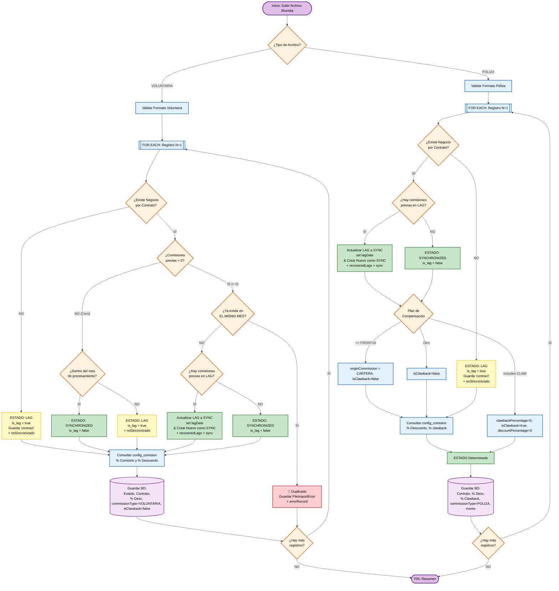

# Design: Load File Process Refactor V2

## Technical Approach

Refactor the Skandia file load into a strict rule engine: separate VOLUNTARIA and POLIZA logic via Strategy/Factory, persist rejections in `FileImportError` (non-blocking), enforce additive metrics on `FileImport`, and add visualization-by-status plus safe historial deletion. Encoding and accent handling for Excel/CSV ensure Spanish column names work with or without diacritics. Implementation follows feature-based layout under `src/features/load-file/` and existing API/UI patterns.

## Architecture Decisions

### Decision: Processor strategy (Voluntaria vs Poliza)

**Choice**: Dedicated processor classes (`VoluntariaProcessor`, `PolizaProcessor`) implementing `ICommissionProcessor`, selected by `ProcessorFactory` from `fileType`. Batch coordinator stays thin and only iterates rows and aggregates metrics.

**Alternatives considered**: Single monolithic switch inside `process-batch.service`; separate API endpoints per file type.

**Rationale**: Proposal and spec require mutually exclusive logic per file type and clear separation. Strategy pattern keeps each processor testable and avoids branching by file type in one large function.

### Decision: Where to persist row-level errors

**Choice**: All validation/format/duplicate rejections go to `FileImportError` linked to `idFileImport`. No row is written to `SettlementCommission` with an error status; metrics (`errorRecord`, `noSincronizadoRecord`) are incremented from processor return only.

**Alternatives considered**: Storing error flag on `SettlementCommission`; writing errors to a generic audit log.

**Rationale**: Spec and proposal require a dedicated error table, non-blocking processing, and fast retrieval by `idFileImport`. Clean separation avoids polluting commission data and keeps queries simple.

### Decision: Deletion of file import (historial)

**Choice**: Allow delete only when `FileImport.status` is `LOAD` or `ERROR`. In one transaction delete dependents in FK order (Clawback → ComissionDistribution → SettlementCommission → FileImportError → FileImport). Service returns typed result (`NOT_FOUND` | `INVALID_STATUS` | success); route maps to 404/409/200.

**Alternatives considered**: Allow delete in any status; cascade deletes in DB only.

**Rationale**: Business rule: no deletion once pre-liquidated/liquidated. FK-safe order avoids "related records" failure when `FileImportError` rows exist. Typed result keeps route thin and testable.

### Decision: Encoding and accented column names

**Choice**: Keep header comparison accent-insensitive via existing `normalizeHeaderValue` (NFD + strip diacritics) in `header-utils`. Add explicit UTF-8 decoding when reading CSV (e.g. `TextDecoder` or `codepage: 65001`) in `validate-excel-structure.ts` and `process-excel-file.ts` so Spanish accents are not corrupted.

**Alternatives considered**: Accept only exact header strings; support multiple encodings (e.g. Windows-1252) with detection.

**Rationale**: Comparison already supports "Plan de Compensación" vs "Plan de Compensacion". Failures are likely from mojibake when CSV bytes are misinterpreted; UTF-8 is the recommended export. Multiple encodings add complexity and can be added later if needed.

### Decision: Records-by-status source and UI

**Choice**: New endpoint `GET /api/carga-archivos/[id]/records` with pagination and optional `status` filter. Counts for cards come from `FileImport` (e.g. `noSincronizadoRecord`); tab content from this endpoint and existing errors endpoint. Shared component `RecordsByStatusView` used in post-upload and historial (fullscreen closeable modal).

**Alternatives considered**: Single endpoint returning all four groups; computing counts client-side from record lists.

**Rationale**: Pagination and filter avoid loading full result sets. Single source for counts (FileImport) ensures post-upload and historial match. Reuse of one component keeps behavior consistent.

## Data Flow

```
Upload (CargarArchivoTab)
    │
    ├─► validateExcelStructure(file, fileType) ──► headers vs FILE_TYPE_REQUIRED_HEADERS (header-utils)
    ├─► processExcelFile(file, fileType) ──► validRecords[], headers
    │
    └─► processBatch({ fileImportId, records, headers, fileType })
            │
            ├─► ProcessorFactory.getProcessor(fileType) ──► VoluntariaProcessor | PolizaProcessor
            ├─► for each record: processor.process(record, …) ──► ProcessorResult (SYNCHRONIZED | LAG | ERROR)
            │       ├─► LAG + !idBusiness ──► noSincronizadoRecord++
            │       ├─► LAG + idBusiness ──► rezagadoRecord++
            │       ├─► ERROR ──► FileImportError.create, errorRecord++
            │       └─► SYNCHRONIZED ──► SettlementCommission.create/update, sincronizadoRecord++
            └─► prisma.fileImport.update({ sincronizadoRecord, rezagadoRecord, noSincronizadoRecord, errorRecord })

Historial / Ver detalle
    │
    ├─► GET /api/carga-archivos/file-import?page&limit ──► list FileImport (counts from DB)
    ├─► GET /api/carga-archivos/[id] ──► single FileImport (for modal counts)
    ├─► GET /api/carga-archivos/[id]/records?page&pageSize&status ──► file-import-records.service ──► SettlementCommission (filtered)
    ├─► GET /api/carga-archivos/[id]/errors ──► FileImportError by idFileImport
    └─► RecordsByStatusView(fileImportId, counts?) ──► four cards + four tabs (tables)

Delete (historial)
    │
    └─► DELETE /api/carga-archivos/file-import/[id]
            └─► deleteFileImport(id, idUser) ──► validate LOAD|ERROR ──► tx: Clawback→ComissionDistribution→SettlementCommission→FileImportError→FileImport
```

## File Changes

| File | Action | Description |
|------|--------|-------------|
| `src/features/load-file/services/processors/processor.interface.ts` | Create | `ICommissionProcessor` and `ProcessorResult` type. |
| `src/features/load-file/services/processors/voluntaria.processor.ts` | Create | Voluntaria rules: business lookup, duplicate check, LAG recovery, date range, write to SettlementCommission or FileImportError. |
| `src/features/load-file/services/processors/poliza.processor.ts` | Create | Poliza rules: business lookup, LAG recovery, Plan de Compensación (FRONT19/CLAW), write to SettlementCommission or FileImportError. |
| `src/features/load-file/services/processors/processor.factory.ts` | Create | Returns Voluntaria or Poliza processor by `fileType`. |
| `src/features/load-file/services/validators/row.validator.service.ts` | Create | Parse dates, numbers, required cells; used by processors. |
| `src/features/load-file/services/process-batch.service.ts` | Modify | Orchestrate batches, call factory and processor per row, aggregate metrics, update FileImport; no direct row logic. |
| `src/features/load-file/services/delete-file-import.service.ts` | Create | Validate LOAD/ERROR, run FK-safe delete transaction. |
| `src/features/load-file/services/file-import-records.service.ts` | Create | getFileImportRecords(fileImportId, userId, { page, pageSize, status }) for records-by-status API. |
| `src/features/load-file/lib/header-utils.ts` | Existing | normalizeHeaderValue, findHeaderIndex, findMissingHeaders (accent-insensitive). |
| `src/features/load-file/lib/validate-excel-structure.ts` | Modify | Validate structure; add UTF-8/encoding for CSV if needed (task 7.1). |
| `src/features/load-file/lib/process-excel-file.ts` | Modify | Read file, build column indices via findHeaderIndex; align encoding with validation (task 7.1). |
| `src/features/load-file/lib/file-types.ts` | Existing | POLIZA/VOLUNTARIA required headers and FILE_TYPE_COLUMN_MAP. |
| `src/features/load-file/types/load-file.types.ts` | Modify | ProcessResult, FileImportHistory, DeleteFileImportResult, record-by-status types. |
| `src/app/api/carga-archivos/file-import/[id]/route.ts` | Modify | GET unchanged; DELETE delegates to deleteFileImport, returns 200/404/409. |
| `src/app/api/carga-archivos/[id]/records/route.ts` | Create | GET records with pagination and status filter; auth and call file-import-records.service. |
| `src/features/load-file/components/RecordsByStatusView.tsx` | Create | Four cards + four tabs (Sincronizados, Errores, No sincronizados, Rezagados); pagination. |
| `src/features/load-file/components/CargarArchivoTab.tsx` | Modify | Post-upload shows RecordsByStatusView; counts from backend (noSincronizadoCount etc.). |
| `src/features/load-file/components/HistorialCargasTab.tsx` | Modify | "Ver detalle" opens fullscreen modal with RecordsByStatusView; format section Voluntaria/Póliza. |
| `src/features/load-file/lib/load-file-api.ts` | Modify | getImportProgress, getImportRecords, getImportErrors. |
| `prisma/schema.prisma` | Modify | FileImportError model; SettlementCommission fields (contract, startDate, endDate, lagDate, isClawback; remove commissionPercentage, error). |

## Interfaces / Contracts

- **Processor**: `ICommissionProcessor.process(record, headers, fileImportId, snapshots, auditContext) => Promise<ProcessorResult>` with `ProcessorResult = { status: 'SYNCHRONIZED'|'LAG'|'ERROR', isLag, idBusiness, recoveredLag?, errorReason? }`.
- **Delete service**: `deleteFileImport(fileImportId, idUser) => Promise<DeleteFileImportResult>` with `DeleteFileImportResult = { ok: true } | { ok: false, code: 'NOT_FOUND'|'INVALID_STATUS', message }`.
- **Records API**: `GET /api/carga-archivos/[id]/records?page&pageSize&status` → `ApiResponse<FileImportRecordsResponse>`; `status` one of `SYNCHRONIZED`|`NO_SYNC`|`REZAGADOS`; response `{ items: FileImportRecordDetail[], pagination }`.
- **Header matching**: `headerMatchesRequired(header, requiredHeader)` uses `normalizeHeaderValue` (NFD + strip diacritics) so accented and non-accented column names match.

## Testing Strategy

| Layer | What to Test | Approach |
|-------|--------------|----------|
| Unit | Voluntaria: duplicate→FileImportError, LAG recovery, date range→LAG/SYNC, business not found→LAG | process-batch.service.test with mocked Prisma; assert processor returns and DB calls. |
| Unit | Poliza: FRONT19→CARTERA, CLAW→isClawback, business not found→LAG, LAG recovery | Same test file; Poliza scenarios. |
| Unit | Header validation with/without accents; encoding (CSV UTF-8) | validate-excel-structure.test; optional test for accented headers. |
| Unit | deleteFileImport: LOAD/ERROR allowed, PRE-SETTLED rejected, FK order in transaction | delete-file-import.service test (if added). |
| Integration | Full batch: file → processBatch → FileImport + SettlementCommission + FileImportError state | Optional integration test. |
| E2E | Upload file → see records by status; historial → Ver detalle → modal; delete LOAD import | Playwright if in scope. |

## Migration / Rollout

- Prisma migration for `FileImportError` and `SettlementCommission` schema changes; backfill not required.
- No feature flags; behavior is backward-compatible for successful imports. Failed rows previously stored as ERROR on SettlementCommission will no longer exist; new failures go to FileImportError only.
- Recommend: run migration, deploy, then validate with sample Voluntaria and Poliza files (including CSV with UTF-8 and accented headers).

## Open Questions

- [ ] Confirm SheetJS (xlsx 0.18.x) `codepage` / string read API for CSV to implement task 7.1 without breaking .xlsx/.xls.
- [ ] Whether to add a small shared helper (e.g. `readWorkbookFromFile(file)`) used by both validate-excel-structure and process-excel-file for consistent encoding.

---

## Flow Architecture (State Machine)

### Diagrama Lógico y de Estados

El siguiente diagrama detalla la máquina de estados por la que pasa cada registro durante el procesamiento por lotes. Garantiza exclusividad mutua (sin sobrescritura de estados) y persistencia del ID de contrato y porcentajes.



## Technical Strategy

- **Separate Handlers**: Fully decouple `process-batch.service.ts` into a `VoluntariaHandler` and a `PolizaHandler` (or separate methods) triggered immediately after validation.
- **Dedicated Error Table Handling**: Records failing basic validation, missing contracts natively, or firing the **Voluntaria Anti-Duplicate Rule** will _not_ be inserted into `SettlementCommission`. Rejections are exclusively stored as explicit rows in a new **`FileImportError`** table linked to the `idFileImport`.
  - **Resilient Processing (Non-Blocking)**: If a row throws a validation error or exception during its isolated processing, the error is caught, logged in `FileImportError` (with reason 'Error processing row'), the `errorRecord` metric is incremented, and **the batch loop strictly continues to the next row**. The file load must never crash completely due to individual row failures.
  - **Error Retrieval**: This ensures fast, indexed queries. The batch process response yields error counts, while the UI retrieves specific error details by querying an endpoint that does a simple `SELECT * FROM FileImportError WHERE id_file_import = ?`.
- **Metrics Counting Rules (`FileImport`)**: To prevent ambiguity, the batch statistics follow a strict additive rule: `totalRecord` = `sincronizadoRecord` + `rezagadoRecord` + `noSincronizadoRecord` + `errorRecord`.
  - `sincronizadoRecord`: Successfully created commissions (`status: SYNCHRONIZED`). **Important Multiplier**: When a Voluntaria or Poliza retrieves and fixes prior LAGs, this increments `sincronizados` for the new record, **AND** tracks recovered old LAGs in `recoveredLagsRecord`.
  - `rezagadoRecord`: Successfully saved rows held as pending/LAG due to valid reasons. Wait, according to the proposal, `noSincronizadoRecord` increments when business is not found or out of bounds. `rezagadoRecord` seems loosely defined, but the proposal focuses on incrementing `noSincronizadoRecord`, `errorRecord` (or errorCount), `recoveredLagsRecord`, and `synchronizedRecord`.
  - `noSincronizadoRecord`: Rejections due to valid business rules (e.g., Creation Date out of range for Voluntaria, or **Business not found / Contract does not exist**). These records are saved as `LAG` in DB.
  - `errorRecord`: Rejections logged exclusively to `FileImportError` due to exact matching duplicates, unparseable data / formatting errors, or processing exceptions.

## Clean Code Technical Strategy

To eliminate complexity and facilitate maintenance, the backend service implementation will be refactored using Clean Code principles, moving away from single massive functions toward specific modules that reflect their precise intent:

- **1. Batch Coordinator (`process-batch.service.ts`)**: Acts solely as the high-level orchestrator. It manages the transaction iteration, delegates row validations, dynamically dispatches processors using a factory, captures isolated row-errors without crashing the flow, and accurately writes DB metrics at the end.
- **2. Strategy & Factory Pattern (`processor.factory.ts`)**: Introduces an `ICommissionProcessor` interface. The Factory determines whether to instantiate a `VoluntariaProcessor` or a `PolizaProcessor` based on `fileType`.
- **3. Specialized Modules (`processors/voluntaria.processor.ts` & `processors/poliza.processor.ts`)**: Fully encapsulates the isolated business rules, date checks, LAG recoveries, and anti-duplicate validations in cohesive classes.
- **4. Validator Service (`row.validator.service.ts`)**: Reusable centralized class dedicated strictly to parsing inputs (dates, cleaning numbers, verifying required cells) to remove data-purification clutter from the main processor logic.
- **5. Error Handling**: Individual row errors (format validation exceptions, duplicates, or processing logic rejections) are saved immediately to a dedicated `FileImportError` table natively linked to the `idFileImport`. The file parsing loop gracefully absorbs the error, increments the `errorRecord` metric, and proceeds to the next item seamlessly without persisting invalid rows in `SettlementCommission`.
- **Metrics Counting Rules (`FileImport`)**: Consistent strict additive rules:
  - `synchronizedRecord`: Successfully `SYNCHRONIZED`. **Multiplier Note**: Recovering prior LAGs increments `synchronizedRecord` + `recoveredLagsRecord`.
  - `noSincronizadoRecord`: Rejections due to valid business rules (e.g. Creation Date out of range, Business fully non-existent). Logged as `LAG` with is_lag = true in DB.
  - `errorRecord` / `errorCount`: Rejections due to duplicate commission existence or instant rejections due to unparseable data / formatting errors. Logged exclusively to `FileImportError` in DB.
- **Voluntaria Anti-Duplicate Rule & LAG Logic**: When querying `SettlementCommission` to check if a commission already exists, **the search MUST match the `contract`, `start_date`, and `end_date`**.
- **Voluntaria Date Validation**: If the `idBusiness.createdAt` falls OUTSIDE the `start_date` and `end_date` parsed from Excel, the row is discarded, the `noSincronizados` counter increments, and it is saved as LAG.
- **Voluntaria Branching**: Comisiones > 0 (by `contract`)? No -> Inside Proc Month => SYNC, otherwise LAG+noSincronizado. Comisiones > 0? Yes -> Same Dates? Yes => Save in FileImportError & increment errorRecord, No => Recover Old LAGs to SYNC, Create New SYNC.
- **Poliza Exact Parsing**: When processing strings that `includes("CLAW")`, it must explicitly override the fetched `CommissionConfiguration` percentages, forcibly setting `clawbackPercentage = 0`, `discountPercentage = 0`, and marking the row `isClawback = true` and `status = 'SYNCHRONIZED'`.
- use Prisma transactions strictly for the Multi-Row creation scenarios (like old LAG recovery + new SYNC creation).

---

## Encoding and Accents (Excel/CSV)

- **Objetivo:** Soportar columnas con acentos en español en archivos Excel/CSV (Pólizas y Voluntaria) y evitar fallos por encoding incorrecto.
- **Comparación de cabeceras:** La comparación de headers ya es insensible a acentos gracias a `header-utils` (`normalizeHeaderValue`: NFD + eliminación de diacríticos). Las columnas requeridas pueden aparecer en el archivo con o sin acento (ej. "Plan de Compensación" / "Plan de Compensacion") y se consideran válidas.
- **Encoding al leer:** Para que los caracteres con acento no se corrompan (mojibake), la lectura de archivos debe usar encoding explícito donde aplique:
  - **CSV:** Decodificar el buffer como UTF-8 (p. ej. `TextDecoder('utf-8')`) antes de pasar a SheetJS, o usar la opción `codepage: 65001` (UTF-8) si la librería lo soporta para formato texto. Se recomienda documentar que los CSV deben estar en UTF-8 (o exportar con “UTF-8 con BOM” desde Excel).
  - **XLSX/XLS:** El formato binario suele traer los strings en UTF-8 internamente; si en algún flujo se lee como texto, usar codepage/UTF-8 de forma coherente.
- **Alcance:** Aplicar en `validate-excel-structure.ts` y `process-excel-file.ts` para que ambos usen la misma estrategia de lectura (y, si aplica, una utilidad compartida de lectura con encoding).

---

## Visualization of Records by Status (Design)

### Definitions (aligned with spec)

- **Sincronizados**: `SettlementCommission` where `idFileImport = id` and `status = 'SYNCHRONIZED'`.
- **Errores**: `FileImportError` where `idFileImport = id` (existing endpoint returns these; cause = `reason`).
- **No sincronizados**: `SettlementCommission` where `idFileImport = id`, `status = 'LAG'`, and `idBusiness` is null (or equivalent: business-not-found / date-out-of-range). Detail column uses **hardcoded text only**: "No existe el contrato" when business was not found, or "La fecha de creación no está en el rango de fechas" when date was out of range. No new DB column.
- **Rezagados**: `SettlementCommission` where `idFileImport = id`, `isLag = true`, and `lagDate IS NOT NULL` (recovered into sync flow).

### API contract (new endpoint)

- **Endpoint**: e.g. `GET /api/carga-archivos/[id]/records` (or `/detail`). Returns records for the given file import, grouped or filterable by status.
- **Pagination**: Required. Query params such as `page`, `pageSize`, and optionally `status` (to fetch one tab at a time) to avoid loading full result set for large imports.
- **Response**: List(s) of records with fields needed for the table: contract, commissionValue, baseCommission, discountPercentage, clawbackPercentage, isClawback, isLag, lagDate, startDate, endDate, and for "No sincronizados" a derived detail string (hardcoded by rule above). Errors are already served by `GET /api/carga-archivos/[id]/errors` (cause = `reason`).
- **Authorization**: Same as existing carga-archivos endpoints (file import must belong to current user).

### UI behavior

- **Carga de archivo**: After successful processing, frontend has `fileImportId`. Call the new records endpoint (and existing errors endpoint) and render shared component: four summary cards + four tabs, each tab a table. No persistence of this view beyond session; on refresh, user can go to Historial and open the same import.
- **Historial**: Each history card has a "Ver detalle" (or equivalent) action. On click, open a **fullscreen modal** (to make the best use of space for tables and many rows) with the same shared component, passing `fileImportId`; component fetches records (paginated) and errors and displays the same four tabs and tables. The modal SHALL be **closeable** (e.g. close button and/or overlay/escape) so the user can return to the historial list.

---

## Deletion of File Import (Historial)

### Business rule

- **Allow deletion when** `FileImport.status === 'LOAD'` **or** `FileImport.status === 'ERROR'`.
- If the file is PRE-SETTLED or SETTLED (preliquidado o liquidado), deletion SHALL be rejected with a clear error (e.g. 400/409 and message such as "Solo se puede eliminar un archivo en estado LOAD o ERROR" or "El archivo está pre-liquidado o liquidado").
- This satisfies: "el archivo solo se puede eliminar si está en estado LOAD o ERROR, sin preliquidados ni liquidados" (PRE-SETTLED/SETTLED imply pre-liquidated or settled; ERROR is a failed import that may be removed from historial).

### Fix for "related errors" on delete

- The current DELETE does **not** remove `FileImportError` rows. Because there is no `onDelete: Cascade` on the relation, deleting `FileImport` while `FileImportError` rows exist causes a foreign-key error ("related records" or similar).
- **Solution**: Within the same transaction, delete dependent rows in an order that respects foreign keys, then delete `FileImport`:
  1. **Clawback** (where the related `ComissionDistribution` belongs to a `SettlementCommission` of this file import).
  2. **ComissionDistribution** (where `idSettlementCommission` belongs to this file import).
  3. **SettlementCommission** (where `idFileImport` = id).
  4. **FileImportError** (where `idFileImport` = id).
  5. **FileImport**.
- For files in LOAD, typically only `SettlementCommission` and `FileImportError` exist; including the full order keeps the implementation safe for any data shape.

### Responsibility split (architecture)

- **API route** (`file-import/[id]/route.ts`): Auth, parse id, call load-file service (e.g. `deleteFileImport(id, idUser)`), map service result to HTTP status and body (200, or 400/409 with message).
- **Service** (in `src/features/load-file/services/`): Ensure file exists and belongs to user; validate `status === 'LOAD' || status === 'ERROR'`; if invalid, return a typed result (e.g. `{ ok: false, code: 'INVALID_STATUS', message }`); otherwise run a single transaction that performs the deletes in the order above and returns success.
- **UI** (optional): When the backend rejects the delete, show the returned error message (e.g. in Historial or in the hook that calls the delete API).
