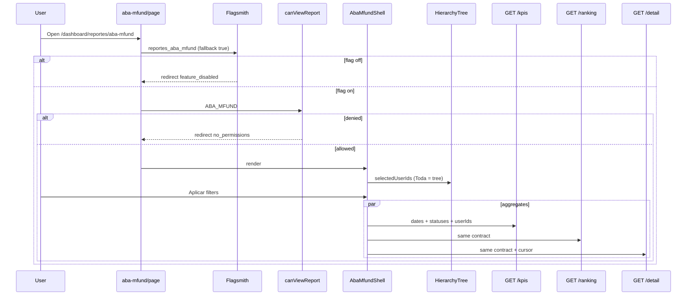
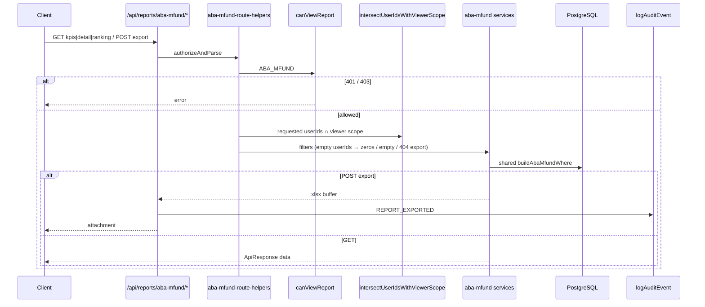
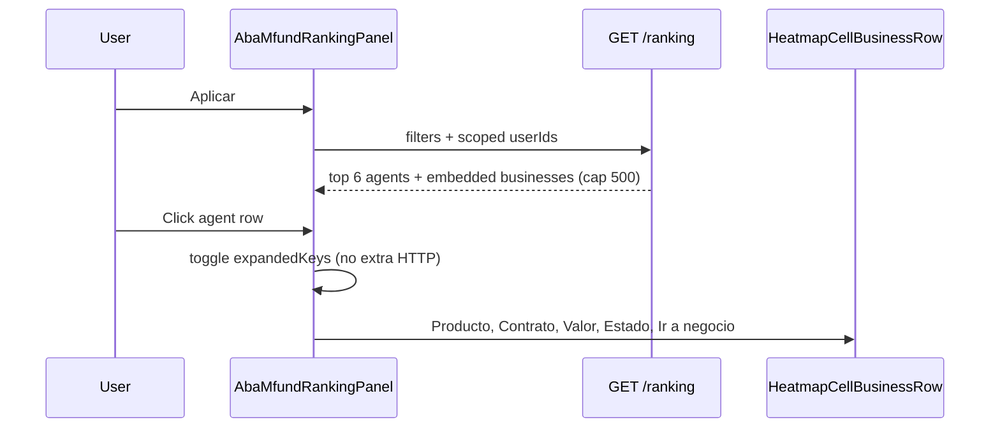

## Context

See `proposal.md` for motivation — don't restate Why.

Today:
- **Producción Real** is live under `src/features/reports/produccion-real/` with page, filter draft/apply, hierarchy, COP/TRM KPIs, detail cursor table, and Excel. Every query path applies `buildMfundExclusionWhere()` (NOT SKANDIA + MFUND). That exclusion **must stay unchanged**.
- Report visibility is already category-based: `canViewReport`, `REPORT_CODES`, `CategoryReportPermission`, nav `reportCode` on `MenuItem`. Catalog currently has `PRODUCCION_REAL` only. Admin **Permisos de Reportes** already configures any active `ReportDefinition` — no new admin UI.
- Hierarchy UX (`HierarchySelectionProvider`, `HierarchyTreePanel`) and viewer-scope intersection (`intersectUserIdsWithViewerScope` → `resolveViewerScope`) exist and must be reused. Non-admin **Toda** = visible subtree, not the whole company.
- Production dashboard heatmap already implements expand-row (`HeatmapTablePanel` + `HeatmapCellBusinessRow`: Producto, Contrato, Valor, Estado, **Ir a negocio**). ABA ranking MAY follow that expand-row; it MUST NOT import `HeatmapTablePanel` itself (TRM × company matrix, dashboard filter coupling).
- Bogotá date helpers (`parseBogotaInclusiveUtcRange`, `formatDateBogota`, `currentBogotaMonthDateStrings`) and Flagsmith `reportes_produccion_real` (fallback `true`) are the patterns to clone.
- `AuditAction.REPORT_EXPORTED` already exists. Soft delete remains `status = false`; never `prisma.*.delete()`. Seed-only catalog rows — **no Prisma schema / ERD change**.
- This change must not depend on `leads-analytics` even if files exist on disk.

Constraints: Feature-Based Architecture under `src/features/`; API routes never call Prisma; identifiers in English; Spanish UI strings in `ui-copy.ts`; hooks use `AsyncState<T>`.

## Goals / Non-Goals

**Goals:**
- Ship a sibling report feature `reports/aba-mfund` that is the **inverse universe** of Producción Real (only SKANDIA + MFUND, COP-only) without editing `buildMfundExclusionWhere` or Producción Real KPIs/filters/Excel.
- Gate page, APIs, and the **Reportes** sub-item with `REPORT_CODES.ABA_MFUND` via existing `canViewReport` / menu `reportCode`.
- Seed catalog + default enablement for category names **Performance Leader** and **Business Leader** independently (do not skip the second if the first is missing).
- Compose UI from existing widgets (hierarchy, `MonthRangePicker`, `MultiSelectFilter`, heatmap expand-row row) plus new KPI / ranking / detail / export surfaces.
- Keep a single shared Prisma WHERE for KPI, ranking, detail, and Excel so the SKANDIA+MFUND + COP + date + hierarchy + status contract cannot drift.

**Non-Goals:**
- Changing Producción Real requirements, MFUND exclusion, TRM modes, Tipo de Aporte, or Excel sheets.
- Extracting a shared `reports/lib` module **unless** it is a pure constant move that does not change Producción Real behavior. Prefer a local inverse helper over a refactor of the live report.
- New Admin screens, new Prisma models, ERD updates, or new `AuditAction` values.
- Ranking beyond Top 6, agent = commission beneficiary, TRM, or Compañía/Producto pickers.
- Feature-flagging the nav item (clone Producción Real: flag on the **page** only; APIs stay permission-gated).

## Decisions

### D1 — Feature folder: sibling of `produccion-real`, not a fork of its module

| Option | Pros | Cons |
|--------|------|------|
| A. Extend `produccion-real` with a mode flag | Less scaffolding | Mixes inverse universes; high regression risk on MFUND exclusion |
| **B. New `src/features/reports/aba-mfund/` (chosen)** | Screaming Architecture; isolation; Open/Closed | Some duplicated filter-shell wiring |
| C. Depend on `leads-analytics` | — | Locked out: do not depend on that module |

**Rationale:** Proposal locks “clone/fork the pattern, do not relax Producción Real.” A new feature folder is the smallest isolation that still reuses providers, date helpers, authz, and Excel library.

```
src/features/reports/aba-mfund/
  components/ hooks/ lib/ services/ types/ mappers/ __tests__/
  index.ts
src/app/dashboard/reportes/aba-mfund/page.tsx
src/app/api/reports/aba-mfund/{kpis,detail,ranking,export}/route.ts
```

Page mirrors Producción Real: `auth()` → `isFeatureEnabledServer('reportes_aba_mfund')` (fallback `true`) → `canViewReport(REPORT_CODES.ABA_MFUND)` → `DashboardLayout` + `AbaMfundShell`.

### D2 — Inverse universe helper (do not touch Producción Real exclusion)

Producción Real:

```ts
buildMfundExclusionWhere() // NOT (product.name = MFUND AND company.name = SKANDIA)
```

ABA-MFUND adds a **positive** predicate in its own lib:

```ts
buildAbaMfundInclusionWhere(): Prisma.BusinessWhereInput
// productPercentageCommission.productConfiguration.product
//   name = MFUND_EXCLUSION.PRODUCT_NAME
//   company.name = MFUND_EXCLUSION.COMPANY_NAME
```

| Option | Pros | Cons |
|--------|------|------|
| A. `NOT buildMfundExclusionWhere()` | One source | Fragile (NOT-of-NOT / Prisma `NOT` shape); would import exclusion internals |
| **B. New inclusion helper (chosen)** | Inverse by construction; unit-testable; zero edits to PR where | Duplicate nested product path |
| C. Extract shared `reports/lib/mfund-universe.ts` and retarget PR | DRY names | Touches Producción Real imports; out of scope unless needed |

**Constants:** Reuse the **names** `MFUND_EXCLUSION`, `COMPANY_NAME: 'SKANDIA'`, `PRODUCT_NAME: 'MFUND'` by copying the object into `aba-mfund/types` (identical literals). Do **not** extract a shared module in this change — that would rewrite Producción Real imports without product value. Do **not** call `buildMfundExclusionWhere` from ABA-MFUND.

`buildAbaMfundWhere(filters)` always ANDs:

1. `buildAbaMfundInclusionWhere()`
2. `idCurrency = 1` (`COP_CURRENCY_ID`, same defensive convention as Producción Real)
3. `createdAt` = `parseBogotaInclusiveUtcRange(dateFrom, dateTo)`
4. `idUser: { in: userIds }` (caller short-circuits when `userIds.length === 0`)
5. `status: { in: statuses }` **only when** `statuses.length > 0`; empty array = all statuses (includes `CANCELADO`)

No Tipo de Aporte, company picker, or currency mode.

### D3 — Authorization, catalog, seed

Reuse `canViewReport` / `getAuthorizedReportCodes` unchanged in behavior except the catalog grows:

```ts
export const REPORT_CODES = {
  PRODUCCION_REAL: 'PRODUCCION_REAL',
  ABA_MFUND: 'ABA_MFUND',
} as const
```

- `knownReportCodes()` / `mergeKnownReportCodes()` automatically include `ABA_MFUND` for ADMIN bypass (they iterate `REPORT_CODES`). Existing tests that expect ADMIN catalog `['PRODUCCION_REAL']` **must** be updated to contain both codes (order = `Object.values(REPORT_CODES)`).
- Every ABA-MFUND API calls `canViewReport(..., REPORT_CODES.ABA_MFUND)` before work (clone `produccion-real-route-helpers.ts` → `aba-mfund-route-helpers.ts`).
- Page + APIs: 401 unauthenticated, 403 unauthorized, 404 user missing — same Spanish errors as Producción Real.
- HU “Administrador” = `UserRole.ADMIN` (`REPORT_VIEW_BYPASS_ROLES`), not a category.

**Seed** (`prisma/seeds/report-permissions.ts`): upsert `ReportDefinition` `{ code: 'ABA_MFUND', name: 'ABA-MFUND', routePath: '/dashboard/reportes/aba-mfund', status: true }`. Then upsert `CategoryReportPermission` for categories named exactly **Performance Leader** and **Business Leader** (`status: true`). If a category is missing, log and continue with the other — do not `return` early after the first miss (current Producción Real seed returns if Performance Leader is absent; that pattern would skip Business Leader and is **not** acceptable here).

No schema migration. No `prisma/ERD.md` update.

### D4 — Feature flag

Clone `reportes_produccion_real`:

- Add `'reportes_aba_mfund'` to `ALL_FEATURE_FLAGS`.
- `FALLBACK_FLAGS.reportes_aba_mfund = true`.
- Page: `isFeatureEnabledServer('reportes_aba_mfund')` → redirect `/access-denied?reason=feature_disabled`.
- APIs do **not** check the flag (same as Producción Real).
- Extend `flagsmith-server.test.ts` fallback coverage.

### D5 — Navigation

- `menu-items.tsx`: add Reportes sub-item **ABA-MFUND** → `/dashboard/reportes/aba-mfund`, `reportCode: 'ABA_MFUND'`.
- Existing `buildReportesMenuItem` already filters by authorized codes; no builder algorithm change.
- Tests: show the item when `ABA_MFUND` is authorized; hide when not; keep Producción Real independent.

### D6 — UI composition

Provider order (clone dashboard / Producción Real ADR):

`HierarchySelectionProvider` → `AbaMfundFilterProvider` → shell content.

Layout:

1. **Left card JERARQUÍA** — reuse `HierarchyTreePanel` (default selection **Toda** = all nodes the provider loads; server still intersects scope).
2. **Filter bar:** Desde / Hasta (`MonthRangePicker` + `currentBogotaMonthDateStrings` defaults), Estado (`MultiSelectFilter`, empty = **Todos**), Limpiar, Aplicar, Descargar Excel (green). No Tipo de Aporte / Compañía / Moneda.
3. **KPI row (COP):** ABA Total, Fondeado, Emitido, Ticket promedio ABA.
4. **Ranking “ABA por Agente”** — Top 6 table with expand-row (see D9).
5. **Detalle** — cursor infinite scroll like Producción Real.

Draft vs applied: local reducer (`SET_DATE_*`, `SET_STATUSES`, `APPLY`, `CLEAR`). Invalid range (`dateFrom > dateTo`) blocks apply with `ABA_MFUND_UI.ERROR_DATE_RANGE`. Empty hierarchy → zeros / empty table / export blocked (toast), **no API leak**.

Spanish copy lives only in `lib/ui-copy.ts` (`ABA_MFUND_UI`). Status filter labels: Spanish display names for all `BUSINESS_STATUS` values from negocios (dashboard donut labels omit `CANCELADO` / `LIQUIDADO` — do not reuse that incomplete map as the filter catalog).

Cliente column: `Nombre Apellido` (space-joined; no hyphen).

### D7 — KPI contracts (COP only)

After shared WHERE (inclusion + COP + dates + hierarchy + optional status):

| KPI | Formula |
|-----|---------|
| **ABA Total** (`abaTotal`) | `sum(value)`, `count(*)` — all statuses present after filters |
| **Fondeado** (`fondeado`) | same WHERE + `status = FONDEADO` |
| **Emitido** (`emitido`) | same WHERE + `status = EMITIDO` |
| **Ticket promedio ABA** (`ticketPromedio`) | `abaTotal.sum / abaTotal.count` if count > 0, else `0` |

Pure helper `computeTicketPromedio(sum, count)` for unit tests. Empty `userIds` → all zeros, no Prisma.

No TRM, no conversion %, no Regular/Único. Defensive `idCurrency = 1` is in the shared WHERE, not a UI control.

### D8 — Detail table + Excel

**Columns (HU):** Fecha de creación, Cliente (Nombre - Apellido), Periodicidad (`buyPeriodicity.name`), Estado, Valor del Negocio (COP), Fecha de emisión (`dateIssued`), Fecha de Fondeo (`dateAnchored`).

Dates displayed via `formatDateBogota`. Money via a COP formatter (clone `formatReportMoney(..., 'COP')` locally or import if that does not pull TRM types into the UI).

Detail service: cursor keyset `(createdAt DESC, idBusiness DESC)`, `take: limit+1`, encode cursor like Producción Real. Mapper in `mappers/` (Prisma → DTO). `isActive` is **not** an extra filter (Producción Real does not apply it).

**Excel:** `POST /api/reports/aba-mfund/export`

- Library: `xlsx-js-style` (already in repo).
- Cap: **5000** rows (`ABA_MFUND_EXPORT_MAX_ROWS`), HTTP **413** when over, **404** when empty / empty hierarchy — same error classes pattern as Producción Real.
- **One sheet** whose columns match the HU detail table (not Producción Real’s three-sheet workbook).
- Audit: `logAuditEvent({ action: AuditAction.REPORT_EXPORTED, details: \`Exportación de reporte ABA_MFUND: N fila(s), dateFrom–dateTo\` })` with `userId`, `email`, `ipAddress`, `userAgent`. Do not add a new enum value.
- Filename: `aba_mfund_<iso-timestamp>.xlsx`.

### D9 — Ranking Top 6 + expand-row

**Grain:** `Business.idUser` (owner), never commission beneficiary.

**Algorithm:**

1. `groupBy: ['idUser']`, `_sum.value`, `_count.idBusiness`, same shared WHERE.
2. Load `User.name` / `lastName` for those ids.
3. Sort in memory: `totalValue` DESC, then `agentName` ASC, then `idUser` ASC.
4. `take 6` (`ABA_MFUND_RANKING_TAKE = 6`).

Prisma `groupBy` cannot tie-break by name — in-memory sort is required. Extract `sortRankingAgents` + `takeRanking(agents, 6)` for tests (ties, fewer than 6, empty).

**Expand-row (locked API surface = 4 endpoints, no fifth):**

| Option | Pros | Cons |
|--------|------|------|
| A. New `GET .../ranking/:idUser/businesses` | Lazy like heatmap | Extra route not in locked API list |
| B. Reuse `GET detail` with `userIds=[agent]` | One list API | Detail columns ≠ expand columns (no Contrato/Producto in HU table) |
| **C. Ranking GET embeds businesses for the 6 agents (chosen)** | Stays within locked APIs; one round-trip; only 6 agents | Heavier payload; need per-agent cap |

Embed businesses in the ranking DTO, mapped to `CellBusinessRowView` so the UI can render `HeatmapCellBusinessRow` (Producto, Contrato, Valor, Estado, **Ir a negocio**). Cap **500 businesses per agent** (heatmap truncation convention). Sort embedded rows `createdAt DESC, idBusiness DESC`. UI: `AbaMfundRankingPanel` copies heatmap expand-row (chevron, extra `<tr colSpan>`), **does not** import `HeatmapTablePanel`.

### D10 — API surface

| Method | Path | Service |
|--------|------|---------|
| GET | `/api/reports/aba-mfund/kpis` | `getAbaMfundKpis` |
| GET | `/api/reports/aba-mfund/detail` | `getAbaMfundDetail` |
| GET | `/api/reports/aba-mfund/ranking` | `getAbaMfundRanking` |
| POST | `/api/reports/aba-mfund/export` | `exportAbaMfundExcel` |

Query/body (Zod in `aba-mfund-schemas.ts`): `dateFrom`, `dateTo` (`YYYY-MM-DD`), `userIds` (comma-separated GET / array POST), `statuses` (comma-separated GET / array POST; empty = all). No `trmRate`, `currencyMode`, `companyIds`, `contributionTypes`. Detail also `cursor` + `limit` (1–100, default 50).

Routes: HTTP + Zod + `canViewReport` + scope intersect only. Prisma only in `services/`. Responses `ApiResponse<T>` except Excel binary.

Reuse `intersectUserIdsWithViewerScope` from `produccion-real/services/produccion-real-scope.service.ts` (thin wrapper over dashboard `resolveViewerScope`). Do not fork BFS / checkbox cascade.

### D11 — Layers and testing

```
Route → aba-mfund-route-helpers (authz + parse + scope)
     → services (Prisma)
     → lib (where, KPI math, ranking sort, excel)
     → mappers (detail / ranking rows)
Hooks: AsyncState<T> only — useAbaMfundKpis, useAbaMfundDetail, useAbaMfundRanking, useAbaMfundExport
```

Tests (mirror Producción Real):

| Area | What |
|------|------|
| `build-aba-mfund-where.test.ts` | Inclusion SKANDIA+MFUND; always `idCurrency = 1`; empty statuses omit status predicate; non-empty `status.in`; dates via Bogotá range; empty userIds not queried by services |
| `can-view-report.test.ts` + helpers/hook tests | `ABA_MFUND` allow/deny; ADMIN `knownReportCodes` includes `ABA_MFUND` |
| `src/app/api/reports/aba-mfund/__tests__/route.integration.test.ts` | 401/403; kpis/detail/ranking/export happy path; export 404/413; audit `REPORT_EXPORTED` |
| `menu-builder-reportes.test.ts` | Sub-item visible iff `ABA_MFUND` authorized |
| KPI helper tests | `ticketPromedio` = sum/count or 0 |
| Ranking helper tests | take 6; tie-break name then `idUser`; fewer than 6 |
| flagsmith-server | fallback `true` for `reportes_aba_mfund` |

Invoke **architecture-enforcer** during apply when creating `src/features/reports/aba-mfund/`.

### Sequence — page + queries



### Sequence — API pipeline (all four endpoints)



### Sequence — ranking expand (client-only after GET)



## Risks / Trade-offs

| Risk | Mitigation |
|------|------------|
| Accidental edit to Producción Real MFUND exclusion | New inclusion helper only; PR files out of scope except catalog tests that list `REPORT_CODES`; unit test that inclusion is the positive SKANDIA+MFUND path |
| Cross-feature coupling (scope, heatmap row, `MonthRangePicker`) | Import existing modules; do not fork checkbox/BFS; do not import `HeatmapTablePanel` |
| ADMIN catalog tests freeze `['PRODUCCION_REAL']` | Update `knownReportCodes` / `mergeKnownReportCodes` / `useAuthorizedReportCodes` / `getAuthorizedReportCodes` assertions to include `ABA_MFUND` |
| Seed skips Business Leader if Performance Leader missing | Enable each category independently; log and continue |
| Ranking ties unstable in SQL | In-memory sort: value DESC, name ASC, `idUser` ASC; unit tests |
| Ranking payload size | Cap 500 businesses/agent; Top 6 only |
| Excel / detail volume | 5000 cap + 413; cursor pagination on the table |
| Status “Todos” silently dropping `CANCELADO` | Empty `statuses` omits the predicate; tests; filter catalog includes all `BUSINESS_STATUS` values |
| Date ±1 day | Only `parseBogotaInclusiveUtcRange` / `formatDateBogota` / `currentBogotaMonthDateStrings`; never raw `new Date('YYYY-MM-DD')` |
| Flag off but menu still shows | Same as Producción Real: page redirect; document; rollback can also soft-disable `CategoryReportPermission` |
| Duplicate `MFUND_EXCLUSION` literals drift | Identical constant names/values; tests assert `'SKANDIA'` + `'MFUND'`; extract shared module only in a later chore |

## Migration Plan

1. Add `REPORT_CODES.ABA_MFUND` + seed upsert (definition + two category permissions). Run existing seed path (`prisma/seed.ts` already calls `seedReportPermissions`).
2. Register flag `reportes_aba_mfund` (fallback `true`) + nav sub-item.
3. Implement feature folder + four APIs + page (where → KPIs → ranking → detail → export → UI).
4. Update ADMIN catalog tests and menu tests.
5. Deploy: seed in the release job; Flagsmith flag optional (fallback keeps the report on). Verify Performance Leader and Business Leader see **ABA-MFUND**; other categories need Admin enablement; ADMIN bypass unchanged.
6. Do **not** touch `prisma/schema.prisma` or `prisma/ERD.md`.

**Rollback:** Disable Flagsmith `reportes_aba_mfund` and/or set `CategoryReportPermission.status = false` for `ABA_MFUND`; hide nav by deactivating `ReportDefinition.status = false` (soft). Unmount page/routes if a full code rollback is required. No `Business` writes to reverse.

## Locked Decisions (apply time)

1. **Do not modify** `buildMfundExclusionWhere` or any Producción Real filter/KPI/Excel behavior.
2. **Inclusion** = new `buildAbaMfundInclusionWhere` (positive SKANDIA + MFUND), not `NOT` of the exclusion helper.
3. **APIs:** GET kpis, GET detail, GET ranking, POST export only.
4. **COP only:** `idCurrency = 1`; no TRM UI or conversion.
5. **Estado Todos:** empty `statuses` array → no status predicate (includes `CANCELADO`).
6. **Ranking:** `groupBy idUser`, sum `value`, Top 6, tie-break name then `idUser`; owner `idUser`; embed expand businesses in ranking GET (cap 500/agent); reuse `HeatmapCellBusinessRow`.
7. **Ticket promedio:** `sum / count` or `0`.
8. **Flag:** `reportes_aba_mfund` fallback `true`; page-level only.
9. **Seed:** Performance Leader **and** Business Leader; independent upserts.
10. **No** `leads-analytics` dependency. **No** schema/ERD. **No** `prisma.delete()`.
11. **Excel:** `xlsx-js-style`, max 5000, columns = HU detail table, `REPORT_EXPORTED`.

## Open Questions

_(None — product questions are locked in the proposal.)_
