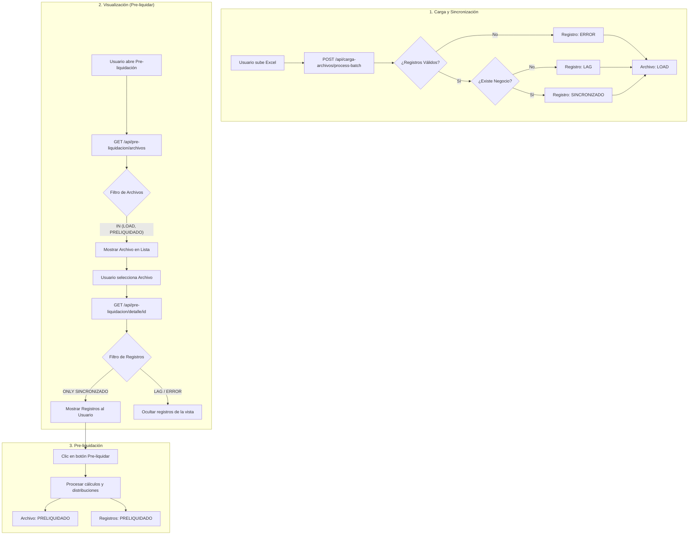

# Spec: Fix Pre-liquidation Visibility & Filtering

## Purpose

Ensure that synchronized files (status `LOAD`) are visible in the dashboard and that the detail view correctly filters for actionable records (`SINCRONIZADO`).

## Problem Description

1. **Visibility Bug**: Newly uploaded files are marked as `LOAD`, but the API only searches for `COMPLETADO` or `PRELIQUIDADO`.
2. **Noise in Detail**: The pre-liquidation detail view shows all records, including `LAG` and `ERROR`, which cannot be processed for commission distribution.

## Full Business Flow

## Requirements

1. **FR-01**: The system SHALL include files with status `LOAD` in the `GET /api/pre-liquidacion/archivos` endpoint.
2. **FR-02**: The system SHALL filter `SettlementCommission` records to show ONLY `SINCRONIZADO` status in the pre-liquidation detail view.
3. **FR-03**: The pre-liquidation process SHALL only be available for files in `LOAD` state.

### Requirement: Pre-liquidación SHALL NOT update ClawbackBalance

The system SHALL NOT create or update `ClawbackBalance` in the pre-liquidación process. Pre-liquidación SHALL only create `Clawback` rows when the flow requires clawback persistence (Poliza CARTERA, Poliza no-CLAW, Poliza CLAW). Updating the user's general clawback balance (adding or subtracting amounts) SHALL be performed only by the liquidation process, not by pre-liquidación.

#### Scenario: Pre-liquidación does not modify ClawbackBalance

- GIVEN a registro with `commissionType === 'POLIZA'`, `isClawback === false`, and `clawbackPercentage` such that `valorClawback > 0` for at least one category
- WHEN pre-liquidación processes that registro
- THEN the system SHALL create `ComissionDistribution` rows and one `Clawback` row per distribution with `valorClawback > 0`
- AND SHALL NOT call create, update, or findUnique on `ClawbackBalance` for any user

#### Scenario: After pre-liquidating, user ClawbackBalance unchanged

- GIVEN a user with an existing `ClawbackBalance` totalAmount equal to X
- AND at least one `SettlementCommission` for that user's business is pre-liquidated with clawback (Poliza no-CLAW, valorClawback > 0)
- WHEN pre-liquidación completes for that commission
- THEN the system SHALL have created the corresponding `Clawback` rows
- AND the same user's `ClawbackBalance.totalAmount` SHALL still be X (unchanged)

### Requirement: Pre-liquidación flow derivation

The system SHALL derive a pre-liquidación flow for each `SettlementCommission` record being processed, based only on `commissionType`, `originCommission`, and `isClawback`. The flow SHALL determine whether clawback is persisted (i.e. whether `Clawback` rows are created). In pre-liquidación the system SHALL NOT create or update `ClawbackBalance` regardless of flow; balance updates are the responsibility of the liquidation process.

- Flow **Voluntarias**: `commissionType === 'VOLUNTARIA'`.
- Flow **Poliza CLAW**: `commissionType === 'POLIZA'` AND `isClawback === true` (evaluated before CARTERA so that CARTERA + CLAW is treated as CLAW).
- Flow **Poliza CARTERA**: `commissionType === 'POLIZA'` AND `originCommission === 'CARTERA'`.
- Flow **Poliza no-CLAW**: `commissionType === 'POLIZA'` AND `isClawback === false` AND not CARTERA (or any other Poliza case not already classified).

#### Scenario: Voluntarias — no clawback persistence

- GIVEN a registro with `commissionType === 'VOLUNTARIA'`
- WHEN pre-liquidación processes that registro
- THEN the system SHALL create `ComissionDistribution` rows with discount applied as today
- AND SHALL NOT create any `Clawback` row for that registro
- AND SHALL NOT create or update `ClawbackBalance` for any user for that registro

#### Scenario: Poliza CARTERA — clawback registered only, no balance update

- GIVEN a registro with `commissionType === 'POLIZA'`, `originCommission === 'CARTERA'`, `isClawback === false`, and `clawbackPercentage` such that `valorClawback > 0` for at least one category
- WHEN pre-liquidación processes that registro
- THEN the system SHALL create `ComissionDistribution` rows using `porcentaje_portfolio` and apply discount and clawback
- AND SHALL create one `Clawback` row per `ComissionDistribution` that has `valorClawback > 0`, linked to that distribution and to the user who owns the business (`business.user.idUser`)
- AND SHALL NOT create or update `ClawbackBalance` for that user (balance update SHALL be done in the liquidation process)

#### Scenario: Poliza no-CLAW — clawback registered only, no balance update

- GIVEN a registro with `commissionType === 'POLIZA'`, `isClawback === false`, and `clawbackPercentage` such that `valorClawback > 0` for at least one category
- WHEN pre-liquidación processes that registro
- THEN the system SHALL create `ComissionDistribution` rows and apply discount and clawback
- AND SHALL create one `Clawback` row per `ComissionDistribution` with `valorClawback > 0`, linked to that distribution and to `business.user.idUser`
- AND SHALL NOT create or update `ClawbackBalance` for that user (balance update SHALL be done in the liquidation process)

#### Scenario: Poliza CLAW — clawback registered only, no balance update

- GIVEN a registro with `commissionType === 'POLIZA'` AND `isClawback === true` (clawback percentage on the record is zero; amount is taken from the user's general clawback balance)
- WHEN pre-liquidación processes that registro
- THEN the system SHALL create `ComissionDistribution` rows (distribute by category; discount applied; clawback percentage 0 on record)
- AND SHALL compute the amount to debit from the user's clawback balance as follows: for each category, `valorComisionBruta * activeClawbackPercentage` (where `activeClawbackPercentage` is the active CommissionDiscount for type CLAWBACK, or a defined fallback if none); the total debit SHALL be the sum over all categories
- AND SHALL create one `Clawback` row per `ComissionDistribution` with `valueClawback` equal to that category's share of the total debit, linked to that distribution and to `business.user.idUser`
- AND SHALL NOT create or update `ClawbackBalance` for that user in pre-liquidación (balance subtraction SHALL be done in the liquidation process)

#### Scenario: Poliza CARTERA + CLAW — treated as Poliza CLAW

- GIVEN a registro with `commissionType === 'POLIZA'`, `originCommission === 'CARTERA'`, and `isClawback === true`
- WHEN the system derives the flow for that registro
- THEN the flow SHALL be Poliza CLAW, not Poliza CARTERA

### Requirement: Clawback row and balance user

The system SHALL associate each `Clawback` row with the user who owns the business of the commission record. The user SHALL be the agent: `business.user.idUser` (the business owner). The system MUST NOT use the file uploader or any other user for Clawback. In pre-liquidación the system SHALL NOT perform any `ClawbackBalance` create or update, so no balance row is associated with pre-liquidación; the liquidation process will associate balance updates with the same user when it runs.

#### Scenario: Clawback linked to business owner

- GIVEN a registro with `business.user.idUser === 42`
- WHEN the system creates a `Clawback` row for that registro
- THEN `Clawback.idUser` SHALL be 42
- AND the system SHALL NOT create or update a `ClawbackBalance` row in pre-liquidación

### Requirement: Clawback initial state and balance atomicity

When creating a `Clawback` row, the system SHALL set `state` to `'RETENIDO'`. The system SHALL perform all persistence for a single `SettlementCommission` (all `ComissionDistribution` creates, all `Clawback` creates when applicable, and the `SettlementCommission` status update to `PRE-SETTLED`) within a single transactional boundary so that either all of these writes succeed or none do. The system SHALL NOT include any `ClawbackBalance` create or update in this transaction.

#### Scenario: Transaction rollback on failure

- GIVEN a registro being processed and the transaction has created at least one `ComissionDistribution` and is about to create a `Clawback`
- WHEN the creation of a `Clawback` row fails (e.g. constraint or DB error)
- THEN the entire transaction for that registro SHALL be rolled back
- AND no `ComissionDistribution` for that registro SHALL remain
- AND the `SettlementCommission` SHALL NOT be updated to `PRE-SETTLED`

#### Scenario: Idempotency — only SYNCHRONIZED processed

- GIVEN a `SettlementCommission` with status `PRE-SETTLED` or any status other than `SYNCHRONIZED`
- WHEN pre-liquidación runs for the same file and date range
- THEN the system SHALL NOT process that record again (it SHALL only select records with status `SYNCHRONIZED`)
- AND SHALL NOT create duplicate `Clawback` rows for the same `ComissionDistribution` (enforced by unique constraint on `idComissionDistribution`)

### Requirement: No clawback persistence when valorClawback is zero (Poliza non-CLAW)

Unchanged in effect: when `valorClawback` is zero for every category, the system SHALL NOT create any `Clawback` row and SHALL NOT update `ClawbackBalance` for that registro. (In pre-liquidación the system never updates ClawbackBalance in any case.)

#### Scenario: Poliza with zero clawback percentage

- GIVEN a registro with `commissionType === 'POLIZA'`, `isClawback === false`, and `clawbackPercentage === 0`
- WHEN pre-liquidación processes that registro
- THEN the system SHALL create `ComissionDistribution` rows only
- AND SHALL NOT create `Clawback` rows
- AND SHALL NOT create or update `ClawbackBalance`

### Requirement: Pre-liquidación data access for flow and user

The system SHALL load, when fetching `SettlementCommission` records for pre-liquidación, the fields `commissionType`, `originCommission`, and `isClawback`, and SHALL include the related `business` with its `user` (so that `business.user.idUser` is available). This data SHALL be sufficient to derive the flow and to associate each `Clawback` row with the correct user without further queries inside the transaction. No `ClawbackBalance` operations are performed in pre-liquidación, so no additional data for balance updates is required.

#### Scenario: Query includes business and user

- GIVEN the pre-liquidación process fetches registros for a file and date range
- WHEN the query is executed
- THEN each returned record SHALL include `commissionType`, `originCommission`, `isClawback`, and `business` with `user` (at least `idUser`)
- AND the service SHALL NOT need to query `User` or `Business` again inside the per-registro transaction to create Clawback rows

### Requirement: Pre-liquidación results and export use PRE-SETTLED state

The system SHALL use the canonical state value `PRE-SETTLED` when querying pre-liquidated commission records for historial (results) and export. Any API that returns or filters by pre-liquidated commissions SHALL filter `SettlementCommission` by `status === 'PRE-SETTLED'` and SHALL NOT use any other string (e.g. `PRELIQUIDADO`) for that filter.

#### Scenario: Historial results return data after pre-liquidating

- GIVEN a file has been pre-liquidated and at least one `SettlementCommission` has status `PRE-SETTLED`
- WHEN the client requests results for that file (e.g. GET pre-liquidación resultados for that fileId)
- THEN the system SHALL return those commission records with status `PRE-SETTLED`
- AND the response SHALL include the expected distributions and metadata so the historial tab shows data

#### Scenario: Export returns data after pre-liquidating

- GIVEN a file has been pre-liquidated and at least one `SettlementCommission` has status `PRE-SETTLED`
- WHEN the client requests export for that file (e.g. POST pre-liquidación exportar for that fileId)
- THEN the system SHALL include those commission records with status `PRE-SETTLED` in the export
- AND the export SHALL NOT be empty due to a status filter mismatch

### Requirement: File list for pre-liquidación includes pending and pre-liquidated files

The system SHALL list file imports available for pre-liquidación (e.g. for the pre-liquidación screen) such that: (1) a file SHALL appear if it has at least one `SettlementCommission` with status `SYNCHRONIZED` OR at least one with status `PRE-SETTLED`; (2) for each file, the system SHALL expose a live count of commissions with status `SYNCHRONIZED` (sincronizados) and a live count with status `PRE-SETTLED` (registrosPreliquidados). The UI "Pendientes" tab SHALL use sincronizados > 0 to show files that can still be pre-liquidated; the "Histórico" tab SHALL use registrosPreliquidados > 0 to show files that have pre-liquidated records.

#### Scenario: Pre-liquidated file remains in list

- GIVEN a file whose commissions have all been pre-liquidated (all `SettlementCommission` records for that file have status `PRE-SETTLED`)
- WHEN the client requests the list of files for pre-liquidación
- THEN the system SHALL include that file in the list
- AND the file SHALL have registrosPreliquidados equal to the number of PRE-SETTLED commissions for that file
- AND the file SHALL appear in the "Histórico" tab when the UI filters by registrosPreliquidados > 0

#### Scenario: Pending file shows correct counts

- GIVEN a file that has at least one `SettlementCommission` with status `SYNCHRONIZED` and none with status `PRE-SETTLED`
- WHEN the client requests the list of files for pre-liquidación
- THEN the system SHALL include that file in the list
- AND sincronizados SHALL equal the count of SYNCHRONIZED commissions for that file
- AND registrosPreliquidados SHALL be 0
- AND the file SHALL appear in the "Pendientes" tab when the UI filters by sincronizados > 0

#### Scenario: File with both pending and pre-liquidated records

- GIVEN a file that has at least one `SettlementCommission` with status `SYNCHRONIZED` and at least one with status `PRE-SETTLED`
- WHEN the client requests the list of files for pre-liquidación
- THEN the system SHALL include that file in the list
- AND sincronizados SHALL equal the count of SYNCHRONIZED commissions
- AND registrosPreliquidados SHALL equal the count of PRE-SETTLED commissions
- AND the file MAY appear in both Pendientes and Histórico depending on UI logic (e.g. show in both or in the tab that matches the user's intent)

### Requirement: Block Re-Sync on Completed Period (FileImportService responsibility)

The system SHALL prevent a new sync attempt when a `FileImport` record with `status = COMPLETED` exists for the same `fileType`, `month`, `year`, and `idUser`. This guard SHALL be enforced in `FileImportService.initiateImport()` — NOT in the pre-liquidación service or any pre-liquidación route handler. Pre-liquidación itself has no behavior change: once a file reaches `status = COMPLETED` (set by the liquidation process), the guard in `FileImportService` ensures no further sync can inadvertently associate new commissions with a liquidated period.

The system SHALL return an error with the message `"El período {month}/{year} ya fue liquidado"` and SHALL NOT create or reuse any `FileImport` record for that period.

#### Scenario: Completed period blocks new sync

- GIVEN a `FileImport` with `status = COMPLETED`, `fileType = POLIZA`, `month = 2`, `year = 2026`, `idUser = 10` exists (set by the liquidation process)
- WHEN `idUser = 10` attempts to initiate a new file import for `fileType = POLIZA`, `month = 2`, `year = 2026`
- THEN `FileImportService.initiateImport()` SHALL reject the request
- AND the API route SHALL return HTTP 409 with `{ data: null, error: "El período 2/2026 ya fue liquidado" }`
- AND no new `FileImport` record SHALL be created
- AND no new `SettlementCommission` records SHALL be associated with that period

#### Scenario: Pre-liquidación service is not the enforcement point

- GIVEN a `FileImport` has `status = COMPLETED`
- WHEN any pre-liquidación service method is called for operations unrelated to re-sync (e.g. fetching detalle, running pre-liquidación calculations)
- THEN those methods SHALL NOT be responsible for checking whether the period is COMPLETED for re-sync blocking purposes
- AND their behavior SHALL remain unchanged from the existing spec

#### Scenario: LOAD period is not blocked

- GIVEN a `FileImport` with `status = LOAD`, `fileType = POLIZA`, `month = 2`, `year = 2026`, `idUser = 10` exists
- WHEN `idUser = 10` initiates a new file import for the same `fileType`, `month`, and `year`
- THEN `FileImportService.initiateImport()` SHALL NOT block the request
- AND SHALL return the existing `FileImport` as a deduplication result (`{ created: false, fileImport: <existing> }`)

---

## Technical Design

- **API Archivos**: Modify `src/app/api/pre-liquidacion/archivos/route.ts` Prisma query.
- **Service Detail**: Modify `obtenerDetallePreLiquidacion` in `src/features/pre-liquidacion/services/pre-liquidacion.service.ts` to change the `where` clause for records.
