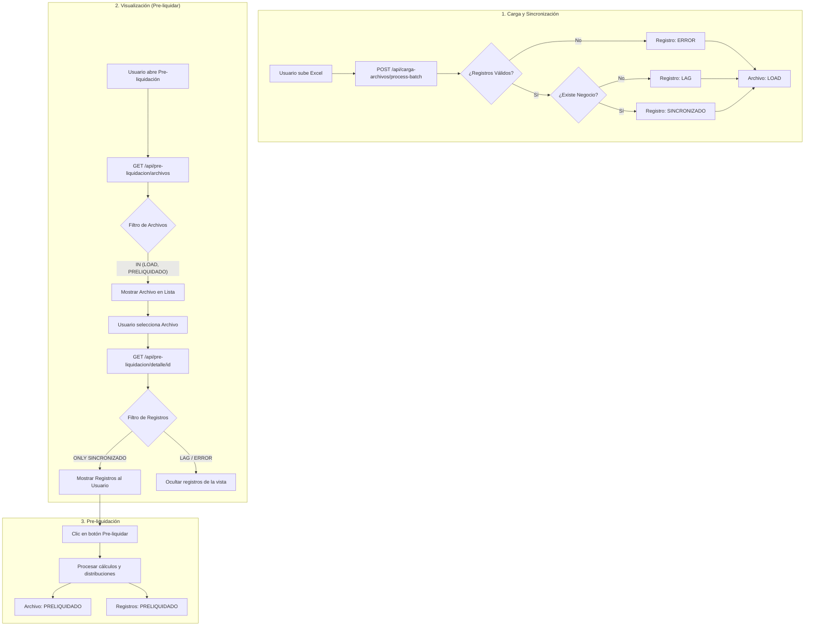

# Spec: Fix Pre-liquidation Visibility & Filtering

## Purpose

Ensure that synchronized files (status `LOAD`) are visible in the dashboard and that the detail view correctly filters for actionable records (`SINCRONIZADO`).

## Problem Description

1. **Visibility Bug**: Newly uploaded files are marked as `LOAD`, but the API only searches for `COMPLETADO` or `PRELIQUIDADO`.
2. **Noise in Detail**: The pre-liquidation detail view shows all records, including `LAG` and `ERROR`, which cannot be processed for commission distribution.

## Full Business Flow

## Requirements

1. **FR-01**: The system SHALL include files with status `LOAD` in the `GET /api/pre-liquidacion/archivos` endpoint.
2. **FR-02**: The system SHALL filter `SettlementCommission` records to show ONLY `SINCRONIZADO` status in the pre-liquidation detail view.
3. **FR-03**: The pre-liquidation process SHALL only be available for files in `LOAD` state.

### Requirement: Pre-liquidación SHALL NOT update ClawbackBalance

The system SHALL NOT create or update `ClawbackBalance` in the pre-liquidación process. Pre-liquidación SHALL only create `Clawback` rows when the flow requires clawback persistence (Poliza CARTERA, Poliza no-CLAW, Poliza CLAW). Updating the user's general clawback balance (adding or subtracting amounts) SHALL be performed only by the liquidation process, not by pre-liquidación.

#### Scenario: Pre-liquidación does not modify ClawbackBalance

- GIVEN a registro with `commissionType === 'POLIZA'`, `isClawback === false`, and `clawbackPercentage` such that `valorClawback > 0` for at least one category
- WHEN pre-liquidación processes that registro
- THEN the system SHALL create `ComissionDistribution` rows and one `Clawback` row per distribution with `valorClawback > 0`
- AND SHALL NOT call create, update, or findUnique on `ClawbackBalance` for any user

#### Scenario: After pre-liquidating, user ClawbackBalance unchanged

- GIVEN a user with an existing `ClawbackBalance` totalAmount equal to X
- AND at least one `SettlementCommission` for that user's business is pre-liquidated with clawback (Poliza no-CLAW, valorClawback > 0)
- WHEN pre-liquidación completes for that commission
- THEN the system SHALL have created the corresponding `Clawback` rows
- AND the same user's `ClawbackBalance.totalAmount` SHALL still be X (unchanged)

### Requirement: Pre-liquidación flow derivation

The system SHALL derive a pre-liquidación flow for each `SettlementCommission` record being processed, based only on `commissionType`, `originCommission`, and `isClawback`. The flow SHALL determine whether clawback is persisted (i.e. whether `Clawback` rows are created). In pre-liquidación the system SHALL NOT create or update `ClawbackBalance` regardless of flow; balance updates are the responsibility of the liquidation process.

- Flow **Voluntarias**: `commissionType === 'VOLUNTARIA'`.
- Flow **Poliza CLAW**: `commissionType === 'POLIZA'` AND `isClawback === true` (evaluated before CARTERA so that CARTERA + CLAW is treated as CLAW).
- Flow **Poliza CARTERA**: `commissionType === 'POLIZA'` AND `originCommission === 'CARTERA'`.
- Flow **Poliza no-CLAW**: `commissionType === 'POLIZA'` AND `isClawback === false` AND not CARTERA (or any other Poliza case not already classified).

#### Scenario: Voluntarias — no clawback persistence

- GIVEN a registro with `commissionType === 'VOLUNTARIA'`
- WHEN pre-liquidación processes that registro
- THEN the system SHALL create `ComissionDistribution` rows with discount applied as today
- AND SHALL NOT create any `Clawback` row for that registro
- AND SHALL NOT create or update `ClawbackBalance` for any user for that registro

#### Scenario: Poliza CARTERA — clawback registered only, no balance update

- GIVEN a registro with `commissionType === 'POLIZA'`, `originCommission === 'CARTERA'`, `isClawback === false`, and `clawbackPercentage` such that `valorClawback > 0` for at least one category
- WHEN pre-liquidación processes that registro
- THEN the system SHALL create `ComissionDistribution` rows using `porcentaje_portfolio` and apply discount and clawback
- AND SHALL create one `Clawback` row per `ComissionDistribution` that has `valorClawback > 0`, linked to that distribution and to the user who owns the business (`business.user.idUser`)
- AND SHALL NOT create or update `ClawbackBalance` for that user (balance update SHALL be done in the liquidation process)

#### Scenario: Poliza no-CLAW — clawback registered only, no balance update

- GIVEN a registro with `commissionType === 'POLIZA'`, `isClawback === false`, and `clawbackPercentage` such that `valorClawback > 0` for at least one category
- WHEN pre-liquidación processes that registro
- THEN the system SHALL create `ComissionDistribution` rows and apply discount and clawback
- AND SHALL create one `Clawback` row per `ComissionDistribution` with `valorClawback > 0`, linked to that distribution and to `business.user.idUser`
- AND SHALL NOT create or update `ClawbackBalance` for that user (balance update SHALL be done in the liquidation process)

#### Scenario: Poliza CLAW — clawback registered only, no balance update

- GIVEN a registro with `commissionType === 'POLIZA'` AND `isClawback === true` (clawback percentage on the record is zero; amount is taken from the user's general clawback balance)
- WHEN pre-liquidación processes that registro
- THEN the system SHALL create `ComissionDistribution` rows (distribute by category; discount applied; clawback percentage 0 on record)
- AND SHALL compute the amount to debit from the user's clawback balance as follows: for each category, `valorComisionBruta * activeClawbackPercentage` (where `activeClawbackPercentage` is the active CommissionDiscount for type CLAWBACK, or a defined fallback if none); the total debit SHALL be the sum over all categories
- AND SHALL create one `Clawback` row per `ComissionDistribution` with `valueClawback` equal to that category's share of the total debit, linked to that distribution and to `business.user.idUser`
- AND SHALL NOT create or update `ClawbackBalance` for that user in pre-liquidación (balance subtraction SHALL be done in the liquidation process)

#### Scenario: Poliza CARTERA + CLAW — treated as Poliza CLAW

- GIVEN a registro with `commissionType === 'POLIZA'`, `originCommission === 'CARTERA'`, and `isClawback === true`
- WHEN the system derives the flow for that registro
- THEN the flow SHALL be Poliza CLAW, not Poliza CARTERA

### Requirement: Category beneficiary mode

Each `Category` SHALL have `beneficiaryMode` with values `UPLINE_CHAIN` or `FIXED_BENEFICIARY`. For `FIXED_BENEFICIARY`, `idFixedBeneficiaryUser` MUST reference an existing user suitable for that category (SHALL be active unless product explicitly allows otherwise). For `UPLINE_CHAIN`, `idFixedBeneficiaryUser` SHOULD be null; if present, pre-liquidación MUST ignore it for resolution.

#### Scenario: Fixed category requires user

- GIVEN a `Category` with `beneficiaryMode === FIXED_BENEFICIARY` and a valid `idFixedBeneficiaryUser`
- WHEN pre-liquidación resolves the beneficiary for a distribution row targeting that category
- THEN the resolved user SHALL be that fixed user

#### Scenario: Upline category matches chain

- GIVEN a `Category` with `beneficiaryMode === UPLINE_CHAIN`
- AND the upline chain from `business.user` contains exactly one user whose `idCategoria` equals that category’s `idCategory` (first from agent toward root)
- WHEN pre-liquidación resolves the beneficiary for that distribution row
- THEN the resolved user SHALL be that chain member

### Requirement: Distribution row beneficiary persistence

Every `ComissionDistribution` created in pre-liquidación SHALL have non-null `idBeneficiaryUser` set to the resolved beneficiary for that row’s distribution category.

#### Scenario: Beneficiary stored with amounts

- GIVEN pre-liquidación successfully processes a registro
- WHEN `ComissionDistribution` rows are persisted
- THEN each row SHALL have `idBeneficiaryUser` set per category rules
- AND no row SHALL be written without a beneficiary

### Requirement: Block registro when beneficiary cannot be resolved

If **any** active `ProductPercentageCommissionCategory` for that settlement’s PPC yields an unresolved beneficiary (`FIXED_BENEFICIARY` without valid fixed user, or `UPLINE_CHAIN` with no matching chain user), the system SHALL NOT create any `ComissionDistribution` for that `SettlementCommission`, SHALL NOT update that registro to `PRE-SETTLED`, and SHALL NOT create `Clawback` rows for it in that attempt.

#### Scenario: Missing upline match

- GIVEN a registro and a distribution category with `UPLINE_CHAIN`
- AND no user in the upline chain has that category’s `idCategory`
- WHEN pre-liquidación runs for that registro
- THEN the registro SHALL remain `SYNCHRONIZED`
- AND no distributions or clawbacks SHALL be created for that registro in that run

#### Scenario: Fixed mode misconfigured

- GIVEN a category with `FIXED_BENEFICIARY` and null or invalid `idFixedBeneficiaryUser`
- WHEN pre-liquidación evaluates that registro’s PPC rows
- THEN the registro SHALL be blocked as above

### Requirement: Clawback user equals distribution beneficiary

Whenever pre-liquidación creates a `Clawback` row for a `ComissionDistribution`, `Clawback.idUser` SHALL equal that distribution’s `idBeneficiaryUser`. The system MUST NOT assign clawback to the file uploader.

#### Scenario: Clawback aligns with row beneficiary

- GIVEN a `Clawback` row is created for a distribution in pre-liquidación
- WHEN persisted
- THEN `Clawback.idUser` SHALL equal `ComissionDistribution.idBeneficiaryUser` for that row

### Requirement: Distribution detail exposes beneficiary

The pre-liquidación distribution detail (API consumed by the modal) SHALL include, per distribution line, enough data to show the beneficiary’s display name when available.

#### Scenario: API includes beneficiary for UI

- GIVEN `GET` distribution detail for a `SettlementCommission` with distributions
- WHEN the response is built
- THEN each line item SHALL include beneficiary display fields derived from the stored beneficiary user

### Requirement: Clawback row and balance user

The system SHALL associate each `Clawback` row created in pre-liquidación with the **beneficiary user of that distribution row** (`ComissionDistribution.idBeneficiaryUser`), resolved from category rules. The system MUST NOT use the file uploader for `Clawback`. In pre-liquidación the system SHALL NOT create or update `ClawbackBalance`.

#### Scenario: Clawback not always the business owner

- GIVEN a Poliza registro where a distribution row’s beneficiary resolves to user `U` (not necessarily `business.user`)
- WHEN a `Clawback` row is created for that distribution
- THEN `Clawback.idUser` SHALL be `U`
- AND SHALL NOT create or update `ClawbackBalance` in pre-liquidación

### Requirement: Clawback initial state and balance atomicity

When creating a `Clawback` row, the system SHALL set `state` to `'RETENIDO'`. The system SHALL perform all persistence for a single `SettlementCommission` (all `ComissionDistribution` creates, all `Clawback` creates when applicable, and the `SettlementCommission` status update to `PRE-SETTLED`) within a single transactional boundary so that either all of these writes succeed or none do. The system SHALL NOT include any `ClawbackBalance` create or update in this transaction.

#### Scenario: Transaction rollback on failure

- GIVEN a registro being processed and the transaction has created at least one `ComissionDistribution` and is about to create a `Clawback`
- WHEN the creation of a `Clawback` row fails (e.g. constraint or DB error)
- THEN the entire transaction for that registro SHALL be rolled back
- AND no `ComissionDistribution` for that registro SHALL remain
- AND the `SettlementCommission` SHALL NOT be updated to `PRE-SETTLED`

#### Scenario: Idempotency — only SYNCHRONIZED processed

- GIVEN a `SettlementCommission` with status `PRE-SETTLED` or any status other than `SYNCHRONIZED`
- WHEN pre-liquidación runs for the same file and date range
- THEN the system SHALL NOT process that record again (it SHALL only select records with status `SYNCHRONIZED`)
- AND SHALL NOT create duplicate `Clawback` rows for the same `ComissionDistribution` (enforced by unique constraint on `idComissionDistribution`)

### Requirement: No clawback persistence when valorClawback is zero (Poliza non-CLAW)

Unchanged in effect: when `valorClawback` is zero for every category, the system SHALL NOT create any `Clawback` row and SHALL NOT update `ClawbackBalance` for that registro. (In pre-liquidación the system never updates ClawbackBalance in any case.)

#### Scenario: Poliza with zero clawback percentage

- GIVEN a registro with `commissionType === 'POLIZA'`, `isClawback === false`, and `clawbackPercentage === 0`
- WHEN pre-liquidación processes that registro
- THEN the system SHALL create `ComissionDistribution` rows only
- AND SHALL NOT create `Clawback` rows
- AND SHALL NOT create or update `ClawbackBalance`

### Requirement: Pre-liquidación data access for flow and user

The system SHALL load data needed to build the upline chain from `business.user` (including `idCategoria` and leader linkage) and SHALL load each active PPC row’s `Category` (including `beneficiaryMode` and fixed-beneficiary fields) before starting the transactional write for that registro.

#### Scenario: Query supports beneficiary resolution

- GIVEN pre-liquidación fetches a registro to process
- WHEN the service prepares beneficiary resolution
- THEN it SHALL have access to `business.user` with category and leader fields needed for the chain
- AND each PPC category configuration SHALL include linked `Category` beneficiary fields

### Requirement: Configuration error report in response

When `procesarPreLiquidacion` completes with at least one configuration error, the response SHALL include `registrosConError: { idSettlementCommission, categoryCode, errorCode }[]` describing each failed registro. When there are no errors the list SHALL be empty (not absent).

#### Scenario: Response includes error list

- GIVEN `procesarPreLiquidacion` runs and one or more registros fail due to config errors
- WHEN the operation completes
- THEN the response SHALL contain `registrosConError` with one entry per failed registro
- AND each entry SHALL include `idSettlementCommission`, `categoryCode`, and `errorCode`

#### Scenario: No errors — empty list

- GIVEN all registros resolve successfully
- WHEN the operation completes
- THEN `registrosConError` SHALL be an empty array

### Requirement: Configuration error modal in UI

The pre-liquidación UI SHALL display a dismissible modal after `procesarPreLiquidacion` when `registrosConError.length > 0`. The modal SHALL list affected registros with their category and error reason so the operator knows what to fix.

#### Scenario: Modal shown after partial failure

- GIVEN `procesarPreLiquidacion` returns `registrosConError` with at least one entry
- WHEN the response is received in the UI
- THEN a modal SHALL appear listing the failed registros
- AND the operator SHALL be able to dismiss it

#### Scenario: No modal when all succeed

- GIVEN `procesarPreLiquidacion` returns `registrosConError: []`
- WHEN the response is received
- THEN no error modal SHALL appear

### Requirement: FileImport advances to PRE-SETTLED only when all records are settled

`FileImport.status` SHALL advance to `PRE-SETTLED` **only if zero `SYNCHRONIZED` registros remain** for that file after processing. If any registros remain `SYNCHRONIZED` (due to configuration errors), the file SHALL stay in its current state. Re-running pre-liquidation on the same file SHALL only process remaining `SYNCHRONIZED` records.

#### Scenario: File advances when all records succeed

- GIVEN `procesarPreLiquidacion` runs and all SYNCHRONIZED registros resolve successfully
- WHEN the transaction commits
- THEN `FileImport.status` SHALL be `PRE-SETTLED`

#### Scenario: File stays when some records fail

- GIVEN `procesarPreLiquidacion` runs and at least one registro has a configuration error
- WHEN the operation completes
- THEN `FileImport.status` SHALL remain unchanged
- AND only the successfully processed registros SHALL be `PRE-SETTLED`

#### Scenario: Re-run only processes remaining SYNCHRONIZED

- GIVEN a file with some registros already `PRE-SETTLED` and some still `SYNCHRONIZED`
- WHEN `procesarPreLiquidacion` is triggered again for the same file
- THEN only `SYNCHRONIZED` registros SHALL be processed
- AND already-`PRE-SETTLED` registros SHALL NOT be modified

### Requirement: Pre-liquidación results and export use PRE-SETTLED state

The system SHALL use the canonical state value `PRE-SETTLED` when querying pre-liquidated commission records for historial (results) and export. Any API that returns or filters by pre-liquidated commissions SHALL filter `SettlementCommission` by `status === 'PRE-SETTLED'` and SHALL NOT use any other string (e.g. `PRELIQUIDADO`) for that filter.

#### Scenario: Historial results return data after pre-liquidating

- GIVEN a file has been pre-liquidated and at least one `SettlementCommission` has status `PRE-SETTLED`
- WHEN the client requests results for that file (e.g. GET pre-liquidación resultados for that fileId)
- THEN the system SHALL return those commission records with status `PRE-SETTLED`
- AND the response SHALL include the expected distributions and metadata so the historial tab shows data

#### Scenario: Export returns data after pre-liquidating

- GIVEN a file has been pre-liquidated and at least one `SettlementCommission` has status `PRE-SETTLED`
- WHEN the client requests export for that file (e.g. POST pre-liquidación exportar for that fileId)
- THEN the system SHALL include those commission records with status `PRE-SETTLED` in the export
- AND the export SHALL NOT be empty due to a status filter mismatch

### Requirement: File list for pre-liquidación updated for PRE-SETTLED status

The system SHALL list file imports in the pre-liquidación module as follows:
- **Tab "Pre-liquidar"**: SHALL include files with `status = LOAD` AND `sincronizados > 0`.
- **Tab "Histórico"**: SHALL include files with `status = PRE-SETTLED` OR `status = COMPLETED`.

The system SHALL also expose a live count of commissions with status `SYNCHRONIZED` (sincronizados) and a live count with status `PRE-SETTLED` (registrosPreliquidados) for each file.

#### Scenario: Pre-liquidated file moves to Histórico

- GIVEN a file whose commissions have been pre-liquidated (`status` transitioned to `PRE-SETTLED`)
- WHEN the user navigates to the Pre-liquidación module
- THEN the file MUST NOT appear in the "Pre-liquidar" tab
- BUT MUST appear in the "Histórico" tab

### Requirement: Navigation to Pre-liquidation Details

The "Histórico" tab (and the "Historial" tab in Load-File) SHALL provide an "IR a PRELIQUIDACIÓN" button for files with `status = PRE-SETTLED`. This button SHALL navigate to `/dashboard/pre-liquidacion/[fileId]`.

#### Scenario: Direct navigation from Load-File History

- GIVEN a file with `status = 'PRE-SETTLED'` in the Historial de Cargas
- WHEN the user clicks "IR a PRELIQUIDACIÓN"
- THEN the system SHALL navigate to the specific pre-liquidación detail page for that file

---

### Requirement: Spanish Table Headers in Results

The results table and exports in the Pre-liquidación module MUST use Spanish headers for all columns to ensure a fully localized experience.

| English Key | Spanish Header |
|-------------|----------------|
| `SYNCHRONIZED` | SINCRONIZADOS |
| `PRE-SETTLED` | PRE-LIQUIDADOS |
| `LAG` | REZAGADOS |
| `TOTAL` | TOTAL |

#### Scenario: Table headers in Spanish

- GIVEN the user is viewing the results of a pre-liquidated file
- WHEN the summary table is rendered
- THEN headers MUST be in Spanish (e.g., "PRE-LIQUIDADOS" instead of "PRE-SETTLED")

---

### Requirement: Block Re-Sync on Completed Period (FileImportService responsibility)

The system SHALL prevent a new sync attempt when a `FileImport` record with `status = COMPLETED` exists for the same `fileType`, `month`, `year`, and `idUser`. This guard SHALL be enforced in `FileImportService.initiateImport()` — NOT in the pre-liquidación service or any pre-liquidación route handler. Pre-liquidación itself has no behavior change: once a file reaches `status = COMPLETED` (set by the liquidation process), the guard in `FileImportService` ensures no further sync can inadvertently associate new commissions with a liquidated period.

The system SHALL return an error with the message `"El período {month}/{year} ya fue liquidado"` and SHALL NOT create or reuse any `FileImport` record for that period.

#### Scenario: Completed period blocks new sync

- GIVEN a `FileImport` with `status = COMPLETED`, `fileType = POLIZA`, `month = 2`, `year = 2026`, `idUser = 10` exists (set by the liquidation process)
- WHEN `idUser = 10` attempts to initiate a new file import for `fileType = POLIZA`, `month = 2`, `year = 2026`
- THEN `FileImportService.initiateImport()` SHALL reject the request
- AND the API route SHALL return HTTP 409 with `{ data: null, error: "El período 2/2026 ya fue liquidado" }`
- AND no new `FileImport` record SHALL be created
- AND no new `SettlementCommission` records SHALL be associated with that period

#### Scenario: Pre-liquidación service is not the enforcement point

- GIVEN a `FileImport` has `status = COMPLETED`
- WHEN any pre-liquidación service method is called for operations unrelated to re-sync (e.g. fetching detalle, running pre-liquidación calculations)
- THEN those methods SHALL NOT be responsible for checking whether the period is COMPLETED for re-sync blocking purposes
- AND their behavior SHALL remain unchanged from the existing spec

#### Scenario: LOAD period is not blocked

- GIVEN a `FileImport` with `status = LOAD`, `fileType = POLIZA`, `month = 2`, `year = 2026`, `idUser = 10` exists
- WHEN `idUser = 10` initiates a new file import for the same `fileType`, `month`, and `year`
- THEN `FileImportService.initiateImport()` SHALL NOT block the request
- AND SHALL return the existing `FileImport` as a deduplication result (`{ created: false, fileImport: <existing> }`)

---

### Requirement: Detail page for SYNCHRONIZED records

The system SHALL provide a detail page at route `/dashboard/pre-liquidacion/[fileId]` that lists only `SettlementCommission` records with status `SYNCHRONIZED` for the given `FileImport`. The page SHALL support row-level checkbox selection and a select-all control, with the **checkbox column as the first (leftmost) column**. The system SHALL display a section header above the table by `fileType` (e.g. "PRELIQUIDACIÓN VOLUNTARIA" when `fileType === 'VOLUNTARIA'`, "PRELIQUIDACIÓN POLIZA" otherwise). The system SHALL display column sets that differ by the file's `fileType` **without** a "Tipo" or "Tipo Comisión" column: VOLUNTARIA columns in order (Checkbox, Contrato, Nombre Asesor, Monto, Base Comisión, Fecha Inicio, Fecha Fin, % Descuento, Rezagado, Fecha Sincronización, Acciones) and POLIZA columns in order (Checkbox, Contrato, Nombre Asesor, Monto, Base Comisión, % Descuento, % Clawback, Es Clawback, Rezagado, Fecha Sincronización, Fecha Rezagado, Acciones). The system SHALL expose a "Ver Negocio" row action that opens a business detail modal; when the business status is EMITIDO, the modal SHALL allow editing the client origin from the modal (label on load, "Editar origen" in footer, then Select and Guardar) per the requirement "Edit client origin from Ver Negocio modal when EMITIDO".

#### Scenario: User opens detail page and sees SYNCHRONIZED records only

- GIVEN a `FileImport` with id `fileId` that has at least one `SettlementCommission` with status `SYNCHRONIZED` and some with status `LAG` or `PRE-SETTLED`
- WHEN an authorized user navigates to `/dashboard/pre-liquidacion/[fileId]`
- THEN the system SHALL return only records with status `SYNCHRONIZED` for that file
- AND the table SHALL display the correct column set according to the file's `fileType` (VOLUNTARIA or POLIZA)
- AND the checkbox column SHALL be the first column (leftmost)
- AND a section header SHALL indicate the file type (e.g. PRELIQUIDACIÓN VOLUNTARIA or PRELIQUIDACIÓN POLIZA)

#### Scenario: User selects rows and opens Ver Negocio

- GIVEN the detail page is displayed with at least one row
- WHEN the user clicks the "Ver Negocio" action on a row that has an associated business
- THEN the system SHALL open a business detail modal for that business
- AND the modal SHALL show all information in labels (read-only) on load, including the current client origin as a label
- AND when the business status is EMITIDO, the modal footer SHALL show an "Editar origen" button next to "Cerrar" so the user can edit the client origin from the modal

#### Scenario: Select-all and row checkbox control selection

- GIVEN the detail page is displayed with multiple rows
- WHEN the user checks the header "select-all" checkbox
- THEN all visible rows SHALL be selected
- WHEN the user unchecks one row
- THEN that row SHALL be deselected and the select-all SHALL reflect partial selection
- AND the bulk action bar SHALL enable "Liquidar" and "Rezagar" only when at least one row is selected

---

### Requirement: API returning SYNCHRONIZED records for the detail page

The system SHALL provide an API (e.g. `GET /api/pre-liquidacion/registros/[fileId]`) that returns only `SettlementCommission` records with status `SYNCHRONIZED` for the given file. The response SHALL include a flat list of records with all fields required to render the detail table (e.g. contrato, nombreAsesor, tipo/descripcion, monto, baseComision, porcentajeDescuento, porcentajeClawback, esClawback, esRezagado, fechaSincronizacion, fechaRezagado, fechaInicio, fechaFin) and SHALL include file metadata (idFileImport, nombreArchivo, fileType, usuarioCargo, fechaCarga, totalRegistros, sincronizados) so the UI can render the page header and choose the column set by `fileType`.

#### Scenario: Client requests registros for a file

- GIVEN a file with id `fileId` and at least one SYNCHRONIZED record
- WHEN the client sends GET to the registros endpoint for that `fileId`
- THEN the response SHALL contain only records with status `SYNCHRONIZED`
- AND each record SHALL include the flat field set required for both VOLUNTARIA and POLIZA column sets
- AND the response SHALL include archivo metadata including `fileType`

#### Scenario: File with no SYNCHRONIZED records

- GIVEN a file with id `fileId` and zero `SettlementCommission` records with status `SYNCHRONIZED`
- WHEN the client sends GET to the registros endpoint for that `fileId`
- THEN the response SHALL include an empty list of registros
- AND the archivo metadata SHALL still be present so the UI can show the file name and state

---

### Requirement: Bulk Liquidar action (SYNCHRONIZED → SETTLED)

The system SHALL allow an authorized user to select one or more rows on the detail page and trigger a "Liquidar" action. The system SHALL transition only those selected records that currently have status `SYNCHRONIZED` to status `SETTLED` within a single transactional boundary. Records that are not `SYNCHRONIZED` (e.g. already `SETTLED` or `LAG`) SHALL be skipped and SHALL NOT be updated. After the transition, if the count of remaining `SYNCHRONIZED` records for that file is zero, the system SHALL set the `FileImport.status` to `COMPLETED` within the same transaction. The system SHALL NOT create or update `ClawbackBalance` in this action; that responsibility remains with the liquidaciones feature.

#### Scenario: User liquidates selected records

- GIVEN the user has selected three rows on the detail page, all with status `SYNCHRONIZED`
- WHEN the user confirms "Liquidar" in the confirmation dialog
- THEN the system SHALL update those three records to status `SETTLED` in a single transaction
- AND SHALL return the number of records actually transitioned (e.g. 3)
- AND SHALL NOT update any record that was not in the selection or that was not `SYNCHRONIZED`

#### Scenario: File completes when last SYNCHRONIZED record is liquidated

- GIVEN a file has exactly five `SettlementCommission` records, all with status `SYNCHRONIZED`
- WHEN the user selects all five and confirms "Liquidar"
- THEN the system SHALL set all five to status `SETTLED`
- AND SHALL set that file's `FileImport.status` to `COMPLETED` in the same transaction
- AND the API response SHALL indicate `fileCompleted: true` so the UI can show a completion message or offer navigation

#### Scenario: File not completed when some SYNCHRONIZED remain

- GIVEN a file has ten `SettlementCommission` records with status `SYNCHRONIZED`
- WHEN the user selects three and confirms "Liquidar"
- THEN the system SHALL set only those three to status `SETTLED`
- AND SHALL NOT set `FileImport.status` to `COMPLETED` because seven SYNCHRONIZED records remain
- AND the API response SHALL indicate `fileCompleted: false`

#### Scenario: Non-SYNCHRONIZED ids in request are skipped

- GIVEN the user selects two rows: one with status `SYNCHRONIZED` and one already `SETTLED` (e.g. due to a prior partial liquidation)
- WHEN the user confirms "Liquidar"
- THEN the system SHALL update only the record that is still `SYNCHRONIZED`
- AND SHALL return `liquidated: 1`
- AND SHALL NOT throw an error; silent skip is acceptable

---

### Requirement: Bulk Rezagar action (SYNCHRONIZED → LAG)

The system SHALL allow an authorized user to select one or more rows on the detail page and trigger a "Rezagar" action. The system SHALL transition only those selected records that currently have status `SYNCHRONIZED` to status `LAG`, set `isLag` to true and `lagDate` to the current date, within a single transactional boundary. Records that are not `SYNCHRONIZED` SHALL be skipped. The system SHALL NOT update `FileImport.status` when rezagar is performed; only the full liquidation path (zero SYNCHRONIZED remaining) sets `FileImport.status` to `COMPLETED`.

#### Scenario: User rezaga selected records

- GIVEN the user has selected two rows on the detail page, both with status `SYNCHRONIZED`
- WHEN the user confirms "Rezagar" in the confirmation dialog
- THEN the system SHALL update those two records to status `LAG`, `isLag = true`, and `lagDate = now()` in a single transaction
- AND SHALL return the number of records actually transitioned (e.g. 2)
- AND SHALL NOT change `FileImport.status`

#### Scenario: Rezagar does not complete the file

- GIVEN a file has five `SettlementCommission` records, all `SYNCHRONIZED`
- WHEN the user selects all five and confirms "Rezagar"
- THEN the system SHALL set all five to status `LAG` with `lagDate` set
- AND SHALL NOT set `FileImport.status` to `COMPLETED` (Rezagar never triggers COMPLETED)

---

### Requirement: Audit logging for Liquidar and Rezagar

The system SHALL write an audit log entry after each successful Liquidar operation with action `COMMISSION_SETTLED` and SHALL include in the details the list of record ids and the file id. The system SHALL write an audit log entry after each successful Rezagar operation with action `COMMISSION_LAGGED` and SHALL include in the details the list of record ids. Audit logging SHALL NOT block the API response (e.g. fire-and-forget with error handling).

#### Scenario: Audit log created after Liquidar

- GIVEN an authorized user successfully liquidates records with ids `[1, 2, 3]` for file `fileId = 5`
- WHEN the liquidar API completes successfully
- THEN an audit log entry SHALL be created with action `COMMISSION_SETTLED` and details containing `ids` and `fileId`
- AND the API response SHALL have been returned without waiting for the audit write

#### Scenario: Audit log created after Rezagar

- GIVEN an authorized user successfully rezaga records with ids `[4, 5]`
- WHEN the rezagar API completes successfully
- THEN an audit log entry SHALL be created with action `COMMISSION_LAGGED` and details containing `ids`

---

### Requirement: Authorization for detail page and bulk actions

The system SHALL allow access to the detail page and to the registros, liquidar, and rezagar APIs only for users with role `ADMIN`, `ASISTENTE_GERENCIA_OPERATIVA`, or `ANALISTA_SOPORTE`. The role `ANALISTA_SOPORTE` SHALL have the permission `liquidaciones.preliquidacion` set to true so that they can access the pre-liquidación section, the new detail page, and the new endpoints under the same role checks as the other two roles.

#### Scenario: ANALISTA_SOPORTE can access detail page and actions

- GIVEN the user is authenticated with role `ANALISTA_SOPORTE` and permissions grant `liquidaciones.preliquidacion`
- WHEN the user navigates to `/dashboard/pre-liquidacion/[fileId]` or calls GET registros, POST liquidar, or POST rezagar
- THEN the system SHALL allow the request and return data or perform the action according to the other requirements
- AND SHALL NOT deny access solely due to role

#### Scenario: Unauthorized role cannot call new endpoints

- GIVEN the user is authenticated with a role other than `ADMIN`, `ASISTENTE_GERENCIA_OPERATIVA`, or `ANALISTA_SOPORTE`
- WHEN the user calls GET `/api/pre-liquidacion/registros/[fileId]`, POST `/api/pre-liquidacion/liquidar`, or POST `/api/pre-liquidacion/rezagar`
- THEN the system SHALL deny the request (e.g. 403) and SHALL NOT return registros or perform Liquidar/Rezagar

---

### Requirement: Navigation to detail from file list

The pre-liquidación file list (e.g. the component that lists available files for pre-liquidación) SHALL provide a way to navigate to the detail page for a given file so that users can perform per-record Liquidar and Rezagar actions. For example, a "Ver Detalle" button or link SHALL navigate to `/dashboard/pre-liquidacion/[fileId]` for the selected file.

#### Scenario: User navigates from file list to detail

- GIVEN the user is on the pre-liquidación screen and sees a file with at least one SYNCHRONIZED record
- WHEN the user clicks "Ver Detalle" (or equivalent) for that file
- THEN the application SHALL navigate to `/dashboard/pre-liquidacion/[fileId]` for that file's id
- AND the detail page SHALL load and display the SYNCHRONIZED records for that file

---

### Requirement: File metadata includes fileType for column set

The system SHALL expose `fileType` for each file in the pre-liquidación file list and in the registros response so that the detail page can choose the correct column set (VOLUNTARIA vs POLIZA). The type `ArchivoDisponible` (or equivalent) SHALL include a `fileType` field; the service that returns the list of files for pre-liquidación SHALL include `fileType` in the query and in the returned data.

#### Scenario: Detail page receives fileType and renders correct columns

- GIVEN a file with `fileType = 'POLIZA'`
- WHEN the client fetches the registros for that file
- THEN the response SHALL include archivo.fileType equal to `'POLIZA'`
- AND the UI SHALL render the POLIZA column set (including % Clawback, Es Clawback, Fecha Rezagado)

#### Scenario: VOLUNTARIA file shows VOLUNTARIA columns

- GIVEN a file with `fileType = 'VOLUNTARIA'`
- WHEN the client fetches the registros for that file
- THEN the response SHALL include archivo.fileType equal to `'VOLUNTARIA'`
- AND the UI SHALL render the VOLUNTARIA column set (including Fecha Inicio, Fecha Fin)

---

### Requirement: Edit client origin from Ver Negocio modal when EMITIDO

The system SHALL display a confirmation alert before persisting the new client origin if the business is in `EMITIDO` state. The alert MUST warn the user that commissions will be recalculated. If accepted, the system SHALL call the update API.
(Previously: The system saved the origin immediately without alerting about recalculation.)

#### Scenario: User saves new origin and accepts recalculation warning

- GIVEN the user is in edit mode (Select visible) and has selected a different client origin for a business in EMITIDO state
- WHEN the user clicks "Guardar"
- THEN the system SHALL display an alert warning that commissions will be recalculated
- WHEN the user confirms the alert
- THEN the system SHALL send the update request to change `idClientOrigin`
- AND the modal SHALL return to the label view showing the new origin

#### Scenario: User cancels origin change at the warning

- GIVEN the user is in edit mode and has selected a different client origin
- WHEN the user clicks "Guardar"
- THEN the system SHALL display an alert warning that commissions will be recalculated
- WHEN the user cancels or dismisses the alert
- THEN the system SHALL NOT send the update request
- AND the modal SHALL remain in edit mode or revert the selection without saving

### Requirement: Detail Page Lists PRE-SETTLED Commissions

(Supersedes the SYNCHRONIZED-only filter in "Requirement: Detail page for SYNCHRONIZED records" above for the primary detail view query. The detail page at `/dashboard/pre-liquidacion/[fileId]` now queries `SettlementCommission` where `status = 'PRE-SETTLED'` for the given `fileId`.)

The detail page MUST query `SettlementCommission` where `status = 'PRE-SETTLED'` for the given `fileId`.

Column headers and empty-state copy MUST clearly indicate that the shown records are in PRE-SETTLED status.

#### Scenario: Detail page shows PRE-SETTLED records

- GIVEN a user navigates to `/dashboard/pre-liquidacion/[fileId]`
- WHEN the page loads
- THEN only commissions with `status = 'PRE-SETTLED'` are displayed in the table

#### Scenario: No PRE-SETTLED records exist for the file

- GIVEN a `fileId` that has zero PRE-SETTLED commissions
- WHEN the detail page loads
- THEN an empty state is shown with copy indicating no pre-settled commissions are available

---

### Requirement: New Service Function for PRE-SETTLED Query

The `pre-liquidacion.service.ts` MUST expose `obtenerComisionesPreliquidadas(fileImportId: number)` that returns all `SettlementCommission` records where `status = 'PRE-SETTLED'` and `fileImportId` matches.

#### Scenario: Returns correct records

- GIVEN `fileImportId = 7` with three PRE-SETTLED commissions
- WHEN `obtenerComisionesPreliquidadas(7)` is called
- THEN exactly those three records are returned

#### Scenario: Returns empty array when none exist

- GIVEN `fileImportId = 99` with no PRE-SETTLED commissions
- WHEN `obtenerComisionesPreliquidadas(99)` is called
- THEN an empty array is returned (no error thrown)

---

### Requirement: Atomic commission recalculation on origin change

When a business's client origin is updated via `PUT /api/negocios/[id]` and the business is in `EMITIDO` state, the system SHALL calculate the new percentages based on the new `ProductConfiguration` (matching the new origin, same product, same category). Within the same transaction, the system SHALL delete existing `ComissionDistribution` and `Clawback` records for related `SettlementCommission`s that are in `PRE-SETTLED` state, and recreate them using the new percentages while retaining the original `discountPercentage` and `clawbackPercentage` from the `SettlementCommission`.

---

### Requirement: Rezagar records user-initiated lag

The system MUST persist user-initiated lag: `status=LAG`, `isLag=true`, lag timestamps, `isLagByUser=true`, `isLagByUserDate` at action time.

#### Scenario: Lag fields written

- GIVEN eligible commissions selected for Rezagar
- WHEN the user confirms
- THEN each updated row SHALL have `status=LAG`, `isLag=true`, `isLagByUser=true`, and `isLagByUserDate` set

#### Scenario: Empty selection

- GIVEN no commission ids are submitted
- WHEN Rezagar runs
- THEN no row SHALL be updated and the response SHALL not indicate a system error

---

### Requirement: Liquidar settles commission and distributions together

The system MUST atomically set targeted `SettlementCommission` and linked `ComissionDistribution` rows to `SETTLED` with settlement time on commissions.

#### Scenario: Pre-liquidated row with distributions

- GIVEN `PRE-SETTLED` commissions with distributions
- WHEN Liquidar runs
- THEN commissions SHALL be `SETTLED` with settlement time AND distributions `SETTLED`

#### Scenario: No distributions

- GIVEN a `PRE-SETTLED` commission with no linked distributions
- WHEN Liquidar runs
- THEN the commission SHALL become `SETTLED` and the operation SHALL succeed

---

### Requirement: Liquidar applies POLIZA clawbacks to balances

For POLIZA flows with persisted pre-liquidación clawbacks, the system MUST apply clawbacks (reason append) and increase each user’s `ClawbackBalance`.

#### Scenario: POLIZA with clawback rows

- GIVEN `PRE-SETTLED` POLIZA with clawbacks on distributions
- WHEN Liquidar runs
- THEN clawbacks SHALL be applied with reason updated AND balances increased

#### Scenario: POLIZA without clawbacks

- GIVEN POLIZA with no clawback rows
- WHEN Liquidar runs
- THEN settlement and distribution updates SHALL still apply
- AND no `ClawbackBalance` change SHALL occur

---

### Requirement: Settlement promotes only FONDEADO businesses to LIQUIDADO

The canonical business status flow is **`EMITIDO` → `FONDEADO` → `LIQUIDADO`**. When commission settlement completes, the system MUST set a linked business to `LIQUIDADO` only if its current status is **`FONDEADO`**. The system MUST NOT promote from `EMITIDO` directly to `LIQUIDADO` in that settlement step.

#### Scenario: Fondeado becomes liquidado after settle

- **GIVEN** a business linked to the settled commissions with `status` `FONDEADO`
- **WHEN** the settlement transaction applies the business status update
- **THEN** that business MUST end with `status` `LIQUIDADO`

#### Scenario: Emitido unchanged by settle

- **GIVEN** a business with `status` `EMITIDO` (not yet fondeado)
- **WHEN** the same settlement flow runs its business update
- **THEN** that business MUST remain `EMITIDO` (the conditional update MUST NOT match it)

---

### Requirement: Import file reaches COMPLETED only with no SYNCHRONIZED and no PRE-SETTLED

After Liquidar, the system MUST set the file to `COMPLETED` **iff** for that `idFileImport` both counts are zero: `SYNCHRONIZED` and `PRE-SETTLED`. If either count is positive, the system MUST NOT set `COMPLETED`.

*(Supersedes any earlier rule that set `COMPLETED` from zero `SYNCHRONIZED` alone.)*

#### Scenario: Partial Liquidar

- GIVEN zero `SYNCHRONIZED` but some `PRE-SETTLED` remain after Liquidar
- WHEN the operation completes
- THEN the file SHALL NOT be `COMPLETED`

#### Scenario: Sync backlog

- GIVEN at least one `SYNCHRONIZED` row remains for the file after Liquidar
- WHEN the operation completes
- THEN the file SHALL NOT be `COMPLETED`

#### Scenario: Fully drained queue

- GIVEN zero `SYNCHRONIZED` and zero `PRE-SETTLED` after Liquidar
- WHEN the operation completes
- THEN the file SHALL be `COMPLETED`

## Technical Design

- **API Archivos**: Modify `src/app/api/pre-liquidacion/archivos/route.ts` Prisma query.
- **Service Detail**: Modify `obtenerDetallePreLiquidacion` in `src/features/pre-liquidacion/services/pre-liquidacion.service.ts` to change the `where` clause for records.
- **Detail page**: `src/app/dashboard/pre-liquidacion/[fileId]/page.tsx` — Client Component, orchestrates RegistrosLiquidacionTable + BarraAccionesLiquidacion.
- **New API endpoints**: GET `/api/pre-liquidacion/registros/[fileId]`, POST `/api/pre-liquidacion/liquidar`, POST `/api/pre-liquidacion/rezagar`.
- **New service functions**: `obtenerRegistrosParaLiquidacion`, `liquidarRegistros`, `rezagarRegistros` in `src/features/pre-liquidacion/services/pre-liquidacion.service.ts`.
- **New types**: `RegistroLiquidacionDetalle`, `RespuestaRegistrosLiquidacion` in `src/features/pre-liquidacion/types/types.ts`.
- **Audit actions**: `COMMISSION_SETTLED`, `COMMISSION_LAGGED` added to `src/features/auth/lib/audit-logger.ts`.
- **Permissions**: `ANALISTA_SOPORTE.liquidaciones.preliquidacion = true` in `src/features/auth/lib/permissions.ts`.
- **Ver Negocio / Edit origin**: `BusinessViewModal` extended with `allowEditOrigin`/`clientOriginsOptions`/`onSaveOrigin`; PUT `/api/negocios/[id]` accepts `idClientOrigin` when business status is EMITIDO.
