```mermaid
erDiagram
    Company ||--o{ Product : "tiene productos"
    TypeProduct ||--o{ Product : "clasifica"
    ClientOrigin ||--o{ ProductConfiguration : "origen en config"
    ClientOrigin ||--o{ Business : "origen del negocio"
    Category ||--o{ User : "categoría del usuario"
    Category ||--o{ ProductConfiguration : "categoría en config"
    Category ||--o{ ProductPercentageCommissionCategory : "en distribución"
    Role ||--o{ User : "rol asignado"
    Role ||--o{ AuditLog : "rol en auditoría"
    BuyPeriodicity ||--o{ Business : "periodicidad de compra"
    Currency ||--o{ Business : "moneda"
    Currency ||--o{ Business : "moneda"
    User ||--o| ClawbackBalance : "saldo reserva"
    User ||--o{ Clawback : "historial movimientos"

    Product ||--o{ ProductConfiguration : "combinación producto/origen/categoría"
    ProductConfiguration ||--o{ ProductPercentageCommission : "versiones PPC"
    ProductConfiguration ||--o| ProductPercentageCommission : "PPC activo nuevos negocios"
    ProductPercentageCommission ||--o{ ProductPercentageCommissionCategory : "distribución por categoría"
    ProductPercentageCommission ||--o{ Business : "config aplicada"
    ProductPercentageCommissionCategory ||--o{ CommissionDistribution : "distribución"

    User ||--o| User : "líder"
    User ||--o{ Business : "negocios"
    User ||--o{ FileImport : "importaciones"
    User ||--o{ AuditLog : "eventos auditoría"

    Client ||--o{ Business : "negocios"

    FileImport ||--o{ SettlementCommission : "registros"
    Business ||--o{ SettlementCommission : "comisiones"
    SettlementCommission ||--o{ CommissionDistribution : "distribuciones"
    CommissionDistribution ||--o| Clawback : "clawback opcional"

    Company {
        int id_company PK
        string name
        string id_type_company
        boolean status
        datetime created_at
        datetime updated_at
    }

    ClientOrigin {
        int id_client_origin PK
        string name
        string description
        boolean status
        datetime created_at
        datetime updated_at
    }

    Category {
        int id_category PK
        string code UK
        string name
        string type_category
        string descripcion
        boolean status
        datetime created_at
        datetime updated_at
    }

    Role {
        int id_role PK
        string code UK
        string name
        string description
        boolean active
        datetime created_at
        datetime updated_at
    }

    BuyPeriodicity {
        int id_buy_periodicity PK
        string name
        boolean active
        datetime created_at
        datetime updated_at
    }

    Currency {
        int id_currency PK
        string name
        string symbol
        boolean active
        datetime created_at
        datetime updated_at
    }

    TypeProduct {
        int id_type_product PK
        string name
        string description
        boolean status
        datetime created_at
        datetime updated_at
    }

    CommissionConfiguration {
        int id_config_commission PK
        float discount_percentage
        float clawback_percentage
        string name
        string description
        string status
        datetime created_at
        datetime updated_at
    }

    ClawbackBalance {
        int id_user PK, FK
        float total_amount
        datetime updated_at
    }

    Product {
        int id_product PK
        int id_company FK
        string name
        string description
        int id_type_product FK
        boolean status
        datetime created_at
        datetime updated_at
    }

    ProductConfiguration {
        int id_product_configuration PK
        int id_product FK
        int id_client_origin FK
        int id_category FK
        string code
        int id_ppc_new_businesses FK
        datetime created_at
        datetime updated_at
    }

    ProductPercentageCommission {
        int id_product_percentage_commission PK
        int id_product_configuration FK
        boolean active
        datetime created_at
        datetime updated_at
    }

    ProductPercentageCommissionCategory {
        int id PK
        int id_category FK
        int id_product_percentage_commission FK
        float porcentaje_distribucion
        boolean active
        datetime created_at
        datetime updated_at
    }

    User {
        int id_user PK
        string name
        string last_name
        string type_identity
        string identity_number
        string email UK
        string password
        boolean sso_only
        string phone
        int id_categoria FK
        int id_role FK
        int id_user_leader FK
        date entry_date
        date retirement_date
        boolean active
        datetime created_at
        datetime updated_at
    }

    Client {
        int id_client PK
        string name
        string last_name
        string type_identity
        string identity_number
        string email
        string phone
        string direcction
        string city
        string country
        boolean active
        datetime created_at
        datetime updated_at
    }

    FileImport {
        int id_file_import PK
        string name_file
        datetime load_date
        int id_user FK
        int total_record
        int success_record
        int error_record
        int sincronizado_record
        int rezagado_record
        int no_sincronizado_record
        string status
        datetime pre_liquidacion_date
        datetime created_at
        datetime updated_at
    }

    Business {
        int id_business PK
        string contract UK
        int term
        float value
        string observations
        int id_buy_periodicity FK
        int id_user FK
        int id_client FK
        int id_product_percentage_commission FK
        int id_currency FK
        int id_client_origin FK
        string status
        datetime created_at
        datetime updated_at
    }

    SettlementCommission {
        int id_settlement_commission PK
        int id_file_import FK
        int id_business FK
        string product
        string descripcion
        float valor_comision
        float porcentaje_comision
        float base_commission
        float applied_discount_percentage "SNAPSHOT"
        float applied_clawback_percentage "SNAPSHOT"
        string origin_commission
        string commission_type
        string status
        boolean is_lag
        string error
        datetime created_at
        datetime updated_at
    }

    CommissionDistribution {
        int id_commission_distribution PK
        int id_settlement_commission FK
        int id_percentage_commission_category FK
        float value_commission
        float value_commission_final
        float total_discount
        float applied_discount_percentage
        int id_config_commission FK
        string observation
        string status
        datetime created_at
        datetime updated_at
    }

    Clawback {
        int id_clawback PK
        int id_user FK
        int id_commission_distribution FK
        float value_clawback
        float porcentaje_applied
        string state "ACUMULADO / DESCONTADO"
        date applied_date
        date release_date
        string reason
        datetime created_at
        datetime updated_at
    }

    AuditLog {
        int id_audit_log PK
        int id_user FK
        int id_role FK
        string action
        string email
        string ip_address
        string user_agent
        string details
        datetime created_at
    }
```

---
# Modelo relacional - Sistema de Liquidación de Comisiones

Diagrama ER (Entity Relationship) generado a partir de `schema.prisma`.  
Sistema: Financieramente — liquidación de comisiones.

## Leyenda de cardinalidad (Mermaid)

| Símbolo | Significado        |
|---------|--------------------|
| `||--o{` | Uno a muchos     |
| `||--o|` | Uno a cero o uno |
| `}o--o{`   | Muchos a muchos  |

## Índices y convenciones

- **PK**: Primary Key  
- **FK**: Foreign Key  
- **UK**: Unique (constraint único)  
- Nombres de tablas y columnas coinciden con el mapeo en `schema.prisma` (`@@map` / `@map`).

## Cómo ver el diagrama

- Pegar el bloque de código mermaid en [mermaid.live](https://mermaid.live).
