# Modelo relacional - Sistema de Liquidación de Comisiones

Diagrama ER (Entity Relationship) generado a partir de `schema.prisma`.  
Sistema: Financieramente — liquidación de comisiones.

**Enums**:
- `BeneficiaryMode`: `OVERRIDE` | `BENEFICIARIO_GENERAL` (en `level.beneficiary_mode`).
- `AnnualPaymentStatus`: `SIN_FONDEAR` | `FONDEADO` | `EN_CARTERA` | `PAGO_ANTICIPADO` | `CARTERA_PAGADO` (en `payment.status`).
- `ContributionType`: `REGULAR` | `UNICO` (en `product.contribution_type`).
- `Notification.status`: Boolean (`is_read`, `is_closed`) para marcar lectura y cierre.
- `LeadOutcomeStatus`: `OPEN` | `WON` | `LOST` | `ABANDONED` (en `lead.outcome_status`, `@default(OPEN)`, `NOT NULL`). `WON` es terminal: ver nota bajo "Índices y convenciones".

```mermaid
erDiagram
    %% ========== CATÁLOGOS Y DOMINIOS ==========
    Company ||--o{ Product : "tiene productos"
    TypeProduct ||--o{ Product : "clasifica"
    CategoryType ||--o{ Category : "tipo de categoría"
    ClientOrigin ||--o{ Business : "origen del negocio"
    Level ||--o{ User : "nivel del usuario"
    Level ||--o{ ProductConfiguration : "nivel en config"
    Level ||--o{ ProductPercentageCommissionCategory : "en distribución"
    Level ||--o| Level : "siguiente en jerarquía"
    User ||--o{ Level : "beneficiario fijo nivel"
    Category ||--o{ User : "categoría del usuario"
    Role ||--o{ User : "rol asignado"
    Role ||--o{ AuditLog : "rol en auditoría"
    BuyPeriodicity ||--o{ Business : "periodicidad de compra"
    Currency ||--o{ Business : "moneda negocio"
    Currency ||--o{ Company : "moneda compañía"

    %% ========== PRODUCTOS Y CONFIGURACIÓN ==========
    Product ||--o{ ProductConfiguration : "combinación producto/nivel"
    ProductConfiguration ||--o{ ProductPercentageCommission : "versiones PPC"
    ProductConfiguration ||--o| ProductPercentageCommission : "PPC nuevos negocios"
    ProductPercentageCommission ||--o{ ProductPercentageCommissionCategory : "distribución por nivel"
    ProductPercentageCommission ||--o{ Business : "config aplicada"
    ProductPercentageCommissionCategory ||--o{ ComissionDistribution : "distribución"

    %% ========== USUARIOS Y JERARQUÍA ==========
    User ||--o| User : "líder"
    User ||--o{ Business : "negocios"
    User ||--o{ FileImport : "importaciones"
    User ||--o{ AuditLog : "eventos auditoría"
    User ||--o{ Clawback : "clawbacks"
    User ||--o| ClawbackBalance : "saldo clawback"
    User ||--o{ ComissionDistribution : "beneficiario distribución"
    User ||--o{ CommissionDiscount : "created_by updated_by"
    User ||--o{ DistributionApproval : "aprobaciones"
    User ||--o{ Notification : "notificaciones"
    User ||--o{ Comment : "comentarios creados"
    Business ||--o{ Comment : "comentarios del contrato"
    LeadFunnelColumn ||--o{ Lead : "columna del embudo"
    User ||--o{ Lead : "propietario del lead"
    Business ||--o| Lead : "negocio originado del lead"

    %% ========== CLIENTES Y NEGOCIOS ==========
    Client ||--o{ Business : "negocios"

    %% ========== IMPORTACIÓN Y LIQUIDACIÓN ==========
    FileImport ||--o{ SettlementCommission : "registros"
    FileImport ||--o{ FileImportError : "errores fila"
    FileImport ||--o{ DistributionApproval : "aprobaciones archivo"
    Business ||--o{ SettlementCommission : "comisiones"
    Business ||--o{ Payment : "pagos anuales"
    Business ||--o{ BusinessSupport : "comprobantes"
    User ||--o{ BusinessSupport : "comprobantes subidos"
    SettlementCommission ||--o{ ComissionDistribution : "distribuciones"
    ComissionDistribution ||--o| Clawback : "clawback opcional"

    %% ========== ENTIDADES - CATÁLOGOS ==========
    Company {
        int id_company PK
        string name
        string id_type_company
        int id_currency FK
        boolean status
        datetime created_at
        datetime updated_at
    }

    ClientOrigin {
        int id_client_origin PK
        string name
        text description
        boolean status
        datetime created_at
        datetime updated_at
    }

    CategoryType {
        int id_category_type PK
        string name UK
        text description
        boolean status
        datetime created_at
        datetime updated_at
    }

    Level {
        int id_level PK
        string code UK
        string name
        text descripcion
        varchar color
        boolean status
        enum beneficiary_mode
        int id_fixed_beneficiary_user FK
        int id_next_level FK
        datetime created_at
        datetime updated_at
    }

    Category {
        int id_category PK
        string name
        int id_category_type FK
        text description
        boolean status
        datetime created_at
        datetime updated_at
    }

    Role {
        int id_role PK
        string code UK
        string name
        text description
        boolean active
        datetime created_at
        datetime updated_at
    }

    BuyPeriodicity {
        int id_buy_periodicity PK
        string name
        boolean active
        datetime created_at
        datetime updated_at
    }

    Currency {
        int id_currency PK
        string name
        string symbol
        boolean active
        datetime created_at
        datetime updated_at
    }

    TypeProduct {
        int id_type_product PK
        string name
        text description
        boolean status
        datetime created_at
        datetime updated_at
    }

    %% ========== ENTIDADES - PRODUCTOS ==========
    Product {
        int id_product PK
        int id_company FK
        string name
        text description
        int id_type_product FK
        decimal commission_percentage
        enum contribution_type
        boolean status
        datetime created_at
        datetime updated_at
    }

    ProductConfiguration {
        int id_product_configuration PK
        int id_product FK
        int id_level FK
        string code UK
        boolean active
        int id_product_percentage_commission_new_businesses FK
        datetime created_at
        datetime updated_at
    }

    ProductPercentageCommission {
        int id_product_percentage_commission PK
        int id_product_configuration FK
        string description
        boolean active
        boolean has_portfolio
        datetime created_at
        datetime updated_at
    }

    ProductPercentageCommissionCategory {
        int id PK
        int id_level FK
        int id_product_percentage_commission FK
        decimal porcentaje_distribucion
        decimal porcentaje_portfolio
        boolean active
        datetime created_at
        datetime updated_at
    }

    %% ========== ENTIDADES - USUARIOS Y CLIENTES ==========
    User {
        int id_user PK
        string name
        string last_name
        string type_identity
        string identity_number
        string email UK
        string password
        boolean sso_only
        string phone
        int id_level FK
        int id_category FK
        int id_role FK
        int id_user_leader FK
        date entry_date
        date retirement_date
        boolean active
        datetime created_at
        datetime updated_at
    }

    Client {
        int id_client PK
        string name
        string last_name
        string type_identity
        string identity_number
        string email
        string phone
        string direcction
        string city
        string country
        boolean active
        datetime created_at
        datetime updated_at
    }

    %% ========== ENTIDADES - OPERACIONES ==========
    FileImport {
        int id_file_import PK
        string name_file
        string file_type
        datetime load_date
        int id_user FK
        int total_record
        int success_record
        int error_record
        int sincronizado_record
        int rezagado_record
        int no_sincronizado_record
        int upload_count
        string status
        datetime pre_liquidacion_date
        int month
        int year
        datetime created_at
        datetime updated_at
    }

    FileImportError {
        int id_file_import_error PK
        int id_file_import FK
        int row_number
        int load_number
        string contract
        text reason
        json raw_data
        boolean resolved
        datetime resolved_at
    }

    Business {
        int id_business PK
        string contract UK
        int term
        decimal value
        text observations
        int id_buy_periodicity FK
        int id_user FK
        int id_client FK
        int id_product_percentage_commission FK
        int id_currency FK
        int id_client_origin FK
        datetime date_issued
        datetime date_anchored
        int num_aportes
        string status
        string novedad_status
        datetime novedad_marked_at
        datetime novedad_resolved_at
        boolean is_active
        datetime created_at
        datetime updated_at
    }

    Payment {
        int id_annual_payment PK
        int id_business FK
        int installment_index
        enum status
        datetime date_anchored
        datetime expected_date
        datetime cartera_date
        datetime pago_anticipado_date
        datetime portfolio_payment_date
        datetime created_at
        datetime updated_at
    }

    CommissionDiscount {
        int id PK
        string name
        string type
        decimal percentage
        text description
        string status
        datetime created_at
        datetime updated_at
        int created_by_id FK
        int updated_by_id FK
    }

    SettlementCommission {
        int id_settlement_commission PK
        int id_file_import FK
        int id_business FK
        int load_number
        string contract
        text descripcion
        decimal commission_value
        decimal base_commission
        decimal discount_percentage
        decimal clawback_percentage
        string origin_commission
        string commission_type
        datetime start_date
        datetime end_date
        string status
        boolean is_lag
        boolean is_clawback
        datetime lag_date
        boolean is_lag_by_user
        datetime is_lag_by_user_date
        datetime sync_date
        datetime settled_date
        datetime created_at
        datetime updated_at
    }

    ComissionDistribution {
        int id_comission_distribution PK
        int id_settlement_commission FK
        int id_percentaje_commision_category FK
        int id_beneficiary_user FK
        decimal value_comission
        decimal value_comission_final
        decimal total_discount
        decimal applied_discount_percentage
        decimal value_commission_with_discount
        text observation
        string status
        boolean is_active
        datetime created_at
        datetime updated_at
    }

    Clawback {
        int id_clawback PK
        int id_user FK
        int id_comission_distribution UK
        decimal value_clawback
        decimal porcentaje_applied
        string state
        date applied_date
        date release_date
        text reason
        datetime created_at
        datetime updated_at
    }

    ClawbackBalance {
        int id_user PK
        decimal total_amount
        datetime updated_at
    }

    DistributionApproval {
        int id_distribution_approval PK
        int id_file_import FK
        int id_user FK
        datetime approved_at
        datetime created_at
        datetime updated_at
    }

    AuditLog {
        int id_audit_log PK
        int id_user FK
        int id_role FK
        string action
        string email
        string ip_address
        text user_agent
        text details
        datetime created_at
    }

    BusinessSupport {
        string id PK
        int business_id FK
        string object_key UK
        string mime_type
        int size_bytes
        int uploaded_by FK
        boolean status
        datetime created_at
        datetime updated_at
    }

    Notification {
        int id_notification PK
        int id_user FK
        string title
        text message
        string callback_url
        boolean is_read
        boolean is_closed
        datetime created_at
        datetime updated_at
    }

    Comment {
        string id PK
        int business_id FK
        int author_id FK
        string title
        string detail
        boolean status
        datetime created_at
        datetime updated_at
    }

    LeadFunnelColumn {
        int id_lead_funnel_column PK
        string name
        string external_status_key UK
        int position
        boolean is_fallback
        boolean active
        datetime created_at
        datetime updated_at
    }

    Lead {
        int id_lead PK
        string external_crm_id UK
        string name
        string last_name
        string email
        string phone
        string identity_number
        string origin_tag
        text external_url
        int id_user FK
        int id_lead_funnel_column FK
        int id_business UK, FK
        string outcome_status
        boolean active
        datetime created_at
        datetime updated_at
    }
```

## Leyenda de cardinalidad (Mermaid)

| Símbolo | Significado        |
|---------|--------------------|
| `\|\|--o{` | Uno a muchos     |
| `\|\|--o\|` | Uno a cero o uno |
| `}o--o{`   | Muchos a muchos  |

## Índices y convenciones

- **PK**: Primary Key  
- **FK**: Foreign Key  
- **UK**: Unique (constraint único)  
- Nombres de tablas y columnas en el diagrama siguen el mapeo físico de `schema.prisma` (`@@map` / `@map`).
- `User`: además de `email` UK, existe constraint único compuesto `(type_identity, identity_number)` cuando ambos tienen valor.
- `SettlementCommission.id_business` es opcional en Prisma (`Int?`); el diagrama refleja la FK habitual hacia `business`.
- Tablas físicas con typo histórico: `product_percentaje_commision`, `product_percentaje_commision_category` (ver `@@map` en el schema).
- `Level.id_next_level` es una FK auto-referencial a `level.id_level` (relación nombrada `"LevelSequence"`). Permite modelar la secuencia de jerarquía: LEVEL_0 → LEVEL_1 → LEVEL_2 → LEVEL_3 → LEVEL_4 → LEVEL_5 → GENERAL_LEVEL.
- `Level.color` almacena un color hex `#RRGGBB` (VARCHAR 7) para identificación visual de cada nivel.
- `BeneficiaryMode` renombrado (migración manual): `UPLINE_CHAIN → OVERRIDE`, `FIXED_BENEFICIARY → BENEFICIARIO_GENERAL`.
- `ProductConfiguration`: el campo `id_client_origin` fue eliminado (migración `20260507010000_mejoras_product_configuration_sin_origen`). El unique constraint cambió de `(id_product, id_client_origin, id_category)` a `(id_product, id_level)`. El `code` es único a nivel de columna.
- `Business`: campo `is_active` agregado (`@default(true)`) para soporte de soft delete lógico.
- `Business`: campos `novedad_status` (nullable, `PENDIENTE` | `RESUELTA` — enum solo en TS), `novedad_marked_at` y `novedad_resolved_at` agregados (migración `20260731043040_add_business_novedad_fields`) para el flag de "novedad" sobre negocios en `VENTA_EFECTUADA`. Sin relación nueva; `novedad_status = null` es el estado por defecto/pre-existente.
- `ComissionDistribution`: campo `is_active` agregado (`@default(true)`) para soft delete lógico (reemplaza `deleteMany` en servicios de pre-liquidación y carga de archivos).
- **Renombre `Category → Level`** (migración `20260509000000_rename_category_to_level`): la tabla `category` fue renombrada a `level`; la columna `id_category_type` fue eliminada de `level` (migración `20260509010000_create_category_and_populate`). El modelo Prisma `Category` ahora mapea a la tabla `level` bajo el nombre `Level`.
- **`Payment` — nuevos campos** (migración `20260521220206_aportes_cartera_anticipado`): `cartera_date` y `pago_anticipado_date` son nullable; se rellenan al marcar EN_CARTERA o PAGO_ANTICIPADO respectivamente. Se añaden los valores `EN_CARTERA` y `PAGO_ANTICIPADO` al enum `AnnualPaymentStatus`.
- **`Payment` — campo `portfolio_payment_date`** (migración `20260524000000_cartera_pagado_transition`): columna nullable `TIMESTAMP(3)` que registra la fecha en que el cliente pagó la cartera. Se rellena al transicionar a `CARTERA_PAGADO`. Corresponde al valor terminal del enum `AnnualPaymentStatus` — una vez en `CARTERA_PAGADO` no hay más transiciones posibles.
- **Nueva tabla `business_support`** (migración `20260514000000_add_business_support`): almacena comprobantes de pago por negocio respaldados en Digital Ocean Spaces. `object_key` es único (ruta en el bucket). Soft delete vía `status = false`. Índice compuesto `(business_id, status)` para filtrar activos eficientemente. FK a `business` y `user` (uploader).
- **Nueva tabla `category`** (migración `20260509010000_create_category_and_populate`): representa la categoría comercial/organizacional de un usuario (p. ej. MS Junior, MS Senior). Tiene FK a `category_type`. `User.id_category` apunta a esta tabla. La antigua jerarquía técnica es ahora `Level`; la nueva `Category` es la clasificación de negocio.
- `ProductConfiguration`: el unique constraint parcial `(id_product, id_level)` preserva el comportamiento de índice parcial `WHERE active = true` heredado de la migración de renombre. El `@@map` del constraint es `product_configuration_idProduct_idLevel_key`.
- `Product`: campos `commission_percentage` (Decimal 7,4) y `contribution_type` (enum REGULAR | UNICO) agregados para configuración de comisiones y tipos de contribución.
- **Nueva tabla `Notification`** (migración `notificaciones`): almacena notificaciones genéricas para usuarios con soporte de `callbackUrl` para acciones interactivas. Campos `is_read` e `is_closed` para estado. Soft delete a través de `is_closed`. FK a `user` con `onDelete: Cascade`.
- **Nueva tabla `comment`** (migración `20260710180400_add_comment_model`): comentarios por contrato, creados por `AGENTE` (Money Strategist) o `ANALISTA_SOPORTE` (Analista de Soporte). `title` `VARCHAR(40)` y `detail` `VARCHAR(200)` reflejan los límites de UI. `status` (boolean, default `true`) se mantiene reservado para soft-delete futuro — esta iteración es create-only, sin endpoints de edición/borrado. Índice compuesto `(business_id, created_at)` para listar el hilo ordenado cronológicamente. FK a `business` y `user` (autor).
- **Nuevas tablas `lead_funnel_column` y `lead`** (migración `20260803190000_add_leads_module`, feature `leads-crm-sync`): representan el embudo de leads sincronizado desde un CRM externo (GoHighLevel vía n8n) antes de que exista un `Business`. `lead_funnel_column.external_status_key` es único y mapea el `statusKey` agnóstico enviado por el webhook; incluye una columna fija no eliminable `is_fallback = true` ("Sin mapear", `external_status_key = '__unmapped__'`) sembrada por `prisma/seeds/lead-funnel-columns.ts`, que recibe cualquier `statusKey` sin mapeo. `lead.external_crm_id` es único y nullable — motor de idempotencia del webhook vía `upsert`. `lead.id_user` (FK nullable, `ON DELETE SET NULL`) es el propietario resuelto por `ownerEmail`; un lead con `id_user = null` es visible únicamente para roles en `HIERARCHY_BYPASS_ROLES` (ver `src/features/auth/lib/hierarchy.ts`). `lead.id_business` (FK nullable y única, `ON DELETE SET NULL`) se completa solo al convertir manualmente el lead en `Client` + `Business`; el `@unique` es el respaldo a nivel de base de datos contra doble conversión. Soft delete vía `active` en ambas tablas — nunca `delete()` físico. Índices en `lead.id_user`, `lead.id_lead_funnel_column` y `lead_funnel_column.position`.
- **`Lead.outcome_status`** (migración `20260804000000_add_lead_outcome_status`): nuevo enum Prisma `LeadOutcomeStatus` (`OPEN | WON | LOST | ABANDONED`), `NOT NULL DEFAULT 'OPEN'`, índice compuesto `(outcome_status, created_at)` para el filtro por defecto del tablero. El webhook nunca rechaza un valor desconocido: normaliza a `OPEN` y audita `LEAD_OUTCOME_STATUS_UNRESOLVED`. **`WON` es terminal**: una vez persistido, ningún webhook posterior puede cambiarlo — el intento se descarta silenciosamente (HTTP 200, resto del payload sí se aplica) y se audita `LEAD_OUTCOME_STATUS_LOCKED`; `LOST`/`ABANDONED` no son terminales. El lock vive enteramente en `resolveOutcomeStatus()` (`src/features/leads/lib/lead-outcome-status.ts`), no en un trigger de base de datos.
