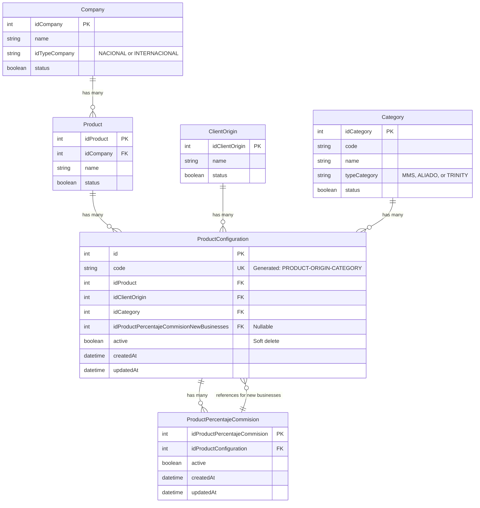
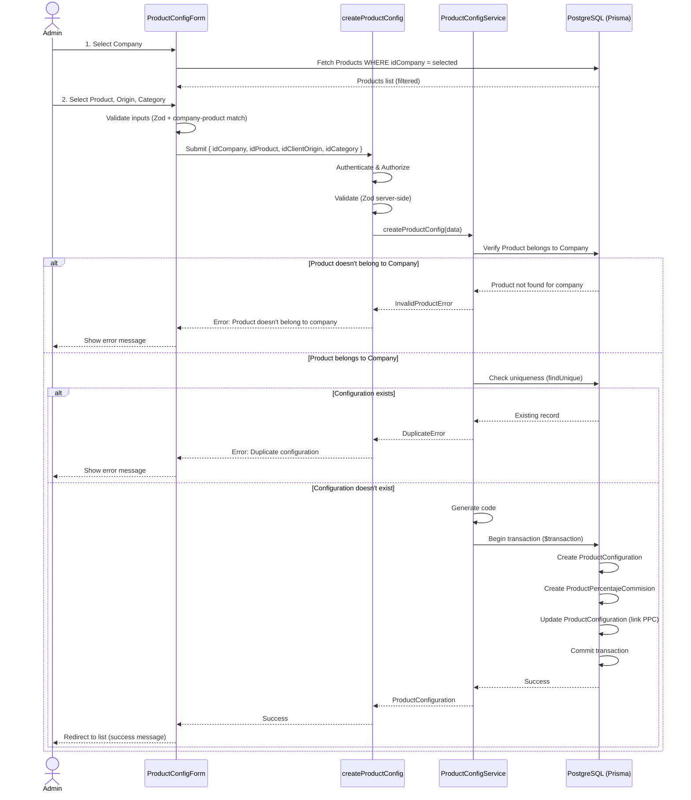
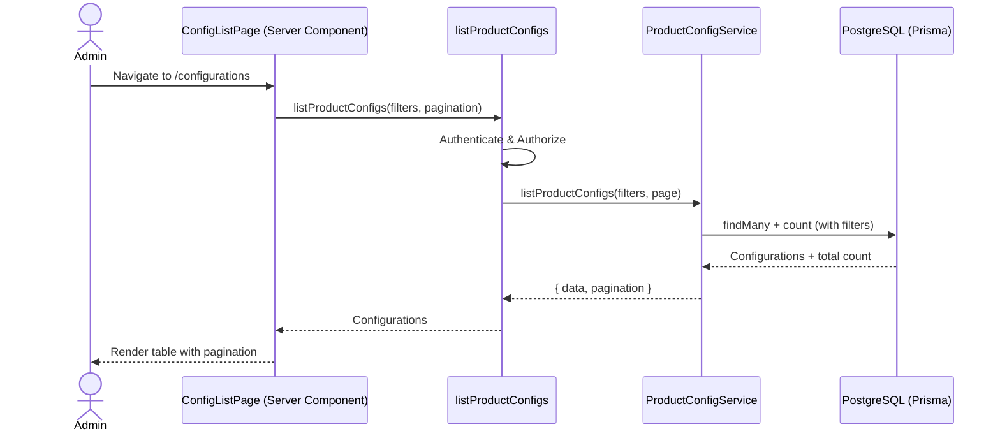
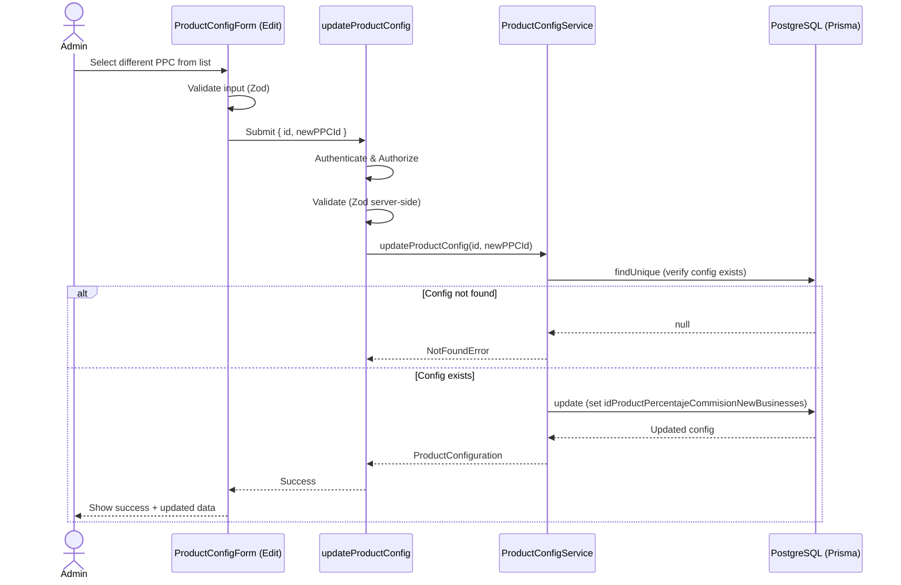

# Data Model: Product Configuration Management

**Feature**: 001-product-config-management  
**Date**: 2026-02-06  
**Status**: Ready for Implementation

## Entity Definitions

### ProductConfiguration (New)

**Purpose**: Represents a unique combination of Product + Origin Client + Category with auto-generated code identifier. Serves as the configuration template for commission distribution to new businesses.

**Attributes**:

| Field | Type | Constraints | Description |
|-------|------|-------------|-------------|
| `id` | String | Primary Key, CUID | Unique identifier |
| `code` | String | Unique, Max 50 chars | Auto-generated identifier (`PRODUCT_NAME-ORIGIN_NAME-CATEGORY_NAME`) |
| `productId` | String | Foreign Key, Not Null | Reference to Product |
| `originClientId` | String | Foreign Key, Not Null | Reference to OriginClient |
| `categoryId` | String | Foreign Key, Not Null | Reference to Category |
| `idProductPercentajeCommisionNewBusinesses` | String | Foreign Key, Nullable | Reference to ProductPercentajeCommision for new businesses |
| `active` | Boolean | Default: true | Soft delete flag (active/inactive) |
| `createdAt` | DateTime | Default: now() | Creation timestamp |
| `updatedAt` | DateTime | Auto-update | Last modification timestamp |

**Relationships**:
- **Belongs to** Product (many-to-one)
- **Belongs to** OriginClient (many-to-one)
- **Belongs to** Category (many-to-one)
- **Belongs to** ProductPercentajeCommision (many-to-one, nullable) - for new businesses reference
- **Has many** ProductPercentajeCommision (one-to-many) - all PPC records for this config
- **Has many** Negocio (one-to-many) - businesses using this configuration

**Business Rules**:
1. The combination of `productId + originClientId + categoryId` MUST be unique
2. The `code` field MUST be unique
3. The `code` is immutable once created (never updated)
4. The `productId`, `originClientId`, `categoryId` are immutable once created
5. Only `idProductPercentajeCommisionNewBusinesses` and `active` can be updated
6. Product, OriginClient, and Category MUST be active when creating a configuration
7. When `active = false`, configuration MUST NOT appear in new business creation flow
8. Soft delete: Setting `active = false` preserves record for existing businesses

**Validation Rules**:
- `code`: Required, max 50 chars, unique, format: `[A-Z0-9_]+-[A-Z0-9_]+-[A-Z0-9_]+`
- `productId`: Required, must exist and be active (at creation time)
- `originClientId`: Required, must exist and be active (at creation time)
- `categoryId`: Required, must exist and be active (at creation time)
- `idProductPercentajeCommisionNewBusinesses`: Optional at creation (auto-created), required after creation
- `active`: Required, boolean

**TypeScript Interface**:
```typescript
// src/features/product-config/types/product-config.types.ts
export interface ProductConfiguration {
  readonly id: number
  readonly code: string | null
  readonly idProduct: number
  readonly idClientOrigin: number
  readonly idCategory: number
  readonly idProductPercentajeCommisionNewBusinesses: number | null
  readonly active: boolean
  readonly createdAt: Date
  readonly updatedAt: Date
}

export interface ProductConfigurationWithRelations extends ProductConfiguration {
  readonly product: {
    readonly idProduct: number
    readonly name: string
    readonly idCompany: number
    readonly company: {
      readonly idCompany: number
      readonly name: string
    }
  }
  readonly clientOrigin: {
    readonly idClientOrigin: number
    readonly name: string
  }
  readonly category: {
    readonly idCategory: number
    readonly code: string
    readonly name: string
  }
  readonly productPercentajeCommisionNewBusinesses: {
    readonly idProductPercentajeCommision: number
  } | null
}

export interface CreateProductConfigurationInput {
  readonly idCompany: number  // For validation: verify product belongs to company
  readonly idProduct: number
  readonly idClientOrigin: number
  readonly idCategory: number
}

export interface UpdateProductConfigurationInput {
  readonly id: number
  readonly idProductPercentajeCommisionNewBusinesses: number
}

export interface ToggleProductConfigurationInput {
  readonly id: number
  readonly active: boolean
}

export interface ListProductConfigurationsInput {
  readonly page?: number
  readonly pageSize?: number
  readonly search?: string
  readonly activeFilter?: 'all' | 'active' | 'inactive'
  readonly idCompany?: number  // Optional filter by company
}
```

---

### ProductPercentajeCommision (Existing - Updated)

**Purpose**: Defines commission distribution percentages for a product configuration. Multiple PPCs can exist for the same ProductConfiguration, but only one is designated as the reference for new businesses.

**Updated Relationships**:
- **Belongs to** ProductConfiguration (many-to-one) - NEW relationship
- **Referenced by** ProductConfiguration (one-to-many) as new businesses reference - NEW relationship
- **Has many** ProductPercentajeCommisionCategory (existing)
- **Referenced by** Negocio (existing)

**Migration Notes**:
- Add `productConfigurationId` field (foreign key to ProductConfiguration)
- Existing records may have `productConfigurationId = null` (handle in migration)

---

### Product (Existing - No Changes)

**Relationships** (updated):
- **Has many** ProductConfiguration (one-to-many) - NEW relationship

---

### OriginClient (Existing - No Changes)

**Relationships** (updated):
- **Has many** ProductConfiguration (one-to-many) - NEW relationship

---

### Category (Existing - No Changes)

**Relationships** (updated):
- **Has many** ProductConfiguration (one-to-many) - NEW relationship

---

### Negocio (Existing - Future Integration)

**Future Enhancement**:
- Add `productConfigurationId` field (foreign key to ProductConfiguration)
- **Belongs to** ProductConfiguration (many-to-one)
- Migration: Link existing Negocio records to appropriate ProductConfiguration based on existing product/origin/category

**Note**: This integration is OUT OF SCOPE for this feature. Mentioned for future reference.

---

## Prisma Schema Changes

### Existing Model: ProductConfiguration (No Changes Needed)

**Current Schema** (already exists in `prisma/schema.prisma`):

```prisma
model ProductConfiguration {
  id                                    Int       @id @default(autoincrement()) @map("id_product_configuration")
  idProduct                              Int      @map("id_product")
  idClientOrigin                         Int      @map("id_client_origin")
  idCategory                             Int      @map("id_category")
  code                                   String?  @db.VarChar(50)
  active                                 Boolean  @default(true) @map("active")
  idProductPercentajeCommisionNewBusinesses Int?   @map("id_product_percentaje_commision_new_businesses")
  createdAt                              DateTime @default(now()) @map("created_at")
  updatedAt                              DateTime @updatedAt @map("updated_at")

  // Relations
  product                              Product                   @relation(fields: [idProduct], references: [idProduct])
  clientOrigin                         ClientOrigin              @relation(fields: [idClientOrigin], references: [idClientOrigin])
  category                             Category                  @relation(fields: [idCategory], references: [idCategory])
  productPercentajeCommisionNewBusinesses ProductPercentajeCommision? @relation("PpcNewBusinesses", fields: [idProductPercentajeCommisionNewBusinesses], references: [idProductPercentajeCommision])
  productPercentajeCommisions          ProductPercentajeCommision[]

  @@unique([idProduct, idClientOrigin, idCategory])
  @@unique([idProductPercentajeCommisionNewBusinesses])
  @@index([idProduct])
  @@index([idClientOrigin])
  @@index([idCategory])
  @@map("product_configuration")
}
```

**Key Points**:
1. ✅ Table already exists - no migration needed
2. ✅ Unique constraint on `[idProduct, idClientOrigin, idCategory]` already in place
3. ✅ Relationship with Product already exists
4. ❌ **Missing**: `code` field is nullable (`String?`) - should be required and unique
5. ❌ **Missing**: Index on `code` for search performance
6. ❌ **Missing**: Index on `active` for filtering

**Required Migration**:
```sql
-- Make code required and unique
ALTER TABLE "product_configuration" 
  ALTER COLUMN "code" SET NOT NULL;

CREATE UNIQUE INDEX "product_configuration_code_key" 
  ON "product_configuration"("code");

-- Add performance indexes
CREATE INDEX "product_configuration_active_idx" 
  ON "product_configuration"("active");
```

**Company Access**:
- ProductConfiguration does NOT store `idCompany` directly (denormalized)
- Company accessed via: `ProductConfiguration → Product → Company`
- Query pattern: `include: { product: { include: { company: true } } }`

### Existing Model: ProductPercentajeCommision (Already Has Relationship)

**Current Schema** (already exists in `prisma/schema.prisma`):

```prisma
model ProductPercentajeCommision {
  idProductPercentajeCommision Int      @id @default(autoincrement()) @map("id_product_percentaje_commision")
  idProductConfiguration       Int      @map("id_product_configuration")
  active                       Boolean  @default(true)
  createdAt                    DateTime @default(now()) @map("created_at")
  updatedAt                    DateTime @updatedAt @map("updated_at")

  // Relations
  productConfiguration                 ProductConfiguration  @relation(fields: [idProductConfiguration], references: [id])
  productConfigurationAsNewBusinesses  ProductConfiguration?  @relation("PpcNewBusinesses")
  productPercentajeCommisionCategories ProductPercentajeCommisionCategory[]
  businesses                           Business[]

  @@index([idProductConfiguration])
  @@map("product_percentaje_commision")
}
```

**Key Points**:
1. ✅ Table already exists - no migration needed
2. ✅ Foreign key `idProductConfiguration` already exists
3. ✅ Relationship with ProductConfiguration already configured
4. ✅ Index on `idProductConfiguration` already in place
5. ✅ Reverse relation for "new businesses reference" already configured (`PpcNewBusinesses`)

**No Schema Changes Needed** - The existing schema already supports the required functionality.

### Updated Models: Product, OriginClient, Category

```prisma
model Product {
  id                       String                    @id @default(cuid())
  // ... existing fields ...
  
  // Relations (add this line)
  productConfigurations   ProductConfiguration[]
  
  @@map("products")
}

model OriginClient {
  id                       String                    @id @default(cuid())
  // ... existing fields ...
  
  // Relations (add this line)
  productConfigurations   ProductConfiguration[]
  
  @@map("origin_clients")
}

model Category {
  id                       String                    @id @default(cuid())
  // ... existing fields ...
  
  // Relations (add this line)
  productConfigurations   ProductConfiguration[]
  
  @@map("categories")
}
```

---

## Migration Strategy

### Migration 1: Update ProductConfiguration Schema

**Status**: Tables already exist. Only need to update constraints and indexes.

```sql
-- Migration: Update product_configuration schema
-- File: prisma/migrations/YYYYMMDDHHMMSS_update_product_configuration_constraints/migration.sql

-- Step 1: Update existing NULL codes (if any) before making field required
-- Generate codes for existing records without code
UPDATE "product_configuration" pc
SET "code" = CONCAT(
  UPPER(REPLACE(p.name, ' ', '_')), '-',
  UPPER(REPLACE(co.name, ' ', '_')), '-',
  UPPER(REPLACE(c.name, ' ', '_'))
)
FROM "product" p
JOIN "client_origin" co ON co."id_client_origin" = pc."id_client_origin"
JOIN "category" c ON c."id_category" = pc."id_category"
WHERE pc."id_product" = p."id_product" AND pc."code" IS NULL;

-- Step 2: Make code field required
ALTER TABLE "product_configuration" 
  ALTER COLUMN "code" SET NOT NULL;

-- Step 3: Add unique constraint on code
CREATE UNIQUE INDEX IF NOT EXISTS "product_configuration_code_key" 
  ON "product_configuration"("code");

-- Step 4: Add performance indexes
CREATE INDEX IF NOT EXISTS "product_configuration_active_idx" 
  ON "product_configuration"("active");
```

### Migration Execution

```bash
# Create migration
npx prisma migrate dev --name update_product_configuration_constraints

# Apply to production
npx prisma migrate deploy
```

**Verification Steps**:
1. Check that all existing ProductConfiguration records have non-null codes
2. Verify unique constraint on `code` field
3. Verify indexes on `active` and `code` fields
4. Test that new configurations can be created with generated codes

**Rollback Plan** (if needed):
```sql
-- Remove indexes
DROP INDEX IF EXISTS "product_configuration_code_key";
DROP INDEX IF EXISTS "product_configuration_active_idx";

-- Revert code to nullable
ALTER TABLE "product_configuration" 
  ALTER COLUMN "code" DROP NOT NULL;
```

---

## Entity Relationship Diagram (ERD)



---

## Data Flow Diagrams

### Create ProductConfiguration Flow



### List ProductConfigurations Flow



### Update ProductConfiguration Flow



---

## Query Patterns

### Find by Unique Combination (Pre-Create Check)

```typescript
const existing = await prisma.productConfiguration.findUnique({
  where: {
    unique_product_origin_category: {
      productId: 'prod-123',
      originClientId: 'origin-456',
      categoryId: 'cat-789'
    }
  }
})
```

### List with Filters & Pagination

```typescript
const whereClause = {
  AND: [
    // Search filter
    search ? {
      OR: [
        { code: { contains: search, mode: 'insensitive' } },
        { product: { name: { contains: search, mode: 'insensitive' } } },
        { product: { company: { name: { contains: search, mode: 'insensitive' } } } },
        { clientOrigin: { name: { contains: search, mode: 'insensitive' } } },
        { category: { name: { contains: search, mode: 'insensitive' } } }
      ]
    } : {},
    // Active filter
    activeFilter !== 'all' ? { active: activeFilter === 'active' } : {},
    // Company filter (optional)
    idCompany ? { product: { idCompany } } : {}
  ]
}

const [configs, total] = await Promise.all([
  prisma.productConfiguration.findMany({
    where: whereClause,
    skip: (page - 1) * pageSize,
    take: pageSize,
    orderBy: { createdAt: 'desc' },
    include: {
      product: { 
        select: { 
          idProduct: true, 
          name: true,
          idCompany: true,
          company: { 
            select: { idCompany: true, name: true } 
          }
        } 
      },
      clientOrigin: { select: { idClientOrigin: true, name: true } },
      category: { select: { idCategory: true, code: true, name: true } },
      productPercentajeCommisionNewBusinesses: { select: { idProductPercentajeCommision: true } }
    }
  }),
  prisma.productConfiguration.count({ where: whereClause })
])
```

### Transactional Create (Config + PPC)

```typescript
const result = await prisma.$transaction(async (tx) => {
  // Step 1: Create ProductConfiguration
  const config = await tx.productConfiguration.create({
    data: {
      code: generatedCode,
      productId,
      originClientId,
      categoryId,
      active: true
    }
  })
  
  // Step 2: Create ProductPercentajeCommision
  const ppc = await tx.productPercentajeCommision.create({
    data: {
      productConfigurationId: config.id,
      active: true
      // Note: ProductPercentajeCommisionCategory entries are created separately
    }
  })
  
  // Step 3: Update ProductConfiguration with PPC reference
  return tx.productConfiguration.update({
    where: { id: config.id },
    data: { idProductPercentajeCommisionNewBusinesses: ppc.id },
    include: {
      product: true,
      originClient: true,
      category: true,
      productPercentajeCommisionNewBusinesses: true
    }
  })
})
```

---

## Performance Considerations

### Indexes

1. **Primary Key Index**: `id` (auto-created)
2. **Unique Indexes**:
   - `code` (auto-created from `@unique`)
   - `unique_product_origin_category` composite (auto-created from `@@unique`)
3. **Query Indexes**:
   - `active` (for filtering active/inactive)
   - `productConfigurationId` on ProductPercentajeCommision (for joins)

### Query Optimization

1. **List Query**: Use `select` to limit fields (don't fetch all related data)
2. **Search**: Use `mode: 'insensitive'` for case-insensitive search (consider full-text search if performance degrades)
3. **Pagination**: Offset-based is acceptable for ~1000 records; monitor performance
4. **Counting**: Parallel execution of `findMany` + `count` reduces latency

### Caching Strategy (Future Enhancement)

- Cache active configurations list (TTL: 5 minutes)
- Invalidate cache on create/update/toggle operations
- Use Next.js unstable_cache or Redis for production

---

## Security Considerations

### Database Level

1. **Foreign Key Constraints**: `ON DELETE RESTRICT` for Product/Origin/Category (prevent orphaned configs)
2. **Foreign Key Constraints**: `ON DELETE SET NULL` for PPC reference (allow PPC deletion without breaking config)
3. **Foreign Key Constraints**: `ON DELETE CASCADE` for ProductConfiguration → ProductPercentajeCommision (delete PPCs when config deleted)

### Application Level

1. **Authorization**: Admin-only access (verified in Server Actions)
2. **Input Validation**: Zod schemas on client + server
3. **SQL Injection**: Prisma protects via parameterized queries
4. **Rate Limiting**: Consider rate limiting for create/update operations (future enhancement)

---

## Testing Strategy

### Unit Tests (Service Layer)

1. **generateProductConfigCode**: Test code generation with various inputs (spaces, special chars, long names)
2. **createProductConfig**: Test transactional creation, uniqueness validation, error handling
3. **listProductConfigs**: Test filtering, pagination, search
4. **updateProductConfig**: Test PPC reference update, immutability of other fields
5. **toggleProductConfig**: Test active/inactive toggle

### Integration Tests

1. **Create Flow**: Create config → verify DB state → verify PPC auto-created
2. **Duplicate Prevention**: Attempt duplicate create → verify rejection
3. **List with Filters**: Create multiple configs → apply filters → verify results
4. **Update Flow**: Create config → update PPC reference → verify persistence
5. **Toggle Flow**: Create config → toggle inactive → verify not shown in new business flow

### E2E Tests

1. **Admin creates configuration**: Navigate → fill form → submit → verify success
2. **Admin searches configurations**: Navigate → enter search term → verify filtered results
3. **Admin updates configuration**: Navigate → edit → change PPC → save → verify change
4. **Admin toggles configuration**: Navigate → toggle inactive → verify status badge

---

## Summary

This data model provides:
- ✅ Unique product-origin-category combinations via compound constraint
- ✅ Auto-generated immutable code identifier
- ✅ Transactional creation of ProductConfiguration + ProductPercentajeCommision
- ✅ Soft delete via `active` field
- ✅ Referential integrity with existing entities (Product, OriginClient, Category)
- ✅ Scalable query patterns with proper indexing
- ✅ Type-safe interfaces for TypeScript
- ✅ Future-proof design for Negocio integration

Ready for Phase 1 contract definitions and implementation.
