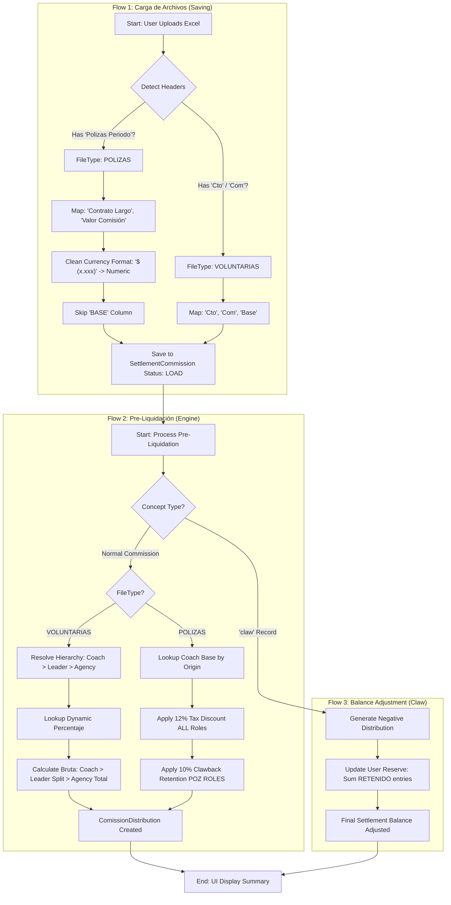

# Process Flowchart: Commission Adjustments

This diagram visualizes the integration of the 3 core flows: **Carga**, **Pre-Liquidación**, and **Ajuste de Saldo (Claw)**, supporting both **Voluntarias** and **Polizas** formats.

## Description of Stages

### 1. Carga (Saving)
The system normalizes the data regardless of the source. For **Polizas**, it performs a rigorous cleaning of the currency strings (which include symbols, parentheses for negatives, and commas) and ignores the `BASE` column as per the latest requirement.

### 2. Pre-Liquidación (Engine)
The core logic switches between:
- **Voluntarias**: A hierarchical approach where the Leader's commission is a percentage of the Coach's earnings.
- **Polizas**: A product-origin approach with fixed retentions applied to the net value.

### 3. Ajuste de Saldo (Claw)
Specifically handles the return of commissions. Instead of a simple deduction, it generates a traceable record in the distribution table that impacts the user's virtual reserve.
