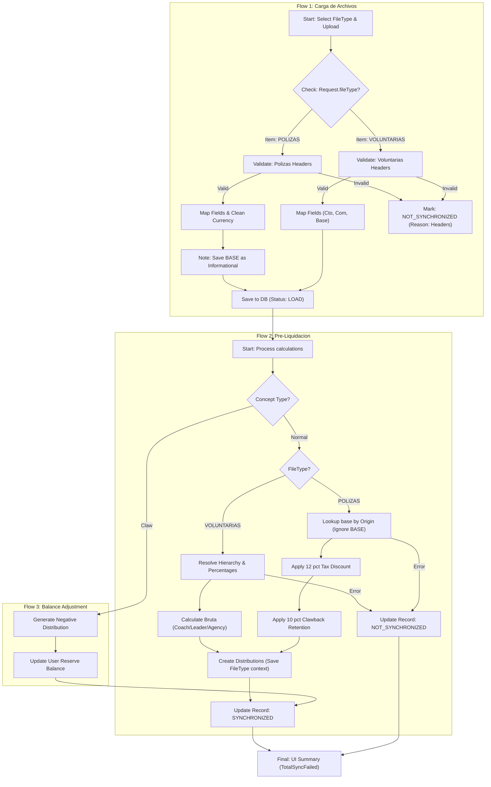

# Process Flowchart: Commission Adjustments

This diagram visualizes the integration of the 3 core flows.

## Description

- **Flow 1 (Carga)**: Mandatory selector in UI. Headers are validated before saving. Polizas currency is cleaned.
- **Flow 2 (Pre-Liquidation)**: Dynamic engine. Voluntarias uses hierarchy; Polizas uses origin + retentions.
- **Flow 3 (Adjustment)**: Negative distribution logic for returns.
